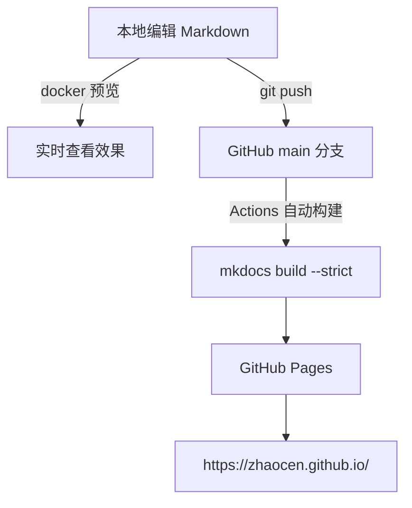

# 关于本站

## 技术栈

| 组件 | 用途 |
|------|------|
| [Material for MkDocs](https://squidfunk.github.io/mkdocs-material/) | 静态站点主题与生成器 |
| [GitHub Actions](https://github.com/features/actions) | 自动构建与发布 |
| [GitHub Pages](https://pages.github.com/) | 站点托管 |
| Docker | 本地预览环境 |

## 部署链路

## 本板块内容

-   __[写作与发布流程](workflow.md)__

    ---

    从新建文章到上线的完整操作步骤，含常用 Markdown 写法速查。

-   __[容器与部署](docker.md)__

    ---

    Docker 常用操作，以及本站预览环境的搭建方式。

## 联系

- GitHub: [@Zhaocen](https://github.com/Zhaocen)
