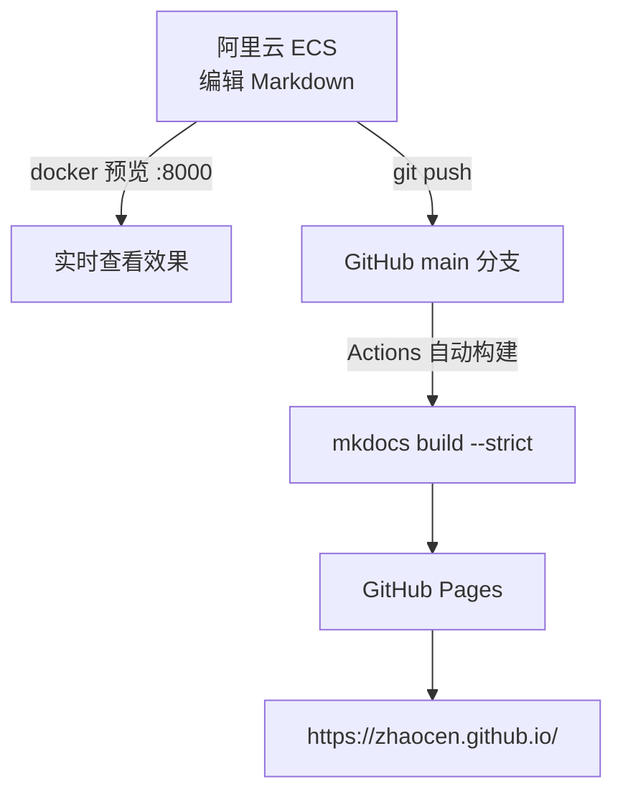

# 关于本站

## 技术栈

| 组件 | 用途 |
|------|------|
| [Material for MkDocs](https://squidfunk.github.io/mkdocs-material/) | 静态站点主题与生成器 |
| [GitHub Actions](https://github.com/features/actions) | 自动构建与发布 |
| [GitHub Pages](https://pages.github.com/) | 站点托管 |
| 阿里云 ECS | 写作与本地预览环境 |

## 部署链路

具体操作步骤见 [写作与发布流程](workflow.md)。

## 联系

- GitHub: [@Zhaocen](https://github.com/Zhaocen)
