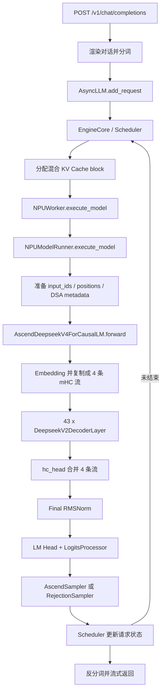
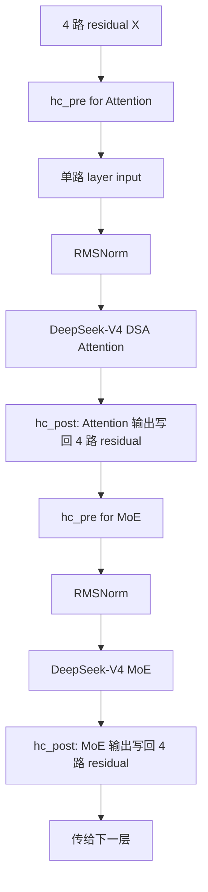
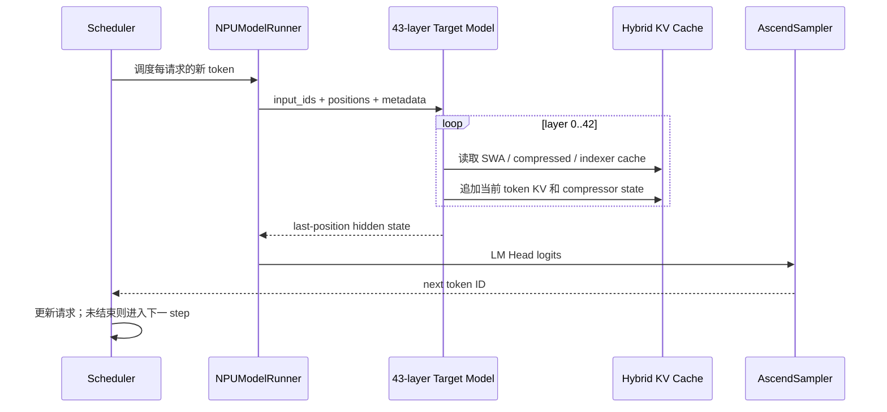
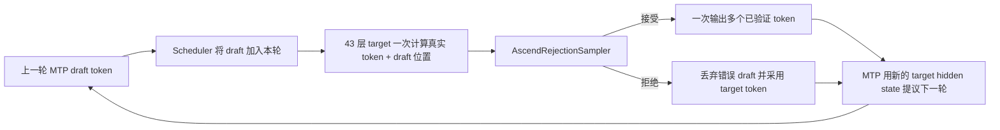

---
tags:
  - vLLM
  - 昇腾
  - 稀疏注意力
  - MoE
---
# DeepSeek-V4-Flash 在 vLLM Ascend 中的一次推理调用过程

本文从代码调用链出发，按一次在线推理请求实际发生的顺序，说明
DeepSeek-V4-Flash 在 vLLM Ascend 上如何完成输入处理、Prefill、逐层计算、
Decode、采样，以及可选的 MTP 推测解码。

本文重点回答两个问题：

1. 一次请求从 OpenAI API 到模型输出经过哪些函数和对象？
2. DeepSeek-V4-Flash 的每一个 Decoder Layer 内部到底计算了什么？

## 1. 阅读范围和代码基线

本文基于以下本地代码进行静态分析：

- `vllm-ascend`：`v0.26.0rc` 系列分支，基线提交 `8376016f4`。
- 同级上游 `vllm`：分支 `releases/v0.26.0`，基线提交 `568afb3a13`。
- 分析日期：2026-08-24。

这里的“DeepSeek-V4-Flash”默认指教程使用的 W8A8 + MTP 量化 checkpoint。
模型结构参数同时与
[DeepSeek-V4-Flash-Base 的公开配置](https://huggingface.co/deepseek-ai/DeepSeek-V4-Flash-Base/blob/refs%2Fpr%2F25/config.json)
交叉核对。量化 checkpoint 可以改变线性层实际调用的量化算子，但不会改变本文描述的
Decoder Layer 拓扑。

本文是源码级调用分析，不是 NPU Profiling 报告。实际运行时是否走 W8A8、W4A8、
ACL Graph、FlashComm1、EP、CP 或多流重叠，取决于 checkpoint 和启动参数。

## 2. 先建立模型的整体认识

### 2.1 关键结构参数

公开配置中的主要参数如下：

| 参数                         |      值 | 含义                                   |
| ---------------------------- | ------: | -------------------------------------- |
| `vocab_size`               |  129280 | 词表大小                               |
| `hidden_size`              |    4096 | 每个 token 的主隐藏维度，本文记作`H` |
| `num_hidden_layers`        |      43 | 主模型 Decoder Layer 数量              |
| `hc_mult`                  |       4 | mHC 残差流数量，本文记作`C`          |
| `hc_sinkhorn_iters`        |      20 | mHC 中 Sinkhorn 归一化迭代次数         |
| `num_attention_heads`      |      64 | Query 头数                             |
| `head_dim`                 |     512 | 每个注意力头维度                       |
| `qk_rope_head_dim`         |      64 | 每个头中应用 RoPE 的维度               |
| `q_lora_rank`              |    1024 | Query 的低秩中间维度                   |
| `o_groups`                 |       8 | Grouped Output Projection 的组数       |
| `o_lora_rank`              |    1024 | 每个输出投影组的低秩维度               |
| `sliding_window`           |     128 | 原始 KV 分支的局部窗口长度             |
| `index_n_heads`            |      64 | Lightning Indexer 的头数               |
| `index_head_dim`           |     128 | Indexer 每头维度                       |
| `index_topk`               |     512 | C4 层为每个 Query 选出的压缩位置数     |
| `n_routed_experts`         |     256 | 路由专家数量                           |
| `n_shared_experts`         |       1 | 共享专家数量                           |
| `num_experts_per_tok`      |       6 | 每个 token 激活的路由专家数            |
| `moe_intermediate_size`    |    2048 | 每个专家的中间维度                     |
| `num_hash_layers`          |       3 | 前 3 层使用 Hash 路由                  |
| `num_nextn_predict_layers` |       1 | checkpoint 中的 MTP 层数               |
| `max_position_embeddings`  | 1048576 | 配置声明的最大上下文，即 1M token      |

`T` 在下文表示当前调度批次中打平后的 token 总数。vLLM 不按
`[batch, sequence, hidden]` 的密集张量运行主模型，而是把不同请求当前需要计算的
token 拼成 `[T, ...]`。

### 2.2 43 层并不是完全相同的注意力

模型的 `compress_ratios` 为：

```text
[0, 0, 4, 128, 4, 128, ..., 4, 128, 4, 0]
```

列表共有 44 项，主模型只使用索引 0 到 42；最后一项索引 43 给 MTP 层使用。
`DeepseekV4Attention.__init__()` 通过
`get_dsv4_compress_ratio(config, layer_idx)` 决定本层走哪一种注意力：

| 主模型层        | 数量 | `compress_ratio` | 注意力路径                                       | MoE 路由     |
| --------------- | ---: | -----------------: | ------------------------------------------------ | ------------ |
| 0、1            |    2 |                  0 | 仅 128-token Sliding Window                      | Hash-MoE     |
| 2               |    1 |                  4 | Sliding Window + C4 Compressor + Top-512 Indexer | Hash-MoE     |
| 3、5、7、…、41 |   20 |                128 | Sliding Window + C128 压缩历史                   | 普通路由 MoE |
| 4、6、8、…、42 |   20 |                  4 | Sliding Window + C4 Compressor + Top-512 Indexer | 普通路由 MoE |

因此，“每一层都执行同一个 Layer 骨架”是正确的，但“每一层做相同的 Attention”
是不正确的。层间最重要的差别就是 `compress_ratio`。

### 2.3 一张总调用图



## 3. 服务启动时：Ascend 模型怎样替换上游模型

推理请求到来之前，服务启动阶段已经完成了平台发现、模型类注册、权重加载和
KV Cache 分配。理解这一点很重要，因为运行时调用的不是上游 GPU 版
`DeepseekV4ForCausalLM`。

### 3.1 插件发现和模型重注册

安装包在 `setup.py` 中注册以下入口：

```text
vllm.platform_plugins:
  ascend -> vllm_ascend:register

vllm.general_plugins:
  ascend_model -> vllm_ascend:register_model
```

启动后调用链为：

```text
vllm 加载 general plugin
└─ vllm_ascend.register_model()
   └─ vllm_ascend.models.register_model()
      └─ ModelRegistry.register_model(
           "DeepseekV4ForCausalLM",
           "vllm_ascend.models.deepseek_v4:AscendDeepseekV4ForCausalLM"
         )
```

checkpoint 的 `config.json` 中：

```json
{
  "architectures": ["DeepseekV4ForCausalLM"],
  "model_type": "deepseek_v4"
}
```

所以模型注册表最终解析到
`vllm_ascend.models.deepseek_v4.AscendDeepseekV4ForCausalLM`。

MTP 也被单独注册：

```text
DeepSeekV4MTPModel -> vllm_ascend.models.deepseek_v4_mtp.DeepSeekV4MTP
```

### 3.2 模型对象构造

主模型对象层级如下：

```text
AscendDeepseekV4ForCausalLM
├─ model: DeepseekV4Model
│  ├─ embed_tokens: VocabParallelEmbedding
│  ├─ layers[0..42]: DeepseekV2DecoderLayer
│  │  ├─ self_attn: DeepseekV4Attention
│  │  │  └─ dsa_attn: AscendDeepseekSparseAttention
│  │  │     └─ DSAAttention
│  │  │        └─ impl: AscendDSAImpl
│  │  └─ mlp: DeepseekV4MoE
│  │     └─ experts: FusedMoE / AscendMoERunner
│  └─ norm: RMSNorm
├─ lm_head: ParallelLMHead
└─ logits_processor: LogitsProcessor
```

`NPUModelRunner.load_model()` 调用上游 `get_model()`。默认 loader 先根据注册表构造
上述对象，再把 safetensors 权重交给
`AscendDeepseekV4ForCausalLM.load_weights()`。加载器会处理：

- `gate_proj` 和 `up_proj` 合并到 `gate_up_proj`；
- 256 个 routed expert 的权重映射到本 rank 的物理专家；
- TP、EP、PP 对应的权重切分；
- W8A8/W4A8/FP8 等 checkpoint 对应的 Ascend quant method；
- mHC、Compressor、Indexer、MTP 等 DeepSeek-V4 专用参数。

### 3.3 为什么 `FusedMoE` 最后会走 Ascend 实现

`vllm_ascend/patch/platform/patch_fused_moe.py` 会把上游 `FusedMoE` 工厂的
默认 runner 替换为 `AscendMoERunner`。因此模型文件虽然从上游包导入
`FusedMoE`，专家选择、token dispatch、grouped matmul 和 combine 实际由
`vllm_ascend/ops/fused_moe/` 完成。

### 3.4 DeepSeek-V4 的 KV Cache 是“混合 Cache”

普通 Transformer 层通常只有一类 K/V Cache。DeepSeek-V4 的一层可能注册多类
cache：

| 层类型    | 该层使用的主要 cache                                                                       |
| --------- | ------------------------------------------------------------------------------------------ |
| ratio 0   | `swa_cache`                                                                              |
| ratio 4   | `swa_cache`、压缩 KV、主 Compressor 状态、Indexer Compressor 状态、Indexer K/scale cache |
| ratio 128 | `swa_cache`、压缩 KV、主 Compressor 状态                                                 |

这些 cache 都使用 Paged KV Cache 思路：Scheduler 管理逻辑 block，运行前的
attention metadata 提供 `block_table` 和 `slot_mapping`，算子据此访问实际 NPU
内存。ratio 4 和 ratio 128 的状态 block 大小不同，因此这属于 Hybrid KV Cache。

## 4. 第一次请求进入服务

下面从一个 `/v1/chat/completions` 请求开始。

### 4.1 对话渲染、分词和 SamplingParams

上游调用链为：

```text
OpenAIServingChat.create_chat_completion()
└─ _create_chat_completion()
   ├─ render_chat_request()
   │  ├─ DeepSeek-V4 chat template / thinking 参数处理
   │  └─ tokenizer: 文本 -> prompt_token_ids
   ├─ request.to_sampling_params()
   └─ engine_client.generate(engine_input, sampling_params, request_id, ...)
```

这里完成两类工作：

- 把 messages、tools、thinking/reasoning 参数渲染成模型 prompt，并转换为 token ID；
- 把 `temperature`、`top_p`、`top_k`、penalty、stop 条件等转换成
  `SamplingParams`。

`AsyncLLM.generate()` 调用 `add_request()`，再把请求发给独立的 EngineCore 进程。

### 4.2 Scheduler 不把 Prefill 和 Decode 写成两个独立调度器

`Scheduler.schedule()` 的核心状态是：

```text
还需要计算的 token 数
= prompt token + 已输出 token + speculative token
- num_computed_tokens
```

新请求尚未计算 prompt，所以本轮调度得到多个 prompt token，这就是 Prefill。
后续普通 Decode 中，每个请求通常只多出 1 个待计算 token。启用 MTP 后，还可能附带
上一轮提出的 draft token。

Scheduler 同时完成：

- continuous batching，把 Prefill 和 Decode 请求混在一个 step 中；
- chunked prefill，长 prompt 不一定一次全部计算；
- prefix cache 命中判断；
- 为各类 DeepSeek-V4 cache 分配 block；
- 生成 `SchedulerOutput`。

### 4.3 EngineCore 到 NPU Worker

每个 EngineCore step 的主调用链为：

```text
EngineCore.step()
├─ scheduler.schedule()
├─ model_executor.execute_model(scheduler_output)
│  └─ NPUWorker.execute_model()
│     └─ NPUModelRunner.execute_model()
├─ model_executor.sample_tokens()
└─ scheduler.update_from_output()
```

`NPUWorker` 还负责 PP rank 间接收和发送 `IntermediateTensors`。本文先按 PP=1
理解；PP>1 时只是把连续层区间分给不同 rank，单层计算没有变化。

## 5. Runner 怎样准备一次模型 Forward

`NPUModelRunner.execute_model()` 在调用模型前做以下事情：

1. `_update_states()`：把 Scheduler 的新请求、已缓存请求、block 分配同步到
   worker 的持久 batch 状态。
2. `_prepare_inputs()`：取出本轮 token ID、位置和需要采样 logits 的索引。
3. `_determine_batch_execution_and_padding()`：决定 eager/ACL Graph、padding 和
   micro-batch。
4. `_build_attention_metadata()`：为 SWA、C4、C128、Indexer 等 cache 构造
   metadata。
5. `_preprocess()`：得到最终 `input_ids`、`positions`、`inputs_embeds` 和模型参数。
6. `update_cos_sin(positions)`：更新各 DSA 层要用的 RoPE cos/sin。
7. 进入 `set_ascend_forward_context(...)`，把 attention metadata、input ID、
   MoE 通信方式和图模式放入本轮 ForwardContext。
8. `_model_forward()` 最终调用 `self.model(...)`。

关键调用如下：

```text
NPUModelRunner.execute_model
└─ _model_forward
   └─ AscendDeepseekV4ForCausalLM.forward
      └─ DeepseekV4Model.forward
```

### 5.1 为什么 metadata 不直接作为模型 `forward()` 参数

`DeepseekV4Attention.forward()` 的显式参数只有：

```python
positions, hidden_states, llama_4_scaling
```

真正的 attention metadata 和 KV Cache 通过 ForwardContext 找到：

```text
DeepseekV4Attention.forward
└─ AscendDeepseekSparseAttention.forward
   └─ torch.ops.vllm.dsa_forward(..., layer_name)
      ├─ ForwardContext.no_compile_layers[layer_name]
      ├─ filter_metadata(..., layer prefix)
      ├─ _build_kv_cache(...)
      └─ AscendDSAImpl.forward(...)
```

这样做的一个重要原因是把整个 DSA 路径包装成 `PrivateUse1` custom op，便于
ACL Graph 捕获，同时用稳定的 `layer_name` 找到本层对象和 cache。

## 6. 主模型 Forward：Embedding 和 4 条 mHC 残差流

进入 `DeepseekV4Model.forward()` 时，典型输入为：

```text
input_ids: [T]
positions: [T]
```

第一个 PP rank 执行：

```text
token embedding:
[T] -> [T, H]

复制为 hc_mult=4 条残差流:
[T, H] -> [T, C=4, H=4096]
```

源码对应：

```python
hidden_states = self.embed_input_ids(input_ids)
hidden_states = hidden_states.unsqueeze(1).repeat(1, self.hc_mult, 1)
```

传统 Transformer 只有一条 residual stream。mHC 可以理解为：每个 token 保留
4 条并行残差流；进入 Attention 或 MoE 前，学习如何从 4 条流组合出一个层输入；
子层计算完成后，再学习如何把结果写回 4 条流。

随后循环执行 43 个 `DeepseekV2DecoderLayer`：

```python
for layer in layers[0:43]:
    hidden_states, residual = layer(...)
```

## 7. 每一个 Decoder Layer 的完整计算

这一节是全文核心。43 层都执行下面的骨架，只有 Attention 的
`compress_ratio` 和前 3 层的 MoE 路由方式不同。



对应 `DeepseekV2DecoderLayer.forward()`：

```python
residual = hidden_states.clone()
hidden_states, post, comb = hc_pre(hidden_states, hc_attn_*)
hidden_states = input_layernorm(hidden_states)
hidden_states = self_attn(positions, hidden_states, ...)
hidden_states = hc_post(hidden_states, residual, post, comb)

residual = hidden_states.clone()
hidden_states, post, comb = hc_pre(hidden_states, hc_ffn_*)
hidden_states = post_attention_layernorm(hidden_states)
hidden_states = mlp(hidden_states)
hidden_states = hc_post(hidden_states, residual, post, comb)
```

### 7.1 第一步：Attention 前的 `hc_pre`

输入 `X` 的形状为 `[T, C, H] = [T, 4, 4096]`。Ascend 调用融合算子：

```text
torch.ops._C_ascend.npu_hc_pre_v2
```

它返回：

```text
layer_input: [T, H]
post:        [T, C]
comb:        [T, C, C]
```

其等价数学过程可以从上游 `mhc_pre_torch()` 看清。先把 4 条流展平：

```text
x_flat = reshape(X)                         # [T, C*H]
m = linear(x_flat, hc_fn) * RMS_scale       # [T, 2C+C²]
```

当 `C=4` 时，`2C+C²=24`，所以每个子层的 `hc_fn` 形状是
`[24, 4*4096]`。24 个输出分成三段：

```text
pre_mix  = sigmoid(m_pre  * scale[0] + base_pre) + eps
post_mix = sigmoid(m_post * scale[1] + base_post) * 2
comb     = Sinkhorn(m_comb * scale[2] + base_comb)
```

`comb` 经过 20 次行列交替归一化，接近双随机矩阵。进入子层的单路输入为：

```text
layer_input = sum_i pre_mix[i] * X[i]       # [T, H]
```

概念上：

- `pre_mix` 决定 4 条 residual stream 以什么权重喂给当前子层；
- `comb` 决定旧的 4 条流如何彼此重组；
- `post_mix` 决定子层输出以多大权重写入每一条新流。

### 7.2 第二步：Attention 前 RMSNorm

```text
x_norm = RMSNorm(layer_input, eps=1e-6)     # [T, 4096]
```

RMSNorm 只按最后一个 hidden 维度归一化，不减均值：

```text
RMSNorm(x) = x / sqrt(mean(x²) + eps) * weight
```

### 7.3 第三步：构造 Query 和原始窗口 KV

以下计算在 `AscendDSAImpl._forward_prefill()` 或
`AscendDSAImpl._forward_decode()` 中完成。

#### Query 路径

```text
q_a = Wq_a(x_norm)                          # [T, 4096] -> [T, 1024]
qr  = RMSNorm(q_a)                          # Query latent
q   = Wq_b(qr)                              # -> [T, 64/TP, 512]
q   = head-wise RMSNorm(q)
q[..., 448:512] = RoPE(q[..., 448:512])
```

这里使用低秩 Query 投影：先从 4096 降到 `q_lora_rank=1024`，再升到全部
Query heads。TP 开启时 `wq_b` 按 head 切分，因此每个 rank 只保留
`64/TP` 个本地头。

512 维 head 被分成：

```text
NoPE 部分: 448 维
RoPE 部分:  64 维
```

`inplace_partial_rotary_mul` 只旋转最后 64 维。

#### 原始窗口 KV 路径

```text
kv = Wkv(x_norm)                            # [T, 4096] -> [T, 512]
kv = RMSNorm(kv)
kv = reshape(kv, [T, 1, 512])               # 1 个共享 KV head
kv[..., 448:512] = RoPE(kv[..., 448:512])
scatter kv -> swa_kv_cache
```

Query 有 64 个头，但 KV 只有 1 个共享头，这是一种 MQA 风格的共享 KV。
`slot_mapping` 指定本轮新 KV 写到 Paged Cache 的哪个物理 slot。

W8A8 动态量化时，代码会尽量共享 `hidden_states` 的一次 dynamic quant，随后用
`npu_quant_matmul` 分别计算 `wq_a` 和 `wkv`，减少重复量化。开启
`multistream_dsv4_dsa_overlap` 时，Query 与 KV 的 Vector/Cube 工作还会在两个
NPU stream 上重叠，但数学结果不变。

### 7.4 第四步：按本层压缩比处理历史 KV

#### A. ratio 0：只使用 Sliding Window

层 0 和层 1 不构造 Compressor，也不构造 Indexer。注意力算子只读取
`swa_kv_cache`，窗口为当前 token 及其之前最多 127 个 token：

```text
Attention(q, original KV in last 128 positions, attention sink)
```

当序列长度不超过 128 时，它等价于当前前缀上的 causal attention；超过 128 后，
更早的原始 KV 不再直接参与这一层。

#### B. ratio 128：Sliding Window + 高压缩历史

奇数层 3、5、…、41 还会调用：

```text
torch.ops._C_ascend.compressor(..., cmp_ratio=128, coff=1)
```

Compressor 的输入和状态包括：

- 当前 `x_norm`；
- `compressor.wkv` 与 `compressor.wgate`；
- 可学习位置参数 `ape`；
- `compressor.norm`；
- 压缩位置的 RoPE cos/sin；
- 跨 step 保存的 `state_cache`。

它以流式方式把约 128 个原始 token 汇聚成一个压缩 KV，并把未凑满一个压缩组的
中间状态保存在 `state_cache`。输出写入 `compress_kv_cache`。

ratio 128 不运行 Lightning Indexer。注意力同时读取：

- 最近 128 个 token 的原始 SWA KV；
- 更长历史对应的 C128 压缩 KV。

#### C. ratio 4：Sliding Window + 细粒度压缩 + Indexer

层 2、4、6、…、42 使用 `cmp_ratio=4`。主 Compressor 的 `coff=2`，代码中的
`overlap=True` 表示压缩状态带相邻组重叠信息。

因为每 4 个 token 产生一个压缩条目，1M 上下文仍可能产生约 25 万个压缩位置。
所以 C4 层额外运行 Lightning Indexer，只从中选择 `index_topk=512` 个位置。

Indexer 的主要计算为：

```text
index_q = indexer.wq_b(qr)                  # [T, 1024] -> [T, 64, 128]
index_q[..., 64:128] = RoPE(...)
index_q = HadamardRotate(index_q)

index_k = indexer.compressor(x_norm)         # ratio=4, head_dim=128
index_k = HadamardRotate(index_k)
quantize/scatter index_k -> indexer K/scale cache

head_weight = weights_proj(x_norm)           # [T, 4096] -> [T, 64]
topk_indices = quant_lightning_indexer(
    index_q, index_k_cache, head_weight, topk=512
)
```

最终 DSA 只读取 `topk_indices` 指向的 C4 压缩 KV，而不是扫描全部 C4 历史。
若启用 `use_index_cache`，部分 C4 层可以复用前一个 Indexer 层的 top-k 索引，避免
重复计算。

### 7.5 第五步：融合 DSA Attention

三种分支最终都进入 `DeviceOperator.get_dsa_sparse_attn_op()` 返回的 Ascend
稀疏注意力算子。

伪代码如下：

```text
ratio 0:
    attn_out = DSA(q, ori_kv=swa_cache)

ratio 4:
    attn_out = DSA(
        q,
        ori_kv=swa_cache,
        cmp_kv=c4_cache,
        cmp_sparse_indices=top512_indices,
    )

ratio 128:
    attn_out = DSA(
        q,
        ori_kv=swa_cache,
        cmp_kv=c128_cache,
    )
```

三者都会传入：

- `block_table`：逻辑 KV block 到物理 block 的映射；
- `cu_seqlens_q` 和 `seqused_kv`：各请求的 Query/KV 长度；
- causal/window mask 信息；
- `softmax_scale = 1/sqrt(512)`；
- 每个 attention head 的可学习 `attn_sink`。

Attention Sink 可以理解为每个 head 的一个额外可学习“汇聚位置”。它给 softmax
提供一个稳定的概率去向，特别适合滑窗或流式注意力。

### 7.6 第六步：逆 RoPE 和 Grouped Output Projection

DSA 输出形状为 `[T, 64/TP, 512]`。代码先对 head 的最后 64 维应用逆 RoPE：

```text
attn_out[..., 448:512] = inverse_RoPE(attn_out[..., 448:512])
```

然后执行 grouped output projection。全局 64 个 head 分成 8 组，每组 8 个 head：

```text
每组输入: 8 * 512 = 4096
wo_a:     4096 -> 1024，每组独立
拼接 8 组: 8 * 1024 = 8192
wo_b:     8192 -> 4096
```

默认 A2/A3 路径使用 `npu_transpose_batchmatmul` 完成 `wo_a`。TP、OTP 或 A5
可能使用 all-to-all、reduce-scatter 或 FP8 batch matmul，但最终输出仍是
`[T, 4096]`。

### 7.7 第七步：Attention 后的 `hc_post`

Attention 输出是单路 `[T,H]`，而下一阶段需要 4 路 residual。融合算子
`npu_hc_post` 计算：

```text
new_residual[j]
= post_mix[j] * attention_output
 + sum_i comb[i,j] * old_residual[i]
```

输出重新变为 `[T,4,4096]`。

这不是普通的 `x = x + attention(x)`。普通 residual 是固定的单位加法，mHC 的
跨流重组矩阵和子层写入权重都是 token-dependent 的学习结果。

### 7.8 第八步：MoE 前第二次 `hc_pre` 和 RMSNorm

Attention 更新后的 4 路状态再次保存为 residual，然后使用另一套参数
`hc_ffn_fn/base/scale` 执行 `hc_pre`：

```text
[T,4,4096] --hc_pre_ffn--> [T,4096] --RMSNorm--> MoE input
```

因此每个 Decoder Layer 有两套独立的 mHC 参数：

- 一套服务于 Attention；
- 一套服务于 MoE。

43 层总计执行 86 次 `hc_pre` 和 86 次 `hc_post`。

### 7.9 第九步：DeepSeek-V4 MoE

#### 7.9.1 路由 logits

普通路由层先计算：

```text
router_logits = float32(x) @ gate.weight.T   # [T,4096] -> [T,256]
scores = sqrt(softplus(router_logits))
```

然后用 correction bias 辅助选择专家，对选出的权重重新归一化，最终每个 token
选择 6 个 routed experts。`routed_scaling_factor=1.5` 应用于路由输出。

前 3 层是 Hash-MoE。它们额外加载：

```text
tid2eid: [vocab_size, 6]
```

算子可以根据当前 `input_ids` 查表得到候选专家，作为训练早期 Hash-MoE 机制在
推理侧的实现。`input_ids` 不是由 `DeepseekV4MoE.forward()` 显式传入，而是从
ForwardContext 获取。

#### 7.9.2 专家内部 MLP

每个被选中的专家执行 SwiGLU MLP：

```text
gate_up = x @ W_gate_up                    # 两个 2048 分支
expert_hidden = SiLU(gate) * up             # [token, 2048]
expert_out = expert_hidden @ W_down          # -> [token, 4096]
```

配置中的 `swiglu_limit=10.0` 会对 gate/up 的预激活进行 clamp。量化 checkpoint
中，Ascend 通常用 grouped matmul、融合 SwiGLU/量化和第二次 grouped matmul，
而不是逐 expert 发起小矩阵乘。

#### 7.9.3 EP 下的 token dispatch 和 combine

启用 `--enable-expert-parallel` 时，不同 NPU rank 只持有一部分物理专家：

```text
topk expert IDs
-> 按目标专家重排 token
-> AllGather / AllToAll / MC2 / FusedMC2 dispatch
-> 本地专家 grouped matmul
-> combine 回原 token 顺序
-> 按 topk weight 加权求和
```

具体通信方式由 `AscendMoERunner` 和 ForwardContext 中的 `moe_comm_type`
决定。EPLB 还可能加入冗余物理专家并动态调整逻辑专家到物理专家的映射。

#### 7.9.4 共享专家

默认 `n_shared_experts=1`。共享专家对所有 token 计算一个普通 SwiGLU MLP，输出与
routed experts 的加权输出合并。若启用 `mix_placement`，共享专家也可以并入统一的
FusedMoE 放置和计算路径。

最终 MoE 输出形状回到 `[T,4096]`。

### 7.10 第十步：MoE 后 `hc_post`

第二个 `hc_post` 把 MoE 的单路输出写回 4 路 residual：

```text
[T,4096] + old [T,4,4096] -> new [T,4,4096]
```

这就是当前 Decoder Layer 的最终输出，也是下一层的输入。接下来 layer index
加一，完整重复 7.1 到 7.10；只有第 7.4 节选择的 Attention 分支，以及前 3 层的
Hash-MoE 路由不同。

## 8. 43 层完成后：合并 mHC、计算 logits

### 8.1 `hc_head` 把 4 条流还原成 1 条

最后一层输出仍为 `[T,4,4096]`。`DeepseekV4Model.hc_head()` 计算：

```text
x_flat = reshape(x, [T, 4*4096])
gate = sigmoid(linear(x_flat, hc_head_fn) * RMS_scale
               + hc_head_base) + hc_eps       # [T,4]
hidden = sum_i gate[i] * x[i]                  # [T,4096]
```

然后执行 final RMSNorm：

```text
[T,4096] -> [T,4096]
```

在 `hc_head` 前，代码还把 4 路状态展平后复制到 `_mtp_hidden_buffer`。这是 MTP
草稿层需要的 target hidden state；它不能使用已经被 `hc_head` 压成单路的结果。

### 8.2 只为需要采样的位置计算 logits

Runner 不会无条件为 Prefill 中所有 token 计算完整词表 logits：

```python
sample_hidden_states = hidden_states[logits_indices]
logits = self.model.compute_logits(sample_hidden_states)
```

`compute_logits()` 的调用链为：

```text
AscendDeepseekV4ForCausalLM.compute_logits
└─ LogitsProcessor(lm_head, hidden_states)
   └─ ParallelLMHead: [N,4096] -> [N,129280]
```

`N` 通常是本轮每个需要生成 token 的请求各一个位置；请求 prompt logprobs 时会包含
更多位置。TP 下词表可以分片，LogitsProcessor 负责必要的 gather 和 logits 处理。

## 9. 采样并得到第一个输出 token

未启用推测解码时：

```text
NPUModelRunner.sample_tokens()
└─ _sample()
   └─ AscendSampler(...)
      ├─ repetition / frequency / presence penalty
      ├─ temperature
      ├─ top-k / top-p
      ├─ greedy argmax 或 random_sample
      └─ sampled_token_ids
```

`AscendSampler.random_sample()` 没有直接调用 `torch.multinomial`，而是使用指数分布
采样再取 argmax，以避免 NPU 上不必要的 CPU-NPU 同步。

采样结果回到 EngineCore 后：

```text
scheduler.update_from_output()
-> 更新 output_token_ids / num_computed_tokens / stop 状态
-> OutputProcessor 反分词
-> AsyncLLM.generate() yield RequestOutput
-> OpenAI serving 生成流式或非流式响应
```

如果遇到 EOS、stop string、最大输出长度或取消请求，请求结束；否则进入下一次
Scheduler step。

## 10. Decode：后续每一个 token 如何生成

Decode 不是另一套模型代码。它仍然执行同一个 43 层模型，只是本轮每个请求通常只有
一个新 token，Attention 读取已经存在的 cache。

### 10.1 Prefill 与 Decode 的主要区别

| 项目                | Prefill                               | Decode                                     |
| ------------------- | ------------------------------------- | ------------------------------------------ |
| 本轮每请求 Query 数 | prompt chunk 中的多个 token           | 通常 1 个；MTP 时可大于 1                  |
| 主要目标            | 建立 KV/压缩状态并产生首 token logits | 读取历史 cache 并产生后续 token            |
| Q/KV 投影           | 对本轮所有 prompt token               | 对新 token                                 |
| SWA Cache           | 批量 scatter 新 KV                    | 追加当前 token KV                          |
| Compressor          | 批量推进压缩状态                      | 用当前 token 更新状态，凑满组时产生压缩 KV |
| C4 Indexer          | 对 prompt query 选 top-512            | 对当前 query 选 top-512                    |
| Attention metadata  | `prefill` 子结构                    | `decode` 子结构                          |

### 10.2 混合 Prefill/Decode batch

`AscendDSAImpl.forward()` 允许一个 step 同时有 Prefill 与 Decode：

```text
hidden_states = maybe_all_gather_and_maybe_unpad(...)
decode_hidden_states  = hidden_states[:decode_tokens]
prefill_hidden_states = hidden_states[decode_tokens:actual_tokens]

if has_prefill:
    _forward_prefill(...)
if has_decode:
    _forward_decode(...)
```

两部分分别构造和读取 metadata，结果再写回同一个 `o_proj_input`。所以源码中所说的
Prefill/Decode 是当前 batch 内的两段 token，而不是两个完全隔离的服务阶段。

### 10.3 一次普通 Decode 的循环



## 11. 启用 MTP 后的推测解码支路

仓库教程常用：

```text
--speculative-config '{"num_speculative_tokens": 1,
                       "method": "mtp",
                       "enforce_eager": true}'
```

MTP 不替代 43 层 target model，而是在每轮 target 计算后额外运行一个较小的草稿层，
为下一轮提出 token。

### 11.1 MTP 草稿层对象

```text
DeepSeekV4MTP
└─ DeepSeekMultiTokenPredictor
   └─ DeepSeekMultiTokenPredictorLayer
      ├─ e_proj
      ├─ h_proj
      ├─ mtp_block: 一个 DeepseekV2DecoderLayer
      └─ shared_head: RMSNorm + ParallelLMHead
```

这个 `mtp_block` 复用主模型完全相同的 Decoder Layer 类，因此也有 mHC、DSA
Attention 和 MoE。不过它使用配置索引 43；公开配置的最后一个
`compress_ratios[43]=0`，所以该 MTP block 使用 Sliding Window，不运行
Compressor/Indexer。

### 11.2 MTP 输入如何融合

主模型先保留 `hc_head` 之前的 4 路 target hidden state：

```text
previous_hidden_states: [T, 4*4096]
```

MTP 把已采样 token 的 embedding 与 target hidden state 融合：

```text
e = RMSNorm(embedding(next_token))            # [T,4096]
h = RMSNorm(previous_hidden.reshape(T,4,4096))

mtp_hidden = e_proj(e).unsqueeze(hc_axis)
             + h_proj(h)                      # [T,4,4096]

mtp_hidden = mtp_block(mtp_hidden)
mtp_logits = LMHead(RMSNorm(hc_head(mtp_hidden)))
draft_token = sample(mtp_logits)
```

位置 0 的 MTP embedding 会被置零，因为那里不存在前一个 token。

### 11.3 稳态下的“提议—验证”过程



`NPUModelRunner._sample()` 检测到 `spec_decode_metadata` 时改用
`AscendRejectionSampler`。它用 target logits 验证 draft token，并处理 bonus token、
采样约束和 logprobs。之后 `propose_draft_token_ids()` 调用 MTP proposer 产生下一轮
draft。

MTP 的收益来自：target model 一次 forward 可以验证多个候选位置；代价是多运行一个
草稿 Decoder Layer，并维护它自己的 KV Cache。教程配置只提出 1 个 speculative
token，因此逻辑最容易理解。

## 12. 三种并行方式分别切在哪里

### 12.1 Tensor Parallel（TP）

- `VocabParallelEmbedding` 和 `ParallelLMHead` 按词表切分；
- `wq_b` 按 attention head 切分；
- `wo_a/wo_b` 使用 column/row parallel；
- 部分输出需要 all-reduce、all-gather 或 reduce-scatter。

### 12.2 Expert Parallel（EP）

- 256 个 routed experts 分布到不同 rank；
- token 根据 top-k expert ID dispatch 到专家所在 rank；
- 计算后 combine 回原 token；
- `AscendMoERunner` 选择 AllGather、AllToAll、MC2 或 FusedMC2 等通信实现。

### 12.3 Pipeline Parallel（PP）

- `make_layers()` 只在当前 PP rank 构造/保留自己的连续层区间；
- 非第一 rank 从 `IntermediateTensors["hidden_states"]` 接收 `[T,4,H]`；
- 非最后 rank 把 `[T,4,H]` 发给下一 rank；
- final `hc_head`、RMSNorm、LM Head 只在最后 rank 执行。

## 13. 容易混淆的概念

### 13.1 Prefill、Decode、Chunked Prefill

- **Prefill**：计算 prompt token，并建立 cache。
- **Decode**：利用 cache 计算新 token，通常每请求每步一个。
- **Chunked Prefill**：长 prompt 被 Scheduler 切成多个 step，避免一次占满 token
  budget；每个 chunk 都仍是 Prefill。

### 13.2 KV Cache 和 Paged KV Cache

KV Cache 保存历史 token 在 Attention 中需要的状态，避免每生成一个 token 都重算
整个前缀。Paged KV Cache 再把它分成固定 block，通过 block table 做地址映射，便于
continuous batching、抢占和 prefix caching。

### 13.3 SWA、C4、C128

- **SWA**：Sliding Window Attention，只保留最近窗口的原始细粒度 KV。
- **C4**：约每 4 token 形成一个压缩表示，保真度较高但条目多，需要 Indexer
  选 top-512。
- **C128**：约每 128 token 形成一个压缩表示，条目很少，可直接读取压缩历史。

DeepSeek-V4 用局部原始 KV 保留近邻精度，用压缩 KV 覆盖超长历史。

### 13.4 DSA 和 Lightning Indexer

本文代码中的 DSA 是 DeepSeek-V4 稀疏注意力执行路径。Lightning Indexer 是 C4
层的检索器：它不是直接生成内容，而是先在大量压缩 key 中选出最相关的 512 个位置，
真正的 Attention 再读取这些位置。

### 13.5 MLA、低秩投影和 MQA

- Query 通过 `4096 -> 1024 -> 64*512` 的低秩路径生成；
- KV 只有一个 512 维共享头；
- 输出再通过 8 组低秩投影回到 4096。

低秩中间表示减少参数、计算或 cache 压力；MQA 式共享 KV 避免为 64 个 Query head
分别保存完整 KV。

### 13.6 mHC 与普通残差连接

普通残差近似为：

```text
y = x + F(x)
```

mHC 为每个 token 维护 4 条 residual stream，并学习：

- 进入子层时如何读这 4 条流；
- 旧流之间如何重组；
- 子层输出如何写回每条流。

Sinkhorn 让跨流重组矩阵接近双随机矩阵，限制映射形态并改善稳定性。

### 13.7 MoE、Routing、Shared Expert、EP

- **MoE**：每层有很多专家，但每个 token 只激活少量专家；
- **Routing**：为 token 选择专家并产生加权系数；
- **Shared Expert**：所有 token 都执行的专家，用来补充 routed experts；
- **EP**：把专家权重分布到多卡，并在运行时搬运 token，而不是每卡复制所有专家。

### 13.8 MTP 与普通 Sampling

- 普通 Sampling 直接从 target model logits 选下一个 token；
- MTP 先用小草稿层提出未来 token，下一轮由完整 target model 并行验证；
- draft 错了不会直接输出，而是由 rejection sampler 丢弃或修正，因此不改变 target
  model 定义的输出分布。

### 13.9 ACL Graph

ACL Graph 会捕获固定形状下的一串 NPU 操作并重放，减少 Python 和算子下发开销。
它改变的是执行方式，不改变本文列出的数学层次。`dsa_forward` custom op、稳定 buffer
地址和 padding bucket 都是为了让复杂的 DSA/HCCL 路径可被图捕获。

## 14. 最短调用链速查

### 14.1 请求到模型

```text
OpenAIServingChat._create_chat_completion
-> AsyncLLM.generate
-> AsyncLLM.add_request
-> EngineCore.add_request
-> Scheduler.schedule
-> EngineCore.step
-> NPUWorker.execute_model
-> NPUModelRunner.execute_model
-> NPUModelRunner._model_forward
-> AscendDeepseekV4ForCausalLM.forward
-> DeepseekV4Model.forward
```

### 14.2 单个 Decoder Layer

```text
DeepseekV2DecoderLayer.forward
-> npu_hc_pre_v2 (Attention 参数)
-> RMSNorm
-> DeepseekV4Attention.forward
-> AscendDeepseekSparseAttention.forward
-> torch.ops.vllm.dsa_forward
-> AscendDSAImpl.forward
   -> _forward_prefill and/or _forward_decode
      -> Q/KV projection + partial RoPE
      -> SWA KV scatter
      -> optional Compressor
      -> optional Lightning Indexer
      -> DSA sparse attention op
   -> inverse partial RoPE
   -> grouped wo_a + wo_b
-> npu_hc_post
-> npu_hc_pre_v2 (FFN 参数)
-> RMSNorm
-> DeepseekV4MoE.forward
   -> router / Hash router
   -> AscendMoERunner
   -> token dispatch
   -> expert GMM1 + SwiGLU + GMM2
   -> weighted combine + shared expert
-> npu_hc_post
```

### 14.3 模型输出到响应

```text
DeepseekV4Model.hc_head
-> final RMSNorm
-> AscendDeepseekV4ForCausalLM.compute_logits
-> ParallelLMHead + LogitsProcessor
-> AscendSampler / AscendRejectionSampler
-> Scheduler.update_from_output
-> OutputProcessor / detokenizer
-> OpenAI response
```

## 15. 建议设置断点或日志的位置

如果要在真实 NPU 环境继续验证本文调用链，可优先观察以下位置：

| 目标                       | 文件和符号                                                              |
| -------------------------- | ----------------------------------------------------------------------- |
| 模型是否注册为 Ascend 版本 | `vllm_ascend/models/__init__.py::register_model`                      |
| 本轮调度了哪些 token       | 上游`vllm/v1/core/sched/scheduler.py::Scheduler.schedule`             |
| 输入和 metadata 构造       | `vllm_ascend/worker/model_runner_v1.py::NPUModelRunner.execute_model` |
| 43 层循环                  | `vllm_ascend/models/deepseek_v4.py::DeepseekV4Model.forward`          |
| 单层完整骨架               | `vllm_ascend/models/deepseek_v4.py::DeepseekV2DecoderLayer.forward`   |
| 本层压缩比                 | `DeepseekV4Attention.__init__` 中的 `self.compress_ratio`           |
| Prefill DSA                | `vllm_ascend/attention/dsa_v1.py::AscendDSAImpl._forward_prefill`     |
| Decode DSA                 | `vllm_ascend/attention/dsa_v1.py::AscendDSAImpl._forward_decode`      |
| Lightning Indexer          | `AscendDSAImpl.indexer_select_qli` 和 `_indexer_qli`                |
| MoE 路由                   | `vllm_ascend/ops/fused_moe/experts_selector.py::select_experts`       |
| MoE 执行/通信              | `vllm_ascend/ops/fused_moe/fused_moe.py::AscendMoERunner`             |
| MTP 草稿层                 | `vllm_ascend/models/deepseek_v4_mtp.py`                               |
| 采样                       | `vllm_ascend/sample/sampler.py::AscendSampler`                        |
| 推测验证                   | `vllm_ascend/sample/rejection_sampler.py::AscendRejectionSampler`     |

服务启动阶段的完整链路可以继续阅读
[vLLM 启动服务全流程代码级剖析](vllm-startup-internals.md)。输入准备与 block table
的基础说明见 vllm-ascend 仓库文档 `ModelRunner_prepare_inputs.md`，部署参数见同仓库
`tutorials/models/DeepSeek-V4-Flash.md`。

## 16. 一句话总结

DeepSeek-V4-Flash 的一次生成，本质上是 Scheduler 不断把“尚未计算的 token”组成
连续批次；模型把 embedding 扩展为 4 条 mHC residual stream，依次经过 43 个
“mHC → 混合压缩稀疏注意力 → mHC → MoE”的 Decoder Layer，再合并 residual
stream、投影到词表并采样；后续 Decode 重复同一层栈但复用 SWA、C4/C128 和
Indexer cache，启用 MTP 时再用一个额外 Decoder Layer 提出候选 token，并由下一轮
完整模型验证。
