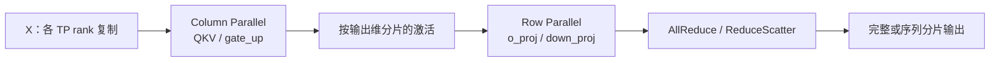
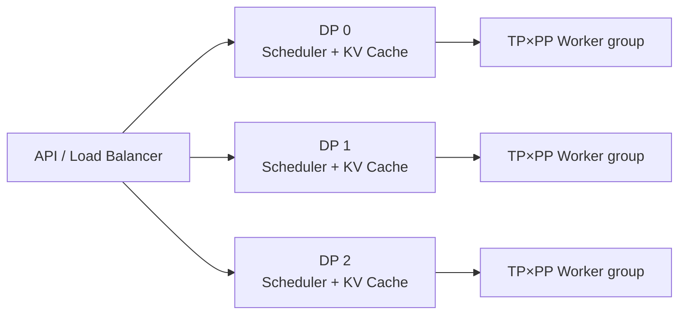
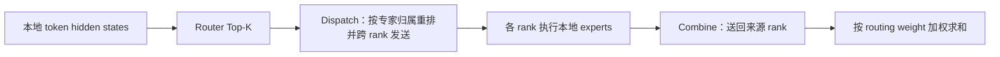
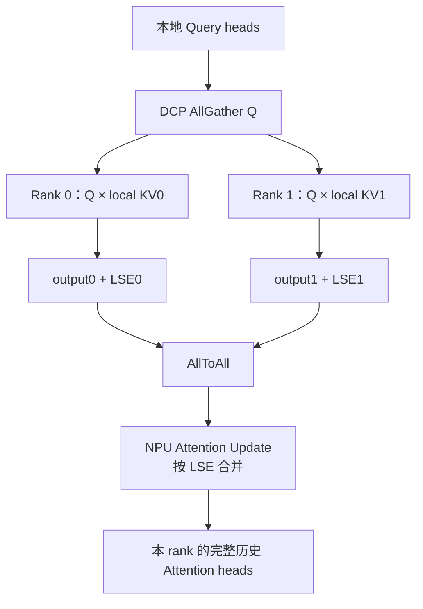
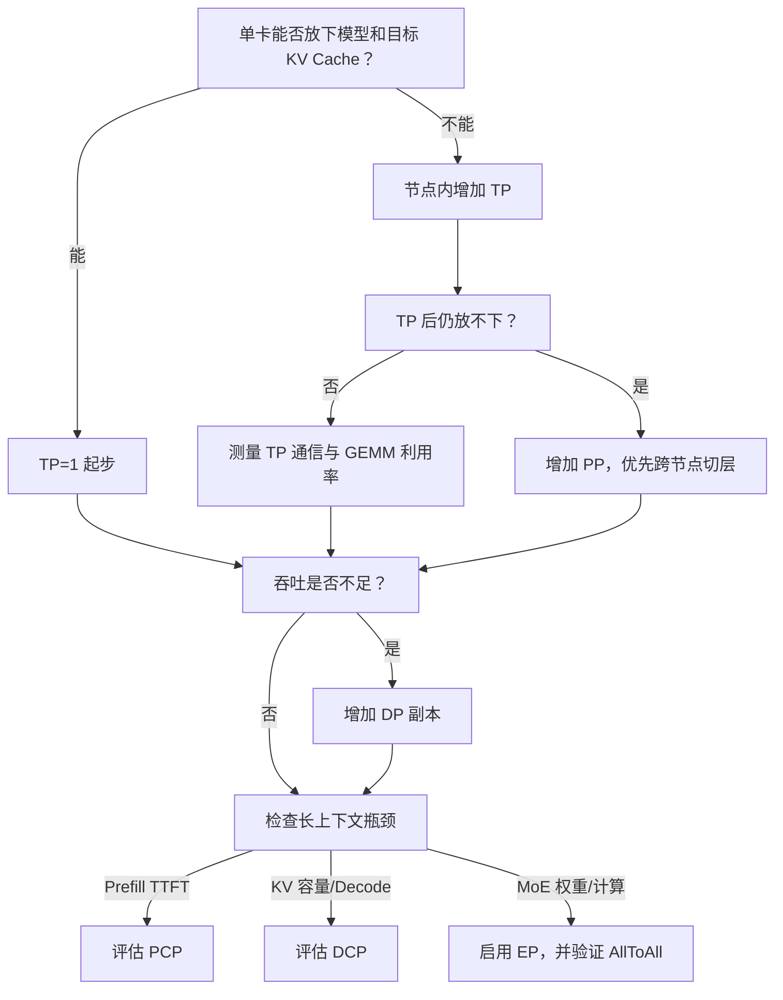

---
tags:
  - vLLM
  - vLLM Ascend
  - 分布式推理
  - 张量并行
  - 专家并行
  - 上下文并行
---

# 大模型并行策略与切分：结合 vLLM 和 vLLM Ascend 源码

!!! abstract "一句话总结"

    大模型并行不是把“GPU 数量”写成一个数字，而是选择**在哪个张量轴上切分**：DP 切请求，PP 切层，TP 切矩阵与 Attention Head，CP 切 token/KV 序列，EP 切专家。vLLM 负责构造这些并行组、调度请求并切分模型；vLLM Ascend 在此基础上把通信落到 HCCL、MC2 MoE Dispatch/Combine、NPU Attention 与平台专用的细粒度并行组。

---

## 1. 先建立五个切分轴

设一个 Decoder-only MoE 模型接收若干请求，Transformer 层中的主要对象是：

```text
请求批次:        B
序列/token 轴:   T
隐藏维度:        D
层数:            N
专家数:          E
```

常见并行策略只是选择其中一个轴切开：

| 策略 | 切分对象 | 每个 rank 拥有什么 | 主要通信 | 主要目标 |
|---|---|---|---|---|
| DP，Data Parallel | 请求/批次 $B$ | 一份完整或逻辑完整模型 | 调度同步；MoE 场景还会跨 DP 通信 | 扩吞吐 |
| PP，Pipeline Parallel | 层 $N$ | 连续一段 Transformer 层 | Stage 间 Send/Recv 激活 | 让超大模型跨更多设备 |
| TP，Tensor Parallel | 矩阵/Head $D,H$ | 每层参数的一块 | AllReduce、AllGather、ReduceScatter | 降低单卡权重占用并并行计算 |
| CP，Context Parallel | token/KV 轴 $T$ | 一段 query 或 KV 历史 | AllGather、AllToAll、输出归并 | 长 Prefill 加速或扩大 KV 容量 |
| EP，Expert Parallel | 专家 $E$ | 一部分专家权重 | Token Dispatch/Combine，通常是 AllToAll | 高效部署 MoE |

一个很实用的记忆方式是：

> **DP 复制模型换吞吐，PP 沿深度切模型，TP 沿宽度切层，CP 沿时间切上下文，EP 沿路由切专家。**

这些并行维度可以叠加。vLLM 当前 rank 布局可抽象为：

$$
\text{ExternalDP}\times\text{DP}\times\text{PP}\times\text{PCP}\times\text{TP}
$$

DCP 通常复用已有 TP/PCP rank，不一定增加进程数；EP 也是覆盖在 DP、PCP、TP rank 上的另一种分组方式，而不是再额外乘一遍设备数。

---

## 2. 阅读基线与源码地图

本文分析以下本地源码快照，不引用容易漂移的行号：

- vLLM：分支 `releases/v0.26.0`，提交 `568afb3a13806beb53bb2e6bd518269357b237c0`；
- vLLM Ascend：分支 `feat/v0.26.0rc-add-fastokens-dependency`，提交 `ba679baccb7c504788c22a5d0fdd0b1c7f9336e2`。

上游 vLLM 的核心阅读地图：

| 文件 | 关键职责 |
|---|---|
| `vllm/config/parallel.py` | `ParallelConfig`，校验 TP/PP/DP/PCP/DCP/EP 参数并计算 world size |
| `vllm/distributed/parallel_state.py` | 构造 World、TP、PP、DP、PCP、DCP、EP、EPLB 通信组 |
| `vllm/model_executor/layers/linear.py` | `ColumnParallelLinear`、`RowParallelLinear`、`QKVParallelLinear` 的权重切分与集合通信 |
| `vllm/model_executor/layers/vocab_parallel_embedding.py` | 词表并行 Embedding 与 LM Head |
| `vllm/model_executor/models/utils.py` | `make_layers` 按 PP rank 创建本地层，其他层放置占位符 |
| `vllm/v1/executor/multiproc_executor.py` | 启动 TP×PP×PCP Worker 并广播每轮执行 |
| `vllm/v1/worker/gpu_worker.py` | PP Stage 间异步收发中间张量 |
| `vllm/v1/engine/coordinator.py` | DP Engine 协调与负载信息 |
| `vllm/v1/worker/dp_utils.py` | DP rank 活跃状态同步、dummy forward 协调 |
| `vllm/v1/worker/cp_utils.py` | DCP token/KV 布局辅助逻辑 |
| `vllm/v1/kv_cache_interface.py` | KV Cache spec 根据 TP/DCP 计算本 rank 的 head 与 shard |

vLLM Ascend 的平台数据面：

| 文件 | 关键职责 |
|---|---|
| `vllm_ascend/platform.py` | 校验 Ascend 支持组合并选择通信/Attention 路径 |
| `vllm_ascend/distributed/parallel_state.py` | MC2、Prefill TP 与模块级细粒度 TP 通信组 |
| `vllm_ascend/worker/worker.py` | 设置 NPU rank/device，初始化分布式环境 |
| `vllm_ascend/worker/model_runner_v1.py` | 准备每轮张量、PP 交接、DP padding、DCP metadata |
| `vllm_ascend/attention/context_parallel/common_cp.py` | DCP 本地长度、AllGather 与 Attention 输出合并 |
| `vllm_ascend/attention/context_parallel/attention_cp.py` | GQA Attention 的 NPU DCP Prefill/Decode 路径 |
| `vllm_ascend/attention/context_parallel/mla_cp.py` | MLA 的 NPU DCP 路径 |
| `vllm_ascend/attention/context_parallel/dsa_cp.py` | DSA 的 CP Top-K、稀疏注意力与输出投影通信 |
| `vllm_ascend/ops/fused_moe/token_dispatcher.py` | AllToAll/MC2 Token Dispatch 与 Combine |
| `vllm_ascend/ascend_config.py` | MC2、EPLB、细粒度 TP 等 Ascend 扩展配置 |

!!! important "上游与插件的边界"

    vLLM Ascend 不是另一套独立调度器。多数请求调度、并行配置、PP 切层和模型层抽象来自上游 vLLM；Ascend 插件替换或扩展设备初始化、Attention backend、MoE 通信与 NPU 图执行。阅读时要先找到上游控制面，再跟到 Ascend 数据面。

---

## 3. TP：沿矩阵宽度切分单层

TP 是单机多卡推理最常见的起点。设线性层：

$$
Y=XW,\qquad
X\in\mathbb{R}^{T\times d_{in}},\quad
W\in\mathbb{R}^{d_{in}\times d_{out}}
$$

vLLM 主要组合 Column Parallel 与 Row Parallel。

### 3.1 Column Parallel：切输出维

把权重按输出维切成：

$$
W=[W_0,W_1,\dots,W_{p-1}]
$$

每个 TP rank 都拿到完整 $X$，只计算自己的输出分片：

$$
Y_i=XW_i
$$

因此 $Y_i$ 的最后一维是全量输出的 $1/p$。如果下一层能直接消费分片，就不需要马上通信；只有 `gather_output=True` 时才 AllGather。

在 `ColumnParallelLinear` 中：

- `output_size_per_partition = output_size / tp_size`；
- checkpoint 加载时按 `tp_rank * shard_size` 沿输出维取本地权重；
- Forward 先执行本地矩阵乘，按需调用 TP AllGather。

典型用途包括：

- Attention 的 Q/K/V 投影；
- MLP 的 gate/up 投影；
- 多个投影融合后的 `MergedColumnParallelLinear`。

### 3.2 Row Parallel：切输入维并归并部分和

下一层权重沿输入维切成：

$$
W=
\begin{bmatrix}
W_0\\W_1\\\vdots\\W_{p-1}
\end{bmatrix},
\qquad
X=[X_0,X_1,\dots,X_{p-1}]
$$

每个 rank 计算部分和：

$$
\hat Y_i=X_iW_i
$$

最终输出是：

$$
Y=\sum_{i=0}^{p-1}\hat Y_i
$$

所以 `RowParallelLinear` 默认在本地 GEMM 后执行 TP AllReduce。典型用途是 Attention 的 `o_proj` 与 MLP 的 `down_proj`。

Column→Row 配对很关键：第一个算子产生分片激活，第二个算子直接消费分片，最后才做一次规约，避免在两个矩阵乘之间反复 Gather。



### 3.3 QKV 不是简单三等分

`QKVParallelLinear` 还要处理 GQA/MQA：

- Query head 通常均匀切到 TP ranks；
- 若 `num_kv_heads >= tp_size`，KV heads 也切分；
- 若 `num_kv_heads < tp_size`，一个 KV head 会在多个 TP ranks 上复制；
- `num_kv_head_replicas = tp_size / num_kv_heads` 描述复制倍数。

这解释了为什么对 MLA/MQA 模型盲目增大 TP 不能持续降低 KV Cache：当 TP 数超过 KV head 数，切无可切，只能复制 KV。DCP 正是为继续沿 token 轴切 KV 而出现。

### 3.4 Embedding 与 LM Head 沿词表切

`VocabParallelEmbedding` 沿词表行切分：每个 TP rank 只保存一段 token id 范围。输入 token 不属于本 rank 时，本地结果置零，之后通过规约得到完整 embedding。

LM Head 可以复用同一分片方式，每个 rank 先产生局部词表 logits，再按采样实现需要 Gather、分布式 Top-K 或其他归并。

### 3.5 TP 的性能边界

TP 越大，单卡参数越少、单次 GEMM 越窄，集合通信却更多。它适合高速卡间互联，不适合无条件跨慢网络扩张。通常优先把一个 TP group 放在同一台有高带宽互联的机器内，再用 PP 跨节点。

---

## 4. PP：沿 Transformer 深度切层

设模型有 $N$ 层、PP size 为 $p$。vLLM 的 `make_layers` 调用 `get_pp_indices` 为当前 PP rank 计算 `[start_layer,end_layer)`：

```text
PP rank 0: layer 0 ... a-1
PP rank 1: layer a ... b-1
...
PP rank p-1: layer z ... N-1
```

不属于本 rank 的层位置使用 `PPMissingLayer` 占位，以保持模块路径和 checkpoint 名称稳定。Embedding 通常只在首 Stage 生效，Final Norm、LM Head 与采样只在末 Stage 生效。

### 4.1 运行时数据流

`gpu_worker.py` 的流程可以压缩成：

1. 非首 Stage 通过 PP group 异步接收 `IntermediateTensors`；
2. 当前 Stage 对本地层执行 Forward；
3. 非末 Stage 异步发送 hidden state/residual 给下一 Stage；
4. 末 Stage 计算 logits 和采样结果；
5. 必要时把输出广播回负责返回结果的 Worker。

当 TP 与 PP 同时开启时，每个 PP Stage 内还有一个 TP group。跨 Stage 发送时，vLLM 可让每个 TP rank 只发送相应切片，由接收侧 TP AllGather 重建，减少单 rank 发送压力。

### 4.2 层数不整除时如何分

`get_pp_indices` 默认尽量平均分层，但会考虑首尾 Stage 额外持有 Embedding、Norm、LM Head：余数通常优先放到中间或非末 Stage。还可通过 `VLLM_PP_LAYER_PARTITION` 手工指定每个 Stage 的层数。

这不是纯粹的层数问题。MoE 层、视觉编码器、稠密层与稀疏层计算量不同，实际部署应按耗时和显存 profile 调整，而不是只追求层数相等。

### 4.3 PP 的代价

- 请求必须依次穿过所有 Stage，单 token 延迟增加；
- Microbatch 不足时会出现 pipeline bubble；
- Stage 最慢者决定整条流水线吞吐；
- KV Cache 只保存本 Stage 层的部分，但每个 Stage 都要维护相同请求的调度语义。

所以 PP 更多是“模型已经无法靠合理 TP 放下”或“需要跨节点”时的容量策略，而非单机低延迟的第一选择。

---

## 5. DP：沿请求切分吞吐

传统 DP 的概念最简单：复制完整模型，每个副本处理不同请求。

在 vLLM 在线服务中，每个 DP rank 通常拥有独立 `EngineCore`、Scheduler 与 KV Cache。前端或外部负载均衡器把请求分发给不同 DP ranks：



这带来两个重要结论：

1. `--max-num-seqs` 等容量通常按 DP rank 生效；
2. Prefix Cache 也按 DP rank 独立，负载均衡若忽略前缀局部性，可能降低命中率。

### 5.1 稠密模型与 MoE 模型的 DP 不完全相同

对稠密模型，DP 副本可完全独立，最简单的做法甚至是启动多个互不关联的 vLLM 服务。

对 MoE + EP，Attention 可在各 DP rank 上独立处理不同请求，但专家层可能形成跨 DP 的 EP group。此时不同 DP rank 的 Forward 必须在集合通信处对齐；某个 rank 暂时没有请求时，也可能需要执行 dummy forward，避免其他 rank 在 MoE 通信中死锁。

vLLM 的 DP Coordinator 与 `dp_utils.py` 会同步“是否仍有未完成请求”等状态。理解这一点很重要：**启用 EP 后，DP 不再等于完全无通信的模型副本。**

### 5.2 三种在线负载均衡形态

vLLM 支持的部署思路包括：

- 内部负载均衡：一个入口管理多个 DP Engine；
- 外部负载均衡：每个 DP rank 独立暴露，由 Kubernetes/网关路由；
- Hybrid：节点内由 vLLM 分发，节点间由外部负载均衡。

源码中的 `data_parallel_size`、`data_parallel_size_local`、`data_parallel_rank`、`data_parallel_index` 正是在表达全局与本机 DP 拓扑。

---

## 6. EP：沿专家切权重，沿路由搬 token

MoE 层先为每个 token 选择 Top-K 专家。若有 $E$ 个专家、EP size 为 $p$，最简单的线性放置是：

$$
\text{rank }i\text{ owns experts }
\left[i\frac{E}{p},(i+1)\frac{E}{p}\right)
$$

vLLM 还支持 round-robin 放置与冗余专家。一次 EP Forward 的本质是：



### 6.1 vLLM 的 EP group 怎样覆盖 TP 与 DP

在常见 `PCP=1` 场景下：

$$
EP\_SIZE=TP\_SIZE\times DP\_SIZE
$$

Attention 层仍在每个 DP 副本内按 TP 切分；专家层则跨 DP×TP ranks 分布。当前源码在 PCP 开启时还把 PCP 轴纳入 EP group，因此更一般地是：

$$
EP\_SIZE=DP\times PCP\times TP
$$

`--enable-expert-parallel` 的语义是：MoE 层使用 Expert Parallel，而不是用普通 Tensor Parallel 处理所有专家。

### 6.2 Dispatch/Combine 比专家 GEMM 更可能成为瓶颈

EP 不只减少权重占用，还会改变 token 的物理位置。每轮都需要：

1. 根据 `topk_ids` 统计每个目标 rank 的 token 数；
2. permute，把发往同一专家的 token 排在一起；
3. AllToAll/AllToAll-v 分发；
4. 本地 grouped GEMM；
5. 反向 AllToAll，并按原 token 顺序 combine。

如果路由不均匀，某个热门专家所在 rank 会成为 straggler。EPLB 通过滑动窗口统计专家热度、重排或复制专家来缓解，但会引入权重迁移和额外状态。

### 6.3 vLLM Ascend 的 MC2 路径

Ascend 插件的 `token_dispatcher.py` 提供两类路径：

- 通用异步 AllToAll 路径；
- `TokenDispatcherWithMC2`，调用 `npu_moe_distribute_dispatch[_v2]` 与对应 Combine，将通信与 MoE 数据重排更紧密地融合。

`init_ascend_model_parallel` 为 DP×PCP×TP ranks 创建 `_MC2` group。Dispatcher 从 HCCL backend 取得通信域名称，并把 `topk_ids`、expert map、token capacity、量化尺度等一起交给 NPU 算子。

这条链路把控制面与数据面连接起来：

```text
vLLM Router / ParallelConfig
        ↓
EP group 与 expert_map
        ↓
vLLM Ascend MoETokenDispatcher
        ↓
HCCL / MC2 Dispatch → Grouped GEMM → Combine
```

---

## 7. CP：沿上下文 token 轴切分

Context Parallel 需要分 Prefill 和 Decode 理解，因为两阶段瓶颈不同。

### 7.1 PCP：把长 Prefill 的新 token 分给多卡

对于长度为 $T$ 的新 prompt、PCP size 为 $p$，最直观的切分是：

$$
X=[X_0,X_1,\dots,X_{p-1}],\qquad |X_i|\approx T/p
$$

每个 rank 只计算一段 token 的 Q/K/V 与 MLP。Attention 仍需要正确看到因果历史，因此常见两种实现是：

- Partial Q、Full KV：Gather K/V 后，各 rank 计算自己 query 的输出；
- Partial Q、Partial KV：通过 Ring Attention 或分块交换让 query 逐段看到 KV。

vLLM 的 `prefill_context_parallel_size` 会扩展 Worker world size：

$$
world\_size=TP\times PP\times PCP
$$

它的目标主要是降低超长 Prefill 的 TTFT，而不是增加模型副本吞吐。

### 7.2 DCP：把 Decode KV Cache 沿时间切开

Decode 每步 query 很少，瓶颈是读取很长的 KV Cache。DCP 让 rank $i$ 只保存部分历史 token：

$$
KV=KV_0\cup KV_1\cup\dots\cup KV_{p-1}
$$

每个 rank 对本地 KV 计算局部注意力：

$$
l_i=\log\sum_{j\in KV_i}e^{s_j},\qquad
o_i=\frac{\sum_{j\in KV_i}e^{s_j}v_j}{e^{l_i}}
$$

全局输出不能直接平均，必须用各分片的 LogSumExp 正确归一化：

$$
l=\log\sum_i e^{l_i}
$$

$$
o=\sum_i e^{l_i-l}o_i
$$

因此 DCP Attention kernel 往往需要同时返回局部 `output` 与 `softmax_lse`。

### 7.3 DCP 为什么不增加设备数

当前 vLLM 中 DCP 通常复用 TP ranks：

- `PCP=1` 时要求 `tp_size % dcp_size == 0`；
- DCP group 从已有 TP rank 中划分；
- `decode_context_parallel_size` 不额外乘进 `world_size`；
- 它改变 KV Cache 与 Attention 的分工，而不是创建更多 Worker。

以 MLA 的单 latent KV head 为例，TP=8 时缓存可能在 8 个 rank 上重复。DCP=8 可把历史 token 分给这 8 个 rank，消除时间轴复制，但每层 Decode 会增加 query/output 通信。

### 7.4 vLLM Ascend 的交错 KV 布局

Ascend 的 DCP 按 `cp_kv_cache_interleave_size` 将连续 token 小块轮流分配给各 rank。若 interleave size 为 $I$、DCP size 为 $p$，token block 的拥有者可理解为：

$$
owner(t)=\left\lfloor\frac{t}{I}\right\rfloor\bmod p
$$

`get_dcp_local_seq_lens` 根据全局 `seq_lens` 计算每个 DCP rank 的本地 KV 长度；BlockTable 与 slot mapping 再把逻辑位置翻译成本地分页缓存地址。

对 GQA Decode，`AscendAttentionDCPImpl` 的关键数据流是：

1. 在 DCP group 内 AllGather query head；
2. 每个 rank 用本地 K/V、`block_table` 和本地 `actual_seq_lengths_kv` 调用 `npu_fused_infer_attention_score`；
3. 算子返回局部 Attention output 与 softmax LSE；
4. 把 output 和 LSE 拼接后做 AllToAll；
5. 用稳定的 LogSumExp 公式合并各 KV 分片结果；
6. 每个 rank 取回自己负责的 head 分片，继续 `o_proj`。



MLA、DSA 路径遵循同一数学原则，但缓存内容和候选合并不同：

- MLA 切 latent KV，并合并局部输出与 LSE；
- DSA 还要在不同 rank 的局部候选中选出全局 Top-K，之后才能执行稀疏主注意力；
- SFA/DSA 的 Indexer 是否复制、Top-K 是否跨 rank Gather，会影响通信量与平台限制。

---

## 8. Sequence Parallel：它与 CP 不是一回事

Sequence Parallel（SP）也会切 token 轴，但目的通常是让 TP/EP 中间激活不必在每个 rank 上复制，而不是把长上下文 KV 分页到不同设备。

一个典型 MoE 数据流是：

```text
Attention Row Parallel
    ↓ ReduceScatter（沿 token 轴）
每个 TP rank 只保留一段 tokens
    ↓ EP Dispatch / Experts / Combine
    ↓ AllGather（需要恢复复制激活时）
下一层
```

`ParallelConfig.use_sequence_parallel_moe` 只在特定 AllToAll backend、EP 已启用、TP>1、DP>1 等条件下成立。模型层会让 Attention 的 Row Parallel 暂不 AllReduce，改为 ReduceScatter，避免每个 TP rank 对同一批 token 重复执行专家与通信。

区别可以这样记：

| 对比 | Sequence Parallel | Context Parallel |
|---|---|---|
| 主要对象 | 层间激活 token | Attention 的 query/KV 历史 |
| 主要目标 | 避免 TP/EP 重复激活与专家计算 | 长上下文 TTFT 或 KV 容量 |
| 生命周期 | 常在一个或几个子层间切开再恢复 | 贯穿请求缓存与 Attention metadata |
| 是否改变 KV 归属 | 通常不改变 | DCP 明确改变 |

---

## 9. vLLM 如何把所有并行维度组织成通信组

`initialize_model_parallel` 先把全局 ranks reshape 为：

```text
[ExternalDP, DP, PP, PCP, TP]
```

再把目标维度 transpose 到最后，生成各类 group：

- TP：固定 DP/PP/PCP，改变 TP；
- PP：固定 DP/PCP/TP，改变 PP；
- PCP：固定 DP/PP/TP，改变 PCP；
- DP：固定 PP/PCP/TP，改变 DP；
- EP：固定 PP，把 DP×PCP×TP 展平；
- DCP：从 PCP/TP 轴中划出指定大小。

### 9.1 一个 16 卡例子

设：

```text
TP=2, PP=2, PCP=1, DP=4
总设备数 = 2 × 2 × 1 × 4 = 16
```

按源码的 rank 排布：

```text
TP groups: [0,1], [2,3], [4,5], [6,7], ...
PP groups: [0,2], [1,3], [4,6], [5,7], ...
DP groups: [0,4,8,12], [1,5,9,13], ...
```

若开启 EP，PP stage 0 的一个 EP group 为：

```text
[0,1,4,5,8,9,12,13]
```

PP stage 1 则是：

```text
[2,3,6,7,10,11,14,15]
```

此时各维度对模型的影响是：

- 每个 PP rank 只持有约一半层；
- 每层 Attention/稠密矩阵在两个 TP rank 上切分；
- 四个 DP Engine 处理四批独立请求，并各自维护 KV Cache；
- 每个 PP stage 的专家分布在 8 个 DP×TP ranks 上；
- 若再设置 DCP=2，它复用每个 TP group 的两张卡，把 KV 时间轴切成两份，不增加第 17 张卡。

### 9.2 Executor backend 不是新的并行策略

`uni`、`mp`、`ray`、`external_launcher` 描述 Worker 如何被创建和控制，不描述张量沿哪个轴切分：

- `uni`：单 Worker；
- `mp`：本地或原生多进程；
- `ray`：用 Ray 安排跨节点 Worker；
- `external_launcher`：由 `torchrun` 等外部系统提供 ranks。

把“Ray 并行”与“TP/PP/DP”放在同一层比较是常见误区。Ray 是执行与资源编排后端，TP/PP/DP 才是计算切分策略。

---

## 10. vLLM Ascend 额外增加了哪些并行能力

### 10.1 设备通信由 HCCL/NPU communicator 承接

上游 `GroupCoordinator` 仍提供统一的 AllReduce、AllGather、ReduceScatter、Send/Recv 接口；Ascend 平台注册 NPU communicator，让这些集合通信落到 HCCL。模型代码因此可以复用上游 TP/PP 抽象，Attention 与 MoE 热路径再进入平台融合算子。

### 10.2 MC2 为 MoE 建立专用通信域

普通 EP group 用于表达专家拓扑；Ascend 额外构造 `_MC2` GroupCoordinator，向 `npu_moe_distribute_dispatch` 提供 HCCL group name、rank id 与 world size。它服务的是融合 MoE 通信算子，并不改变“专家沿 EP rank 切分”的数学语义。

### 10.3 细粒度 TP：不同模块可以使用不同并行组

`FinegrainedTPConfig` 支持为以下模块指定独立 TP size：

- `lmhead_tensor_parallel_size`；
- `embedding_tensor_parallel_size`；
- `oproj_tensor_parallel_size`；
- `mlp_tensor_parallel_size`；
- `olora_tensor_parallel_size`。

这些 group 当前主要从 DP 轴中再分组。例如 MoE 部署中 Attention 可能采用 DP 复制，但巨大的 LM Head 或某个输出投影仍希望在若干 DP ranks 间切开。

这是一种“模块级混合并行”：全局 `TP=1` 不代表每个模块都必须完全复制。

!!! warning "细粒度 TP 有明确边界"

    当前源码要求它只用于 MoE 模型，模块 TP size 必须整除 DP size；`oproj_tensor_parallel_size` 还要求标准 TP=1、图模式，并限定在 P/D 分离的 Decode 节点。它是平台优化开关，不应当成任意组合都成立的通用 TP。

### 10.4 Ascend Forward Context 负责让图执行看到并行状态

ACL Graph/NPU Graph 要求通信组、workspace 与张量 shape 在捕获和回放时保持一致。vLLM Ascend 会在 Forward Context 中准备：

- 每种 Attention backend 的 metadata；
- DCP 本地序列长度、block table 与 mask；
- MoE token capacity、MC2 mask 与量化信息；
- 图捕获使用的固定 workspace 和通信 buffer。

这也是为什么很多并行错误只在图模式暴露：并行组本身可能正确，但捕获时的 shape、实际请求的 token 数或 buffer capacity 与回放不一致。

---

## 11. 怎样为实际部署选择并行组合

### 11.1 稠密模型，单机能放下

优先从 TP 开始：

```text
TP = 单机高速互联设备数
PP = 1
DP = 剩余可复制的模型组数
```

先找到能放下权重并留出足够 KV Cache 的最小 TP，再用 DP 扩吞吐。TP 过大会让 GEMM 变窄、通信占比升高。

### 11.2 稠密模型，需要跨节点

常见组合是节点内 TP、节点间 PP：

```text
TP = 每节点设备数
PP = 节点数
```

这样高频 TP AllReduce 留在高速节点内，跨节点主要传 Stage 间激活。之后再根据并发需求复制整套 TP×PP 形成 DP。

### 11.3 MoE 模型

如果 Attention 权重较小、专家权重占大头，常见方向是：

```text
Attention: DP 或小 TP
Experts:   大 EP = DP × TP
```

这能让 Attention 在每个 DP rank 独立服务请求，同时把大量专家摊到更多卡。但前提是 AllToAll 网络、路由均衡和 dummy forward 同步成本可接受。

### 11.4 超长上下文

分两步判断：

1. TTFT 太高：考虑 PCP，把 Prefill query/token 计算摊开；
2. KV Cache 放不下或并发太低：先用 TP 切 KV heads，再用 DCP 切历史 token。

对 MLA/MQA 等 KV head 很少的模型，TP 很快会进入 KV 复制区间，DCP 的价值尤其明显。

### 11.5 一个简化决策流



---

## 12. 常见失败模式与调试清单

### 12.1 形状不能整除

典型约束包括：

- Attention Query heads 必须能被 TP 合理切分；
- KV heads 少于 TP 时，TP 必须能按整数倍复制；
- Column/Row Parallel 的目标维度必须可切；
- 专家数、冗余专家布局与 EP size 必须形成合法映射；
- `tp_size % dcp_size == 0`，或 PCP+DCP 满足源码允许的组合；
- 量化 block size 还可能给权重 shard 增加额外对齐约束。

### 12.2 通信组看似正确，rank 顺序却错了

优先核对启动日志中的 DP/PP/PCP/TP/DCP/EP rank，而不是只看全局 rank。一个 Worker 可以同时是 `tp_rank=1`、`pp_rank=0`、`dp_rank=3`、`ep_rank=7`，不同集合通信必须使用对应 group。

### 12.3 PP 卡住

检查：

- 所有 Stage 是否收到同一轮 SchedulerOutput；
- 中间张量的 key、shape、dtype 是否一致；
- 发送方和接收方是否对 `residual` 使用相同的 TP/SP Gather 规则；
- 末 Stage 的输出是否由 Executor 预期的 `output_rank` 返回。

### 12.4 EP 吞吐不升反降

检查：

- 每个 expert 的 token 数是否严重倾斜；
- Dispatch/Combine 时间是否超过 grouped GEMM；
- AllToAll 是否跨越低带宽链路；
- token capacity/padding 是否过大；
- EPLB 是否真的降低了最大 rank 负载，而非只改善平均值；
- Ascend MC2 使用的 HCCL group 与 expert map 是否一致。

### 12.5 DCP 结果不一致或性能差

检查：

- 全局 token 到 DCP rank 的 interleave 规则；
- `block_table`、slot mapping 与本地 KV 长度是否使用同一规则；
- Attention kernel 是否返回并正确合并 softmax LSE；
- 稀疏 Attention 是否先形成全局 Top-K；
- Query AllGather、output/LSE AllToAll 是否发生在正确 stream；
- 图捕获的 workspace 与实际 token bucket 是否匹配。

### 12.6 推荐的排查顺序

1. 用 TP=PP=DP=PCP=DCP=1 验证单卡数值；
2. 每次只增加一个并行维度，做固定输入的 greedy 对比；
3. 打印每个 rank 的本地权重 shape、层区间与 KV spec；
4. 再打开量化、图模式、Chunked Prefill 和 Speculative Decoding；
5. 最后做真实并发 profile，分别观察计算、集合通信与空泡。

!!! note "硬件验证范围"

    本文根据源码静态分析了 Ascend 通信与算子调用链，但当前环境未连接多卡 NPU，未执行 HCCL/MC2/DCP 的硬件数值与性能验证。实际部署应以目标 CANN、torch-npu、vLLM Ascend 版本组合的支持矩阵和多卡测试为准。

---

## 13. 总结

大模型并行最核心的不是记参数名，而是明确每个 rank 到底少保存、少计算了什么：

- **TP** 少保存一部分矩阵或 Attention heads，用层内集合通信换容量；
- **PP** 少保存一部分层，用 Stage 间激活传输换容量；
- **DP** 不少保存模型，用更多副本换请求吞吐；
- **EP** 少保存一部分专家，用 token 路由与 AllToAll 换 MoE 容量；
- **PCP** 少计算一部分 Prefill token，用上下文通信换 TTFT；
- **DCP** 少保存一部分历史 KV，用局部 Attention 与 LSE 归并换缓存容量；
- **SP** 少复制一部分中间 token 激活，用 ReduceScatter/AllGather 降低 TP×EP 重复工作。

在 vLLM 中，这些语义由 `ParallelConfig`、rank grid、模型层切分与 Scheduler/Worker 协同建立；在 vLLM Ascend 中，它们最终变成 HCCL 通信组、NPU Attention metadata、MC2 Dispatch/Combine 和图模式 buffer。只有把“配置参数 → rank group → 本地张量 → 集合通信 → 输出归并”完整连起来，才算真正理解一次分布式推理。
