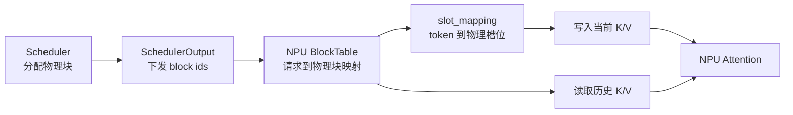
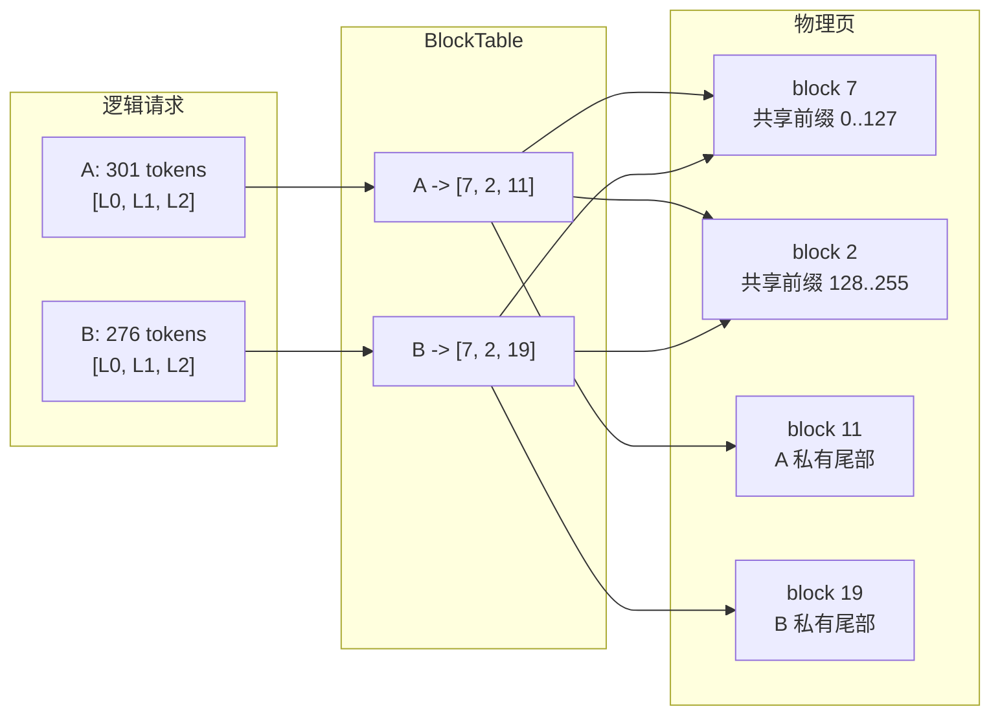
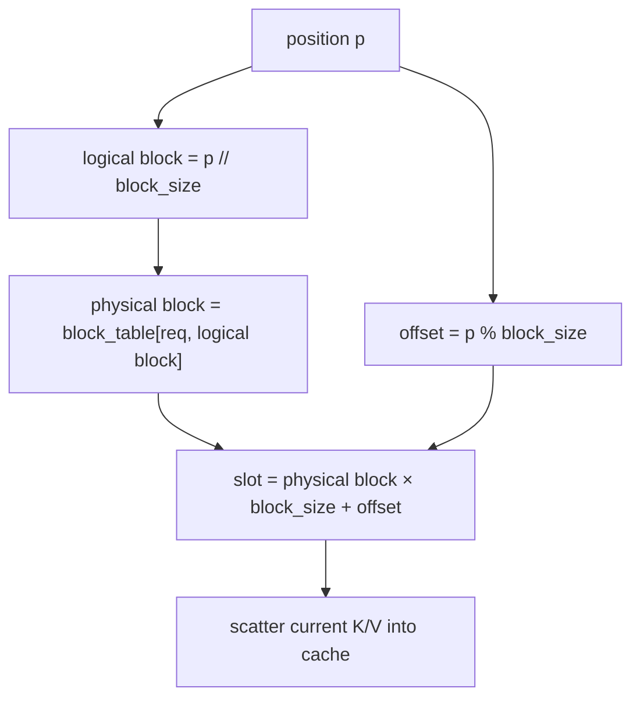
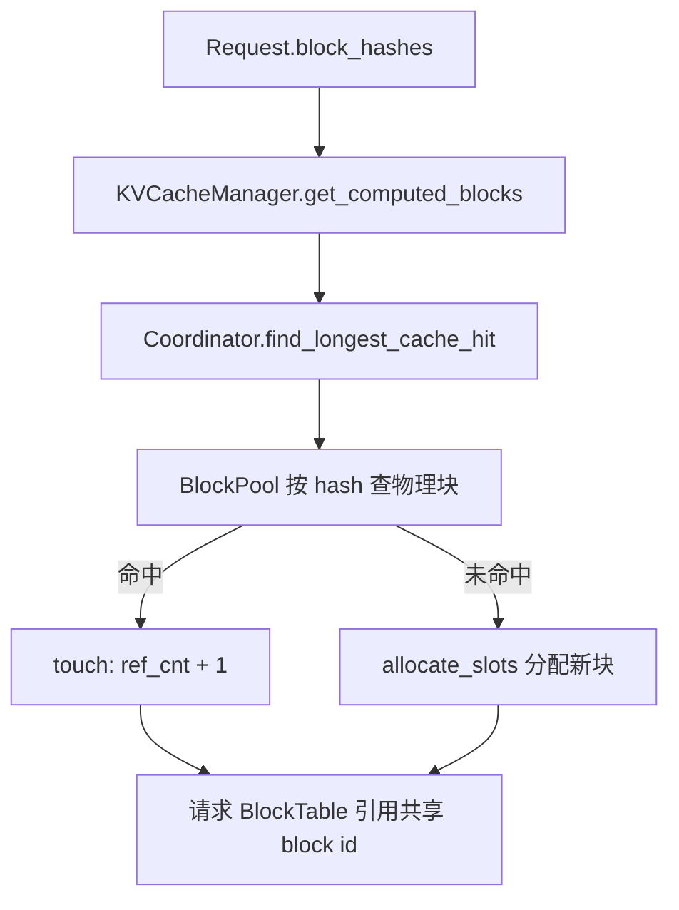

---
tags:
  - vLLM
  - vLLM Ascend
  - KV Cache
  - PagedAttention
  - NPU
---

# 从 KV Cache 到 PagedAttention：vLLM Ascend 代码级拆解

!!! abstract "一句话总结"
    KV Cache 解决的是“历史 K/V 不要重复计算”，PagedAttention 解决的是“历史 K/V 如何按页分配、定位和读取”。在 vLLM V1 中，上游调度器管理逻辑页、物理块和前缀复用；vLLM Ascend 把调度结果转换成 NPU 上的 `block_table` 与 `slot_mapping`，先把当前 token 的 K/V 写进分页缓存，再根据运行形态选择独立 PagedAttention 算子或带分页能力的融合注意力算子。

本文按代码调用链解释 KV Cache 和 PagedAttention，不绑定源码行号。分析基于以下本地分支：

- vLLM：`releases/v0.26.0`
- vLLM Ascend：`releases/v0.26.0rc`

版本升级后，优先按文中列出的文件、类和数据流重新定位实现。

---

## 一、先建立正确的心智模型

KV Cache 和 PagedAttention 经常被混成一个概念，其实它们位于不同层次。

| 层次 | 解决的问题 | 核心对象 |
| --- | --- | --- |
| Transformer 计算 | 为什么要缓存历史信息 | Key、Value |
| 缓存布局 | K/V 在设备内存中怎样组织 | KV cache tensor、page/block |
| 调度与分配 | 一个请求占哪些物理块 | `KVCacheManager`、`BlockPool` |
| 地址翻译 | token 应写入哪里、历史 token 在哪里 | `block_table`、`slot_mapping` |
| NPU 执行 | 怎样写缓存并完成注意力 | scatter/reshape-and-cache、PagedAttention、FIA |

完整链路可以压缩成一句话：

> 调度器给请求分配物理块 → Worker 把块号写进 BlockTable → 根据 token position 生成 slot mapping → 当前 K/V 按 slot 写入缓存 → 注意力算子根据 BlockTable 读取历史 K/V。



### 1.1 推荐的源码阅读地图

上游 vLLM 负责控制面：

| 文件 | 主要职责 |
| --- | --- |
| `vllm/v1/kv_cache_interface.py` | 定义 KV cache spec、group、tensor config 和页大小 |
| `vllm/v1/engine/core.py` | 启动时收集 spec、探测显存、生成并下发 KV cache 配置 |
| `vllm/v1/core/kv_cache_utils.py` | 分组、容量规划、块哈希及各种缓存工具 |
| `vllm/v1/core/kv_cache_manager.py` | 面向 Scheduler 的分配、释放和命中接口 |
| `vllm/v1/core/kv_cache_coordinator.py` | 协调一个或多个 KV cache group |
| `vllm/v1/core/single_type_kv_cache_manager.py` | Full Attention、Sliding Window、Mamba 等单类缓存策略 |
| `vllm/v1/core/block_pool.py` | 物理块池、引用计数、空闲队列和前缀缓存索引 |
| `vllm/v1/core/sched/scheduler.py` | 在每轮调度中查询命中并申请新 block |
| `vllm/v1/core/sched/output.py` | 把新 block id 等调度结果传给 Worker |
| `vllm/v1/request.py` | 保存请求 token、已计算 token 数和链式 block hash |

vLLM Ascend 负责 NPU 数据面：

| 文件 | 主要职责 |
| --- | --- |
| `vllm_ascend/worker/worker.py` | NPU 显存 profiling，并触发 KV cache 初始化 |
| `vllm_ascend/worker/model_runner_v1.py` | 生成 Ascend spec、分配缓存、同步 BlockTable、构造注意力元数据 |
| `vllm_ascend/worker/npu_input_batch.py` | 保存运行批次，并持有多组 BlockTable |
| `vllm_ascend/worker/block_table.py` | 维护 CPU/NPU 双缓冲页表并计算 slot mapping |
| `vllm_ascend/core/kv_cache_interface.py` | MLA、SFA、Sliding-Window MLA 等 Ascend 专用 spec |
| `vllm_ascend/models/layer/attention/layer.py` | Attention 层声明自己的缓存需求 |
| `vllm_ascend/attention/attention_v1.py` | 构造 Ascend attention metadata，写 KV，并派发 PA/FIA |
| `vllm_ascend/attention/utils.py` | PagedAttention 选择条件、图模式 workspace 等辅助逻辑 |
| `vllm_ascend/device/device_op.py` | 屏蔽不同 Ascend 代际的 KV 写入与注意力算子差异 |

---

## 二、从两个真实请求出发，把完整流程跑一遍

先不继续堆概念，直接构造一个贯穿全文的请求。下面的数值是为了能手工验证地址而选取的，但每一步都对应真实代码路径。

### 2.1 模型与运行配置

假设当前 TP rank 上是一个普通 GQA 模型：

```text
本 rank 的 Attention 层数:      32
num_query_heads:                32
num_kv_heads:                    8
head_size:                     128
KV cache dtype:              bf16
KV cache groups:                 1
物理 block_size:               128 tokens
Prefix Caching:             enabled
Chunked Prefill:            enabled
单轮 long prefill 上限:         256 tokens
Speculative Decoding:       disabled
DCP / KV Connector:         disabled
```

普通 KV 页在单层上的大小为：

$$
2 \times 128 \times 8 \times 128 \times 2
= 524288\ \text{bytes}
= 512\ \text{KiB}
$$

32 层共用一套 block id 语义，因此调度器分配一个 block，实际代表当前 rank 上所有 32 层都要提供同编号的一页：

$$
512\ \text{KiB} \times 32 = 16\ \text{MiB}
$$

!!! important "block id 不是只对应某一层"
    如果请求拿到物理块 `7`，第 0 层会使用自己的 `key_cache[7]`、`value_cache[7]`，第 1 层也使用自己的第 7 页，直到本 PP rank 的最后一层。BlockTable 在同一个 KV cache group 内被各层共享，容量规划已经把所有层的 page bytes 算进一个调度 block 的成本。

### 2.2 两个请求

请求 A：

```text
request_id: A
prompt:     300 tokens，记作 a0 ... a299
max_tokens: 3
```

请求 B 稍后到达：

```text
request_id: B
prompt:     276 tokens
            前 256 个 token 与 A 完全相同：a0 ... a255
            后 20 个 token 不同：b256 ... b275
max_tokens: 2
```

假设 BlockPool 此时依次给出物理块：

```text
A 的前两个块:  [7, 2]
A 的尾块:      [11]
B 的私有尾块:  [19]
```

这些 block id 是示例性的合法分配结果。真实编号取决于空闲队列和驱逐顺序，但不影响地址计算。

### 2.3 请求 A 进入 Engine Core：先生成 hash，但没有缓存命中

`vllm/v1/request.py` 创建 `Request A` 后保存：

```text
num_tokens            = 300
num_prompt_tokens     = 300
num_computed_tokens   = 0
all_token_ids         = [a0, ..., a299]
```

请求通过 `vllm/v1/core/kv_cache_utils.py` 的 block hasher 生成完整块的链式 hash：

```text
h0 = hash(None, a0 ... a127, extra_keys)
h1 = hash(h0,   a128 ... a255, extra_keys)
```

最后的 `a256 ... a299` 只有 44 个 token，不足 128，所以此时不会生成第三个完整 block hash。

Scheduler 在 `vllm/v1/core/sched/scheduler.py` 中对等待请求调用：

```text
KVCacheManager.get_computed_blocks(A)
```

`BlockPool` 中还没有 `h0` 和 `h1`，所以结果是：

```text
new_computed_blocks             = empty
num_new_local_computed_tokens   = 0
shared_prefix_boundary          = 0
```

这一步只查“已经存在的相同前缀”，不会读取 NPU tensor。

### 2.4 A 的第一轮 Prefill：调度 256 token

由于 long prefill 上限是 256，Scheduler 本轮只调度 `a0 ... a255`：

```text
num_new_tokens = min(300, 256, token_budget) = 256
```

`KVCacheManager.allocate_slots` 计算至少需要：

$$
\left\lceil\frac{256}{128}\right\rceil = 2\ \text{blocks}
$$

`BlockPool` 返回 `[7, 2]`。控制面的请求状态变为：

```text
A.req_to_blocks = [[block 7, block 2]]
```

单 KV group 下，外层列表只有一组。Scheduler 构造的关键信息可以理解为：

```text
scheduled_new_reqs:
  req_id: A
  block_ids: ([7, 2],)
  num_computed_tokens: 0

num_scheduled_tokens:
  A: 256
```

这里是新请求，所以 `NewRequestData.block_ids` 携带请求当前的完整 BlockTable，而不是只携带增量。

#### Worker 如何接住这份调度结果

Ascend `NPUModelRunner` 继承上游 ModelRunner 的持久批次更新逻辑：

1. 创建 `CachedRequestState(A)`；
2. 把 300 个 prompt token 保存到 `NPUInputBatch` 的 CPU token buffer；
3. 写入 `num_computed_tokens = 0`；
4. 调用 `block_table.add_row(([7, 2],), req_index)`。

假设 A 是 batch 中第 0 个请求，CPU 侧页表为：

```text
block_table[0] = [7, 2, 0, 0, ...]
num_blocks_per_row[0] = 2
```

后面的 0 只是未使用区域，不属于 A 的有效页。

#### positions、query_start_loc 和 seq_lens

`vllm_ascend/worker/model_runner_v1.py` 的输入准备阶段生成：

```text
positions       = [0, 1, 2, ..., 255]
query_start_loc = [0, 256]
seq_lens        = [256]
```

三者的语义不同：

- `positions`：每个本轮 token 在各自请求中的绝对位置；
- `query_start_loc`：扁平 token batch 中每个请求的 query 边界；
- `seq_lens`：写入本轮 token 后，每个请求可见的完整 KV 长度。

#### slot_mapping 的真实结果

`vllm_ascend/worker/block_table.py` 根据 position 和 BlockTable 计算：

```text
position 0   -> block_table[0, 0] = 7 -> slot 7  * 128 + 0   = 896
position 127 -> block_table[0, 0] = 7 -> slot 7  * 128 + 127 = 1023
position 128 -> block_table[0, 1] = 2 -> slot 2  * 128 + 0   = 256
position 255 -> block_table[0, 1] = 2 -> slot 2  * 128 + 127 = 383
```

因此完整结果是两段不连续区间：

```text
slot_mapping = [896 ... 1023, 256 ... 383]
```

这正是分页的意义：逻辑位置 127 和 128 相邻，物理位置却可以从 1023 跳到 256。

#### 每一层如何执行

进入某个普通 Attention 层时：

```text
query: [256, 32, 128]
key:   [256,  8, 128]
value: [256,  8, 128]
```

`AscendAttentionBackendImpl.forward` 先调用 `reshape_and_cache`：

```text
DeviceOperator.reshape_and_cache(
    key,
    value,
    key_cache,
    value_cache,
    slot_mapping,
)
```

对当前层而言，写入效果是：

```text
key[0:128]    -> key_cache[7, 0:128]
value[0:128]  -> value_cache[7, 0:128]

key[128:256]   -> key_cache[2, 0:128]
value[128:256] -> value_cache[2, 0:128]
```

因为 batch 中所有请求的 `num_computed_tokens` 都是 0，`_build_attn_state` 选择 `PrefillNoCache`。本轮没有历史 cache 要读，Attention 使用当前 K/V 完成 causal prefill；但 K/V 已经写入分页缓存，供下一轮使用。

这个过程会在本 rank 的每一个 Attention 层重复，BlockTable 和 slot mapping 相同，实际 key/value cache tensor 各自独立。

### 2.5 A 的第二轮 Prefill：只追加一个物理块

第一轮完成后，Engine Core 中 A 的 `num_computed_tokens` 已推进到 256。还剩：

```text
a256 ... a299，共 44 tokens
```

已有 `[7, 2]` 提供 256 个槽位，但总长度要达到 300，因此还需要一个 block。BlockPool 分配 `[11]`。

这次 A 已经是运行中请求，`CachedRequestData` 只传增量：

```text
scheduled_cached_reqs:
  req_ids: [A]
  new_block_ids: [([11],)]
  num_computed_tokens: [256]

num_scheduled_tokens:
  A: 44
```

Worker 收到后执行 `block_table.append_row`：

```text
before: [7, 2]
append: [11]
after:  [7, 2, 11]
```

本轮元数据为：

```text
positions       = [256, ..., 299]
query_start_loc = [0, 44]
seq_lens        = [300]
slot_mapping    = [11 * 128 + 0, ..., 11 * 128 + 43]
                = [1408, ..., 1451]
```

此时 `num_computed_tokens != 0`，调度 token 数也不全是 1；启用 Chunked Prefill 时，AttentionState 是 `ChunkedPrefill`。

缓存与计算分别做两件事：

1. 当前 44 个 K/V 写入第 11 页的前 44 个 slot；
2. FIA 根据 `[7, 2, 11]` 读取前 256 个历史 token，并把当前 K/V 纳入 causal attention。

最后一个 prompt token `a299` 产生 logits，Sampler 生成 A 的第一个输出 token，记作 `y0`。注意：`y0` 此时只是采样结果，它的 K/V 要到下一轮模型 forward 才会生成。

### 2.6 A 的第一轮 Decode：不需要新 block

下一轮要把 `y0` 作为 position 300 输入模型。第 11 页还有大量空位，所以 Scheduler 不分配新 block：

```text
A BlockTable:      [7, 2, 11]
new_block_ids:     None
num_scheduled:     1
num_computed:      300
position:          300
```

slot 为：

$$
11 \times 128 + (300 \bmod 128)
= 1408 + 44
= 1452
$$

Worker 构造：

```text
query_start_loc = [0, 1]
seq_lens        = [301]
slot_mapping    = [1452]
```

每层先把 `y0` 的 K/V 写入 `key_cache[11, 44]` 和 `value_cache[11, 44]`，然后进行注意力。

因为所有请求本轮都只调度一个 token，状态为 `DecodeOnly`。如果 `using_paged_attention` 同时满足硬件、图模式、head size 和 runtime shape 条件，就调用专用 `_npu_paged_attention`：

```text
query:        [1, 32, 128]
block_table: [[7, 2, 11, ...]]
context_lens: [301]
```

kernel 按逻辑顺序读取：

```text
物理页 7 的 128 tokens
-> 物理页 2 的 128 tokens
-> 物理页 11 的前 45 tokens
```

虽然物理地址不连续，Attention 看到的仍是长度 301 的连续历史。如果专用 PA 条件不满足，同样的分页缓存和 BlockTable 会交给 Decode FIA 路径。

### 2.7 B 到达：Prefix Caching 命中两个完整块

现在 B 带着 276-token prompt 到达。它的前两个 hash 为：

```text
B.h0 == A.h0
B.h1 == A.h1
```

最后 20 个 token 与 A 不同，而且不足一个完整 hash block。

`KVCacheManager.get_computed_blocks(B)` 逐块查询 `BlockPool`：

```text
h0 -> physical block 7
h1 -> physical block 2
```

得到：

```text
new_computed_blocks            = ([7, 2],)
num_new_local_computed_tokens  = 256
```

`BlockPool.touch([7, 2])` 把引用计数从 A 单独引用变成 A、B 共同引用：

```text
block 7: ref_cnt 1 -> 2
block 2: ref_cnt 1 -> 2
```

B 只需计算不同的 20-token suffix。`allocate_slots` 先把命中块挂到 B，再从 BlockPool 分配私有尾块 `[19]`：

```text
B.req_to_blocks = [[7, 2, 19]]
B.num_computed_tokens = 256
B.num_new_tokens = 20
```

B 是新进入 Worker 的请求，所以 `NewRequestData` 携带完整行：

```text
block_ids: ([7, 2, 19],)
num_computed_tokens: 256
```

注意 B 的逻辑块 2 不能使用 A 的物理块 11：两者从 position 256 开始内容已经不同，而且尾页仍会继续写入。B 必须拥有独立可写尾页 19。

### 2.8 最有代表性的一轮：A Decode 与 B Prefill 混跑

假设同一轮中：

- A 继续处理 position 300 的 `y0`，1 token；
- B 处理 position 256 到 275 的 suffix，20 tokens。

扁平 batch 可以表示为：

```text
request order        = [A, B]
num_scheduled_tokens = [1, 20]
positions            = [300, 256, 257, ..., 275]
query_start_loc      = [0, 1, 21]
seq_lens             = [301, 276]
```

BlockTable 是：

```text
request A -> [7, 2, 11]
request B -> [7, 2, 19]

block_table = [
  [7, 2, 11, 0, ...],
  [7, 2, 19, 0, ...],
]
```

slot mapping 是：

```text
A position 300      -> 11 * 128 + 44 = 1452
B position 256      -> 19 * 128 + 0  = 2432
B position 257      -> 19 * 128 + 1  = 2433
...
B position 275      -> 19 * 128 + 19 = 2451

slot_mapping = [1452, 2432, 2433, ..., 2451]
```

进入每一层时，当前 batch 的张量为：

```text
query: [21, 32, 128]
key:   [21,  8, 128]
value: [21,  8, 128]
```

一次 scatter 会把：

- 第 0 个 token 的 K/V 写入 A 的物理页 11；
- 后 20 个 token 的 K/V 写入 B 的物理页 19；
- 共享页 7 和 2 完全不写，只被两个请求读取。

由于 batch 中 query length 不是全 1，整体 AttentionState 为 `ChunkedPrefill`，不会走纯 Decode 的专用 PA 分支。Ascend 会使用 FIA 或硬件相关的 split 路径：

- A 的 query 根据 `[7, 2, 11]` 读取 301-token 上下文；
- B 的 20 个 query 根据 `[7, 2, 19]` 读取各自逐步增长的 causal 上下文；
- 两者都读取物理页 7 和 2，但尾页彼此隔离。



这轮把 KV Cache 的核心价值全部体现出来了：逻辑连续、物理离散、前缀共享、尾页私有、按 token scatter、按请求 gather。

### 2.9 四轮执行状态放在一起对照

| 轮次 | 请求进入 Worker 前的 `num_computed_tokens` | 本轮 query tokens | Worker 收到的 block 变化 | 最终 BlockTable | AttentionState | 主要读取方式 |
| --- | --- | --- | --- | --- | --- | --- |
| A 首块 Prefill | A=0 | A=256 | 新请求完整行 `[7,2]` | A=`[7,2]` | `PrefillNoCache` | 当前 K/V causal attention |
| A 尾块 Prefill | A=256 | A=44 | 运行请求追加 `[11]` | A=`[7,2,11]` | `ChunkedPrefill` | 历史 cache + 当前 K/V |
| A 单独 Decode | A=300 | A=1 | 无新 block | A=`[7,2,11]` | `DecodeOnly` | 专用 PA 或 Decode FIA |
| A/B 混合 | A=300，B=256 | A=1，B=20 | B 以完整行 `[7,2,19]` 加入 | A=`[7,2,11]`，B=`[7,2,19]` | `ChunkedPrefill` | 混合 FIA 或 split 路径 |

最容易出错的是第二列：SchedulerOutput 要保留“执行本轮之前”的 `num_computed_tokens`，Worker 才能据此生成正确 position；Scheduler 在构造输出后再乐观推进自己的计数，以便下一轮继续调度。若推测 token 后续被拒绝，`update_from_output` 会回退这部分乐观计数。

### 2.10 请求结束后，块不会一律立即清空

假设 A 生成 3 个输出 token 后结束。A 释放引用：

```text
block 7:  ref_cnt 2 -> 1   # B 仍在使用
block 2:  ref_cnt 2 -> 1   # B 仍在使用
block 11: ref_cnt 1 -> 0   # A 的未满尾页
```

block 11 没有完整 hash，回到空闲队列后可以优先复用。

B 结束后：

```text
block 7:  ref_cnt 1 -> 0，保留 h0
block 2:  ref_cnt 1 -> 0，保留 h1
block 19: ref_cnt 1 -> 0，未满尾页，无 hash
```

此时 block 7 和 2 虽然没有活跃请求引用，仍然可以作为 Prefix Cache 命中。新请求 C 如果具有相同 256-token 前缀，`touch` 会把它们从可驱逐队列重新取回。

只有当 BlockPool 需要空间并选择驱逐这些 hash block 时，才会删除 hash → block 映射并把物理页分配给其他内容。缓存 tensor 通常不需要先清零；新 K/V 会覆盖有效 slot，正确性由 BlockTable、长度和 slot mapping 保证。需要零初始化的 Mamba 状态或特殊缓存会通过 `new_block_ids_to_zero` 走独立路径。

### 2.11 这个例子对应哪些代码

| 示例动作 | 上游 vLLM | vLLM Ascend |
| --- | --- | --- |
| 创建请求、生成完整块 hash | `vllm/v1/request.py`、`vllm/v1/core/kv_cache_utils.py` | — |
| 查询 A/B 前缀命中 | `vllm/v1/core/kv_cache_manager.py`、`vllm/v1/core/single_type_kv_cache_manager.py` | — |
| 分配 `[7,2,11,19]` | `vllm/v1/core/block_pool.py`、`vllm/v1/core/kv_cache_coordinator.py` | — |
| 构造新请求/运行请求 payload | `vllm/v1/core/sched/scheduler.py`、`vllm/v1/core/sched/output.py` | — |
| 把完整行或增量 block 写入批次 | `vllm/v1/worker/gpu_model_runner.py`、`vllm/v1/worker/gpu_input_batch.py` | `vllm_ascend/worker/npu_input_batch.py` |
| CPU 页表同步到 NPU | — | `vllm_ascend/worker/block_table.py`、`vllm_ascend/worker/model_runner_v1.py` |
| 计算 positions 与 slot mapping | 上游提供通用 kernel | `vllm_ascend/worker/block_table.py`、`vllm_ascend/worker/model_runner_v1.py` |
| 当前 K/V scatter 到页 11 或 19 | — | `vllm_ascend/attention/attention_v1.py`、`vllm_ascend/device/device_op.py` |
| 按 `[7,2,11]` 或 `[7,2,19]` 读取 | — | `vllm_ascend/attention/attention_v1.py` |
| 引用计数下降、保留或驱逐 hash | `vllm/v1/core/block_pool.py` | — |

后续章节会把这个例子中的张量、分配器和算子选择分别拆开。

---

## 三、KV Cache 到底缓存了什么

### 3.1 自回归注意力中的重复计算

一层注意力的投影可以写成：

$$
Q_t = X_tW_Q,\qquad K_t = X_tW_K,\qquad V_t = X_tW_V
$$

生成第 $t$ 个 token 时，Query 只来自当前位置，但它要与从第一个 token 到当前位置的所有 Key 做匹配：

$$
O_t = \operatorname{softmax}\left(\frac{Q_tK_{0:t}^{T}}{\sqrt{d}}\right)V_{0:t}
$$

历史 token 的 $K$ 和 $V$ 在生成过程中不会变化，所以可以把它们保存下来。下一轮只计算新 token 的 $Q_t/K_t/V_t$，再把新的 $K_t/V_t$ 追加到缓存。

!!! note "KV Cache 不缓存 Query"
    Query 只服务当前计算；历史 Query 不会被后续 token 再次读取。真正随序列增长并长期保留的是 K 和 V。

### 3.2 Ascend 主路径中的张量维度

`AscendAttentionBackendImpl.forward` 接收到的逻辑形状是：

```text
query: [num_tokens, num_query_heads, head_size]
key:   [num_tokens, num_kv_heads,    head_size]
value: [num_tokens, num_kv_heads,    head_size]
```

Ascend 普通 Full Attention 的分页缓存形状由 `AscendAttentionBackend.get_kv_cache_shape` 给出：

```text
kv_cache: [2, num_blocks, block_size, num_kv_heads, head_size]
           │       │          │             │           └─ 每个 head 的维度
           │       │          │             └─ 本 rank 保存的 KV heads
           │       │          └─ 每页可放的 token 数
           │       └─ 物理页数量
           └─ K 和 V
```

实际使用时通常拆成：

```text
key_cache:   [num_blocks, block_size, num_kv_heads, head_size]
value_cache: [num_blocks, block_size, num_kv_heads, head_size]
```

这里的 `num_kv_heads` 是当前并行 rank 上真正保存的头数。GQA/MQA 通过减少 KV heads 直接减少缓存体积；Tensor Parallel 还会把 KV heads 分散到不同 rank。

### 3.3 一页和整份缓存占多少字节

对普通、未量化、K/V head size 相同的注意力层：

$$
\text{page bytes per layer}
= 2 \times B \times H_{kv} \times D \times \operatorname{sizeof}(dtype)
$$

其中：

- $B$：`block_size`
- $H_{kv}$：本 rank 的 `num_kv_heads`
- $D$：`head_size`
- 系数 2：K 和 V 两份缓存

整份缓存不能只用“页大小 × 层数 × block 数”机械计算，因为 V1 还支持：

- 不同层使用不同 KV cache spec；
- Full Attention 与 Sliding Window、Mamba、MLA 混合分组；
- 多组缓存共享或打包底层 allocation；
- K/V 不同维度、量化 scale、页对齐和跨层共享；
- Pipeline Parallel 下不同 Worker 持有不同层。

因此代码以 `KVCacheSpec.page_size_bytes` 为唯一预算入口，再由 `vllm/v1/core/kv_cache_utils.py` 根据 group 布局统一计算 `num_blocks`。

!!! info "MLA 不是普通双头布局"
    DeepSeek MLA 保存的是压缩后的 latent KV 与 RoPE 相关部分，不能套普通 GQA 的形状。Ascend 通过 `AscendMLAAttentionSpec`、模型层的 `get_kv_cache_spec` 以及 ModelRunner 中的专用 reshape 逻辑描述真实布局。

---

## 四、PagedAttention 的三个关键地址

PagedAttention 借鉴操作系统分页，但要分清三个编号。

### 4.1 逻辑块号

对请求中的 token position `p`：

$$
\text{logical\_block} = \left\lfloor\frac{p}{B}\right\rfloor
$$

它表示“这是该请求的第几页”，与物理显存放在哪里无关。

### 4.2 物理块号

每个请求有一行 BlockTable：

```text
block_table[request_index] = [7, 2, 11, ...]
```

含义是：

```text
请求逻辑块 0 -> 物理块 7
请求逻辑块 1 -> 物理块 2
请求逻辑块 2 -> 物理块 11
```

请求看到的 token 空间连续，NPU 上的物理块可以完全不连续。

### 4.3 物理槽位 slot

页内偏移为：

$$
\text{offset} = p \bmod B
$$

拿到物理块号后，把二维地址压平：

$$
\text{slot} = \text{physical\_block} \times B + \text{offset}
$$

`slot_mapping` 就是当前批次每个输入 token 的 slot 列表。它解决“写到哪里”，BlockTable 解决“历史缓存从哪里读”。



### 4.4 一个具体例子

假设 `block_size = 4`，请求 A 的 BlockTable 为 `[7, 2, 11]`。

| position | 逻辑块 | 物理块 | 页内 offset | slot |
| ---: | ---: | ---: | ---: | ---: |
| 0 | 0 | 7 | 0 | 28 |
| 3 | 0 | 7 | 3 | 31 |
| 4 | 1 | 2 | 0 | 8 |
| 9 | 2 | 11 | 1 | 45 |

注意 position 3 到 4 在逻辑上相邻，但物理 slot 从 31 跳到 8。注意力 kernel 不能假设缓存连续，必须读取 BlockTable 完成 gather。

---

## 五、启动阶段：KV Cache 是怎样定尺寸并分配的

### 5.1 每层先声明 KVCacheSpec

启动后，ModelRunner 从静态 forward context 找出所有需要缓存的层，并调用层的 `get_kv_cache_spec`。

主入口位于：

- `vllm_ascend/worker/model_runner_v1.py`
- `vllm_ascend/models/layer/attention/layer.py`
- `vllm_ascend/core/kv_cache_interface.py`

一个 spec 至少回答四个问题：

1. 一页容纳多少 token；
2. 一页实际占多少字节；
3. 一个请求最多需要多少页；
4. 该层属于 Full Attention、MLA、Sliding Window、Mamba 还是其他缓存类型。

普通 Attention 使用上游 `AttentionSpec`/`FullAttentionSpec` 语义；MLA、SFA 等路径由 Ascend 专用 spec 修正形状、压缩比例和真实 page bytes。

### 5.2 Engine Core 汇总所有 Worker 的需求

`vllm/v1/engine/core.py` 的初始化流程负责：

1. 注册内置和平台扩展的 KV cache spec；
2. 从各 Worker 收集 `{layer_name: KVCacheSpec}`；
3. 调用 Worker 的显存 profiling；
4. 把不同 Worker 的 spec 合并并分组；
5. 生成每个 Worker 的 `KVCacheConfig`；
6. 取所有 Worker 都能满足的 block 数；
7. 把配置下发给 Worker 真正分配张量。

`KVCacheConfig` 中最关键的三个字段是：

| 字段 | 含义 |
| --- | --- |
| `num_blocks` | 物理块池的总 block 数 |
| `kv_cache_tensors` | 每块底层内存如何分配、被哪些层共享 |
| `kv_cache_groups` | 哪些层共享同一套调度语义和 BlockTable |

### 5.3 Ascend 如何得到可用显存

`vllm_ascend/worker/worker.py` 的 `determine_available_memory` 先执行一次 profile run，测量：

- 模型权重占用；
- Torch/NPU 激活峰值；
- 非 Torch 内存增长；
- 图模式与其他运行时保留。

默认思路是：

$$
\text{available KV bytes}
= \text{requested memory} - \text{non-KV memory}
$$

如果用户显式指定 KV cache 字节数，则按手动预算分配，但仍运行 profile 以完成必要的编译和预热。

!!! warning "profiling 不是 num_blocks"
    profiling 只给出“还能用多少字节”。真正的 `num_blocks` 还要结合各组 page size、组内层数、共享布局以及 PP Worker 的最小容量计算。

### 5.4 从可用字节到 num_blocks

`vllm/v1/core/kv_cache_utils.py` 负责容量规划。普通单一类型模型可以近似理解为：

$$
\text{num blocks}
\approx \left\lfloor
\frac{\text{available bytes}}
{\text{每个 block 在所有本地层上的总字节数}}
\right\rfloor
$$

混合模型会先构造 `KVCacheGroupSpec`，再按统一页大小、组大小或 packed layout 规划底层 tensor。调度器看到的是一致的 block id 空间，Worker 看到的是适合本地层的实际 tensor layout。

### 5.5 NPU 上真正分配缓存

`vllm_ascend/worker/model_runner_v1.py` 的初始化路径分为三步：

1. `_allocate_kv_cache_tensors`：按字节申请原始 NPU 内存，必要时处理地址对齐、K/V 分离和特殊 cache；
2. `_reshape_kv_cache_tensors`：把原始内存解释成 attention backend 需要的形状；
3. `initialize_kv_cache_tensors`：处理跨层共享，并把缓存绑定到静态 forward context 中的 Attention 层。

这里先按字节分配、再 reshape，是因为配置层关心统一内存预算，而具体 backend 才知道 K/V 的最终维度和布局。

---

## 六、运行阶段：从 Scheduler 到 NPU 页表

### 6.1 Scheduler 只管理元数据，不搬运 K/V

每轮调度时，`vllm/v1/core/sched/scheduler.py` 会调用 `KVCacheManager`：

- 新请求先通过 `get_computed_blocks` 查询前缀命中；
- 再通过 `allocate_slots` 为未命中的 token 和 lookahead token 申请空间；
- 新增物理块号写入 `SchedulerOutput`；
- 请求结束或抢占时释放引用。

Engine Core 不直接访问 NPU KV tensor，它只维护“请求当前拥有哪些 block”。因此控制面可以复用，具体设备插件只需消费 block id。

### 6.2 Worker 把 block id 写进 BlockTable

Ascend 的 `NPUInputBatch` 持有 `MultiGroupBlockTable`。每个 KV cache group 有独立 `BlockTable`，因为不同组可能具有不同 block size 和缓存语义。

`vllm_ascend/worker/block_table.py` 中的核心操作是：

- `add_row`：新建或恢复请求时设置整行；
- `append_row`：请求增长时追加新物理块；
- `clear_row`：请求离开 batch 时清空；
- `move_row` / `swap_row`：batch compaction 或重排时移动请求；
- `commit_block_table`：把 CPU 页表同步到 NPU；
- `compute_slot_mapping`：根据请求边界和 positions 在设备侧计算写入槽位。

BlockTable 使用 `CpuGpuBuffer` 同时维护 CPU、NumPy 和 NPU 视图。Scheduler 更新首先落到 CPU 侧；执行前批量复制到 NPU，避免逐 token 做 CPU→NPU 更新。

### 6.3 为什么还区分 physical block 和 kernel block

Ascend `BlockTable` 同时记录：

- `physical_block_size`：调度/缓存分配所使用的物理页大小；
- `block_size` 或 `logical_block_size`：当前 kernel 实际使用的块粒度；
- `blocks_per_phys_block`：一个物理页拆成多少个 kernel 可见逻辑页。

如果 kernel block 能整除物理 block，一个物理 block id 会在 `_convert_physical_to_logical_blocks` 中展开成多个连续的逻辑 block id。这样 Scheduler 不必感知 kernel 的细粒度限制，NPU backend 又能得到自己支持的 BlockTable。

普通 Ascend Attention backend 当前声明的 kernel block size 是 128；混合缓存、MLA、Mamba 和特定硬件路径可能使用各自的 spec 与转换规则，不能把 128 当成所有模型的统一 cache block size。

### 6.4 slot_mapping 在什么时候生成

`vllm_ascend/worker/model_runner_v1.py` 的输入准备阶段会：

1. 从每个请求的 `num_computed_tokens` 和本轮 query offset 算出绝对 positions；
2. 调用 `commit_block_table`，尽早启动页表 H2D/NPU copy；
3. 调用 `compute_slot_mapping`；
4. 把 BlockTable、slot mapping、sequence lengths、query boundaries 放进 `AscendCommonAttentionMetadata`；
5. 由各 attention group 的 metadata builder 生成每层共享的 `AscendMetadata`。

对 padding token，slot 会被设置为无效值，防止图模式填充写坏真实缓存。启用 Decode Context Parallel 后，slot mapping 还会结合 rank 和 interleave 规则，只让负责该 token 的 rank 写入本地缓存。

### 6.5 完整代码调用链：block id 怎样变成 Attention metadata

把调度与执行两侧连起来后，一轮请求的主调用链如下。为了突出主干，省略了 PP、KV Connector、Mamba 和推测解码等旁路：

```text
EngineCore.step
├─ Scheduler.schedule
│  ├─ KVCacheManager.allocate_slots
│  │  └─ KVCacheCoordinator.allocate_new_blocks
│  │     └─ SingleTypeKVCacheManager.allocate_new_blocks
│  │        └─ BlockPool.get_new_blocks
│  ├─ NewRequestData.from_request                 # 新请求：携带完整 block_ids
│  ├─ Scheduler._make_cached_request_data         # 运行中请求：携带增量 new_block_ids
│  └─ SchedulerOutput(...)
└─ ModelExecutor.execute_model(SchedulerOutput)
   └─ GPUWorker.execute_model
      └─ NPUModelRunner.execute_model
         ├─ NPUModelRunner._update_states
         │  └─ GPUModelRunner._update_states
         │     ├─ InputBatch.add_request
         │     │  └─ MultiGroupBlockTable.add_row
         │     └─ MultiGroupBlockTable.append_row
         ├─ NPUModelRunner._prepare_inputs
         │  ├─ MultiGroupBlockTable.commit_block_table
         │  ├─ NPUModelRunner._build_attn_state
         │  ├─ 生成 query_start_loc / positions / seq_lens
         │  └─ MultiGroupBlockTable.compute_slot_mapping
         └─ NPUModelRunner._build_attention_metadata
            ├─ 构造 AscendCommonAttentionMetadata
            └─ AscendAttentionMetadataBuilder.build
               └─ 为同一 attention group 的各层绑定 AscendMetadata
```

按这棵调用树跳读源码时，对应文件是：

| 调用段 | 源文件 |
| --- | --- |
| Engine Core 发起调度与执行 | `vllm/v1/engine/core.py` |
| 分配 slot、组间协调与物理块出池 | `vllm/v1/core/sched/scheduler.py`、`vllm/v1/core/kv_cache_manager.py`、`vllm/v1/core/kv_cache_coordinator.py`、`vllm/v1/core/single_type_kv_cache_manager.py`、`vllm/v1/core/block_pool.py` |
| 构造新请求和缓存请求 payload | `vllm/v1/core/sched/output.py`、`vllm/v1/core/sched/scheduler.py` |
| Worker 更新持久批次 | `vllm/v1/worker/gpu_model_runner.py`、`vllm/v1/worker/gpu_input_batch.py`、`vllm_ascend/worker/npu_input_batch.py` |
| 页表提交、slot 计算和 metadata 构造 | `vllm_ascend/worker/block_table.py`、`vllm_ascend/worker/model_runner_v1.py`、`vllm_ascend/attention/attention_v1.py` |

这里有三个容易在读代码时混淆的边界：

1. `Scheduler.schedule` 返回的 block id 仍是控制面数据；真正的 NPU tensor 尚未参与。
2. `GPUModelRunner._update_states` 是上游实现，但 `self.input_batch` 实际是 Ascend 的 `NPUInputBatch`，其中的 `block_table` 是 `MultiGroupBlockTable`。因此继承来的 `InputBatch.add_request` 最终会动态调用 Ascend 页表实现。
3. `_prepare_inputs` 先发起 `commit_block_table`，再继续准备 CPU 输入，以便页表复制与后续 CPU 工作重叠；`compute_slot_mapping` 随后直接读取 NPU 侧 BlockTable。`_build_attention_metadata` 不再重新计算地址，只把已经准备好的 `block_table`、`slot_mapping`、`seq_lens` 和 `query_start_loc` 组合成各层可消费的 metadata。

新请求与运行中请求在 Worker 侧最终汇合，但更新方式不同：

| `SchedulerOutput` 内容 | Worker 中的处理 | BlockTable 语义 |
| --- | --- | --- |
| `scheduled_new_reqs[].block_ids` | 构造 `CachedRequestState`，再由 `InputBatch.add_request` 调用 `add_row` | 覆盖整行 |
| `scheduled_cached_reqs.new_block_ids` | 更新已有 `CachedRequestState.block_ids`，再调用 `append_row` | 只追加本轮新页 |
| `resumed_req_ids` 中的 `new_block_ids` | 先用新列表替换请求旧 block ids，随后重新加入 batch | 抢占恢复后的完整新行 |

!!! note "CPU 页表先更新，NPU 页表按轮提交"
    `add_row`、`append_row`、`clear_row` 和 batch 重排首先修改 `CpuGpuBuffer` 的 CPU/NumPy 视图；`commit_block_table` 才把当前有效请求行批量复制到 NPU。`slot_mapping` 必须在这次提交之后计算，否则会用旧页表把 token 写到错误的物理页。

---

## 七、NPU 执行阶段：先写缓存，再做注意力

### 7.1 KV 写入路径

普通 Attention 层最终进入 `vllm_ascend/attention/attention_v1.py` 的 `AscendAttentionBackendImpl.forward`。

从 ModelRunner 到设备算子的完整主调用链如下：

```text
NPUModelRunner.execute_model
├─ set_ascend_forward_context(attn_metadata, ...)
└─ NPUModelRunner._model_forward
   └─ model.forward
      └─ Attention.forward
         └─ torch.ops.vllm.unified_attention_with_output
            ├─ get_attention_context(layer_name)
            │  ├─ 取本层 AscendMetadata
            │  └─ 取本层 kv_cache tensor
            └─ AscendAttentionBackendImpl.forward
               ├─ AscendAttentionBackendImpl.reshape_and_cache
               │  └─ DeviceOperator.reshape_and_cache
               │     ├─ BaseDeviceAdaptor
               │     │  └─ torch_npu.npu_scatter_pa_kv_cache
               │     └─ Ascend310PDeviceAdaptor
               │        └─ torch_npu._npu_reshape_and_cache
               └─ AscendAttentionBackendImpl.forward_impl
                  ├─ forward_paged_attention
                  │  └─ torch_npu._npu_paged_attention
                  └─ forward_fused_infer_attention
                     ├─ _get_fia_params
                     └─ DeviceOperator.npu_fused_infer_attention_score
                        └─ torch_npu.npu_fused_infer_attention_score
```

这条链跨过三个文件边界：上游 `vllm/model_executor/layers/attention/attention.py` 提供统一 Attention 包装和 `get_attention_context`；`vllm_ascend/attention/attention_v1.py` 完成 KV 写入与 PA/FIA 派发；`vllm_ascend/device/device_op.py` 把统一调用映射到当前 Ascend 代际的算子。

`set_ascend_forward_context` 把 ModelRunner 构造的 per-layer metadata 放进 forward context。`Attention.forward` 只携带 `layer_name` 进入统一 attention op，`get_attention_context` 再按层名取回对应的 metadata 和 KV cache，所以模型定义不需要显式传递 BlockTable。

Ascend 平台声明 opaque attention op，普通 backend 又使用默认的 `forward_includes_kv_cache_update = True`。因此这条路径不会先调用上游独立的 `unified_kv_cache_update`；KV 写入就在 `AscendAttentionBackendImpl.forward` 内部完成，并且明确排在 `forward_impl` 之前。只有将来某个 backend 把 `forward_includes_kv_cache_update` 设为 `False`，上游 `Attention.forward` 才会拆出独立 update op，并用 dummy dependency 保证写入与注意力计算的顺序。

基础设备适配路径使用 `npu_scatter_pa_kv_cache`；310P 覆盖为 `_npu_reshape_and_cache`。`DeviceOperator` 在模块加载时由 `get_device_adaptor` 按设备类型选定，上层 Attention 不需要了解具体算子差异。

写入的语义可以表示成：

```text
for token i in current_batch:
    slot = slot_mapping[i]
    key_cache[slot] = key[i]
    value_cache[slot] = value[i]
```

真实算子按分页张量的多维布局完成 scatter，不会真的先把整个缓存 flatten。

### 7.2 为什么先写再读

Decode 时，当前位置也应该参与 causal attention。Ascend 路径先把当前 token 的 K/V 写入对应 slot，然后 PagedAttention 使用包含当前位置的 `context_lens` 读取缓存。因此 kernel 只需面向一套完整历史缓存，不必再单独拼接 current K/V。

### 7.3 专用 PagedAttention 算子并非所有场景都调用

`AscendAttentionBackendImpl.forward_impl` 只有满足以下条件时才进入 `forward_paged_attention`：

- 当前状态是纯 Decode；
- 不是 Sliding Window Attention；
- `using_paged_attention` 对当前硬件、图模式、batch shape 和 head size 判定为真。

对应的代码分支可以直接压缩为：

```text
AscendAttentionBackendImpl.forward_impl
└─ if attn_state == DecodeOnly
      and sliding_window is None
      and using_paged_attention(num_tokens, vllm_config, head_size):
       forward_paged_attention
   else:
       forward_fused_infer_attention
```

`using_paged_attention` 继续执行以下判断：推测解码直接返回 `False`；A5 直接返回 `False`；A2/A3 上 512 维大 head 的 Decode 作为 FIA 限制的 fallback 返回 `True`；其余场景要求图模式为 `FULL_DECODE_ONLY`，并且 `num_tokens` 命中 Ascend 配置中的 `pa_shape_list`。所以“纯 Decode”只是必要条件，不代表一定进入专用 PA 算子。

命中后调用 `torch_npu._npu_paged_attention`，核心输入是：

```text
query
key_cache / value_cache
block_table
context_lens
num_heads / num_kv_heads
softmax scale
```

图捕获阶段还会通过 `_npu_paged_attention_get_workspace` 准备 workspace，并记录弱引用参数供 ACL Graph replay 更新。

### 7.4 没调用 `_npu_paged_attention`，还算分页缓存吗

算。

Prefill、Chunked Prefill、Prefix Cache Hit、Sliding Window、推测解码或部分硬件路径会进入 `forward_fused_infer_attention`。这些 FIA 调用同样可以接收：

- `block_table`；
- `block_size`；
- 历史 key/value cache；
- 当前 key/value；
- query 与 KV 的实际 sequence lengths。

所以要区分：

- **Paged KV cache 机制**：调度、BlockTable、slot mapping 和非连续物理页；
- **专用 PagedAttention kernel**：纯 Decode 下的一条具体高性能算子路径。

前者贯穿大多数缓存场景，后者只是运行时派发分支之一。

### 7.5 五种 AttentionState 的意义

`AscendAttentionState` 把 batch 形态概括为：

| 状态 | 典型含义 | 缓存行为 |
| --- | --- | --- |
| `PrefillNoCache` | 首次长 prompt，没有历史前缀可读 | 计算当前 K/V，并为后续轮次写缓存 |
| `PrefillCacheHit` | prompt 前部命中前缀缓存 | 读缓存前缀，再处理未命中 suffix |
| `DecodeOnly` | 每请求通常只推进少量 token | 优先选择专用 PA 或 Decode FIA |
| `ChunkedPrefill` | 同批混合 decode 与分块 prefill | 根据 phase 和硬件能力走融合或拆分路径 |
| `SpecDecoding` | 一次验证多个 draft token | 预留 lookahead slot，并处理接受/拒绝后的状态 |

Metadata builder 根据 query length、已计算 token 数和调度信息判断状态，再准备相应 mask、sequence lengths、BlockTable 和 slot mapping。

### 7.6 PA 与 FIA 两条读取链怎样消费同一份页表

两条分支都从 `AscendMetadata` 取得地址信息，但消费方式不同：

| 调用链 | K/V 来源 | 地址与长度输入 |
| --- | --- | --- |
| `forward_paged_attention` → `_npu_paged_attention` | `self.key_cache`、`self.value_cache` | `block_tables`、`seq_lens` |
| `forward_fused_infer_attention` → `_get_fia_params` → `npu_fused_infer_attention_score` | `PrefillNoCache` 使用当前 K/V；其余状态把分页 cache reshape 后传给 FIA | `block_table`、`block_size`、`actual_seq_lengths_q`、`actual_seq_lengths_kv` |

`_get_fia_params` 是理解 FIA 是否“真的读了分页缓存”的关键：

```text
PrefillNoCache
  -> block_table = None
  -> key/value = 当前 batch 的 K/V

PrefillCacheHit / DecodeOnly / ChunkedPrefill / SpecDecoding
  -> key/value = 分页 key_cache/value_cache 的视图
  -> block_table = attn_metadata.block_tables
  -> actual_seq_lengths_kv = attn_metadata.seq_lens_list
```

因此，第六章生成的同一份 BlockTable 在第七章有两个终点：专用 PA 直接用它 gather 分页 K/V；FIA 把它连同页大小和序列长度一起交给融合算子。无论走哪条读取链，当前 token 的写入地址都来自同一个 `slot_mapping`，这保证了“写入页”和“读取页”使用一致的物理块编号。

---

## 八、Prefix Caching 如何复用物理页

PagedAttention 让不同请求可以引用任意物理页；Prefix Caching 进一步允许多个请求引用同一物理页。

### 8.1 链式 block hash

`vllm/v1/core/kv_cache_utils.py` 为请求按固定 hash 粒度生成 block hash。一个块的身份不仅取决于本块 token，还取决于父块 hash 和额外上下文：

```text
block_hash[n] = hash(
    block_hash[n - 1],
    token_ids_of_block_n,
    extra_keys,
)
```

`extra_keys` 会纳入可能改变 KV 结果的上下文，例如多模态输入、LoRA 和 cache salt。因为父 hash 参与计算，中间任意 token 改变都会使后续 hash 全部改变，这正好表达“相同前缀”。

### 8.2 命中流程



命中的块不会复制 K/V；新请求的 BlockTable 直接指向已有物理 block。

### 8.3 引用计数与驱逐

`vllm/v1/core/block_pool.py` 维护：

- `KVCacheBlock.ref_cnt`：当前有多少请求引用该块；
- hash → block 的前缀缓存索引；
- `FreeKVCacheBlockQueue`：同时承担空闲池和可驱逐缓存的排序。

命中时 `touch` 增加引用。如果块原本 `ref_cnt == 0`，它虽然在空闲队列中仍保留 hash、可被命中，但现在必须从队列移除，避免被其他请求重新分配。

请求结束时引用计数递减：

- 无 hash 的空闲块优先被重新使用；
- 有 hash 且无人引用的块保留为 Prefix Cache 候选；
- 真正需要空间时，从队列头驱逐旧 hash 并复用物理块。

这解释了一个容易误解的现象：请求结束不等于 KV 数据立即清零。只要块仍带有效 hash，它就可能以可驱逐缓存的身份继续存在。

### 8.4 为什么只安全共享前缀

已完成的前缀块是只读的；请求继续生成时会为尾部申请自己的 block。对于更细粒度或 partial hit 场景，管理器需要进行边界对齐或 Copy-on-Write，避免两个请求向同一可变尾页写数据。

---

## 九、显存、并发和碎片的真实关系

### 9.1 PagedAttention 消除了什么浪费

如果为每个请求按 `max_model_len` 预留连续缓存，会产生：

- 请求实际很短导致的内部浪费；
- 长短请求频繁进出导致的外部碎片；
- 无法让相同前缀直接共享物理存储。

分页后，请求按需增加固定大小 block。外部碎片基本消失，普通 Full Attention 的内部浪费主要落在最后一个未写满 block，最多接近一个 block。

### 9.2 block_size 的取舍

block 越小：

- 尾页浪费更少；
- 分配更细；
- BlockTable 更长，调度和地址元数据更多；
- kernel 的访问粒度可能不理想。

block 越大：

- 页表更短，kernel 更容易做连续搬运；
- 尾页浪费增加；
- 小请求并发时粒度更粗。

在 Ascend 上还必须满足 kernel 支持的 block size，因此不能只从碎片率决定参数。

### 9.3 并发容量为什么不是简单除法

最大并发还受以下因素影响：

- 每个请求的真实上下文长度；
- Prefix Cache 命中率；
- Chunked Prefill 的调度策略；
- Sliding Window/Mamba 的回收策略；
- 推测解码的 lookahead slots；
- TP、PP、DCP 对本地缓存形态的影响；
- 混合 KV cache group 的共同容量约束。

因此应以启动日志给出的 group-aware KV capacity 和实际运行 metrics 为准，而不是只看 `num_blocks × block_size`。

---

## 十、排查 KV Cache / PagedAttention 问题的顺序

### 10.1 启动即 OOM 或 num_blocks 太少

按以下顺序检查：

1. `vllm_ascend/worker/worker.py` 的 profiling 结果是否合理；
2. 权重、激活峰值和图内存是否被重复计入；
3. 每层 `KVCacheSpec.page_size_bytes` 是否与真实张量一致；
4. 混合 group 是否因为页对齐或 padding 放大预算；
5. PP 各 Worker 中是否有某个 stage 成为最小容量瓶颈；
6. 手动 KV cache memory 或 block override 是否覆盖了自动结果。

### 10.2 写缓存越界或结果错误

检查四个不变量：

```text
0 <= physical_block_id < num_blocks
0 <= offset < block_size
slot == physical_block_id * block_size + offset
非 padding token 的 slot 必须落在真实缓存容量内
```

对应文件：

- `vllm_ascend/worker/block_table.py`
- `vllm_ascend/worker/model_runner_v1.py`
- `vllm_ascend/attention/attention_v1.py`
- `vllm_ascend/device/device_op.py`

特别留意 batch 重排、恢复请求、推测 token 被拒绝、DCP interleave 和图模式 padding 后，BlockTable 行与请求索引是否仍一致。

### 10.3 Prefix Cache 命中却输出不一致

重点检查：

- block hash 是否包含所有会改变 KV 的 extra keys；
- 权重更新后是否 reset prefix cache；
- 命中长度是否按 hash/block 边界对齐；
- partial tail 是否发生了错误共享；
- LoRA、多模态输入或 cache salt 是否被遗漏。

对应文件：

- `vllm/v1/request.py`
- `vllm/v1/core/kv_cache_utils.py`
- `vllm/v1/core/single_type_kv_cache_manager.py`
- `vllm/v1/core/block_pool.py`

### 10.4 为什么没有进入 `_npu_paged_attention`

依次检查：

1. attention state 是否真的是 `DecodeOnly`；
2. 是否启用了 Sliding Window；
3. 是否启用 speculative decoding；
4. 当前 Ascend 代际是否允许该路径；
5. 图模式是否符合专用 PA 的要求；
6. runtime shape 是否在配置的 PA shape 集合中；
7. head size 是否触发特殊 fallback。

对应文件：

- `vllm_ascend/attention/utils.py`
- `vllm_ascend/attention/attention_v1.py`
- `vllm_ascend/ascend_config.py`

没有进入专用 PA 不一定是 bug，也可能是 FIA 对当前 shape 更合适。

### 10.5 性能分析时避免额外同步

KV cache 热路径应尽量保持在设备侧。不要为了打印 slot、sequence length 或 block id，在每层、每 token 的循环里对 NPU tensor 调用 `.item()` 或频繁搬到 CPU。

更合理的做法是：

- 优先观察已有 CPU mirror；
- 一次性批量拷贝调试窗口；
- 在非性能测试模式下增加受控日志；
- 用 profiler 确认 H2D/D2H 和同步点，而不是靠高频 print。

---

## 十一、最后再看一遍核心结论

1. KV Cache 保存每层历史 token 的 K/V，减少自回归生成中的重复投影计算。
2. Scheduler 管的是物理 block 元数据，Worker 管的是真实设备 tensor；两者通过 `SchedulerOutput` 解耦。
3. BlockTable 完成“请求逻辑页 → 物理页”翻译，slot mapping 完成“当前 token → 写入槽位”翻译。
4. Ascend Attention 在计算前先写入当前 K/V，随后使用 BlockTable 读取完整历史。
5. `_npu_paged_attention` 是纯 Decode 的条件优化路径；其他场景即使走 FIA，也仍可使用分页 KV cache。
6. Prefix Caching 的本质是多个请求的 BlockTable 引用相同物理 block，并靠链式 hash、引用计数和 LRU 驱逐保证正确性。
7. 混合模型、MLA、Mamba、量化和 DCP 会改变页大小或映射规则，排查时必须从实际 `KVCacheSpec` 出发。

理解这套机制后，阅读任何新 attention backend 都可以固定追问四件事：

> 缓存长什么样？块由谁分配？slot 怎样计算？kernel 怎样根据 BlockTable 读历史？

只要这四个问题能在代码中闭环，KV Cache 和 PagedAttention 的主链路就清楚了。
