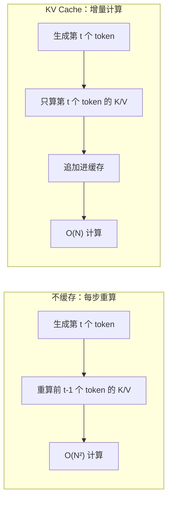
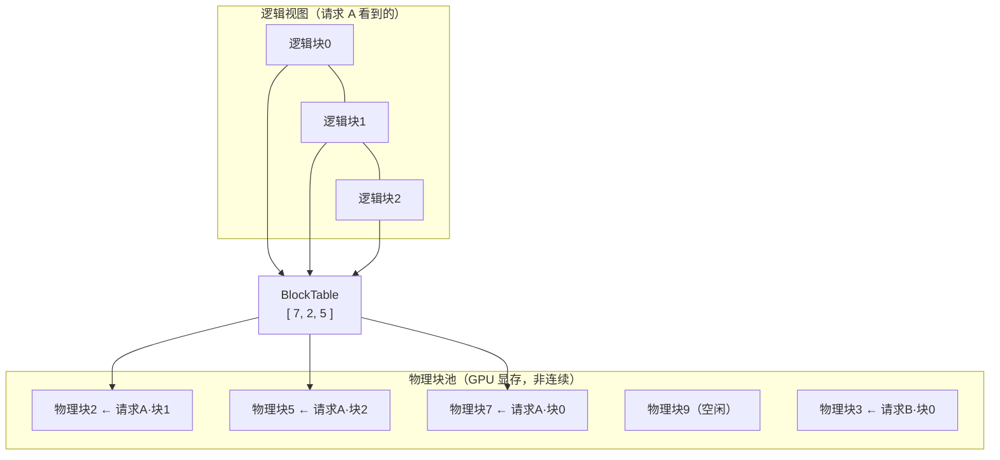
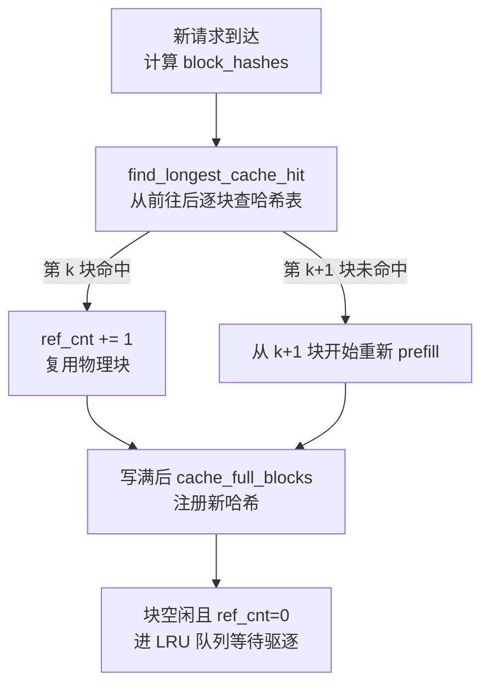
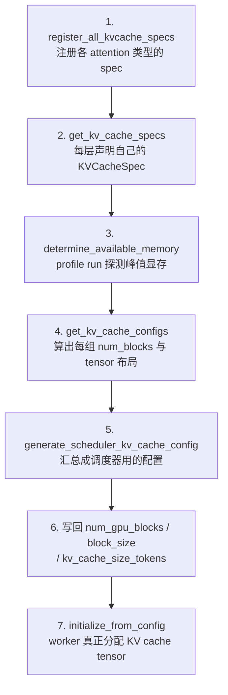
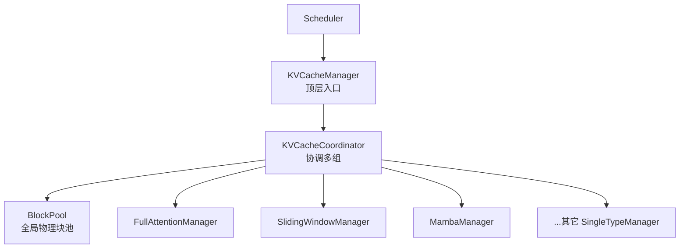

---
tags:
  - vLLM
  - 显存优化
  - 模型架构
  - KV Cache
---

# vLLM 的 KV Cache 机制剖析

!!! abstract "一句话总结"
    KV Cache 是 Transformer 自回归生成的「显存账本」——把已经算过的 Key/Value 投影存起来避免重算。vLLM 用 **PagedAttention** 把这块缓存像操作系统分页内存一样管理（逻辑块→BlockTable→物理块），解决显存碎片；再用 **Prefix Caching**（V1 默认开启）让相同前缀只算一次；启动时通过一次 **profile run** 自动算出 KV Cache 能用多少显存、开多少块。

## 一、先建立整体认识：KV Cache 是什么，为什么是显存瓶颈

### 1.1 没有 KV Cache 会怎样

Transformer 是**自回归**生成：每生成一个新 token，都要对前面**所有**已生成 token 做一次注意力计算。注意力需要用到每个历史 token 在每一层投影出的 Key 和 Value。

如果不缓存，每生成一个 token，都得把前面所有 token 重新过一遍模型才算得出来——生成长度 $N$ 的序列要 $O(N^2)$ 次前向计算，根本无法实用。



### 1.2 KV Cache 的本质

KV Cache 就是把每一层、每个历史 token 的 **K（Key）和 V（Value）张量**存下来。生成第 $t$ 个 token 时，只算第 $t$ 个 token 的 K/V 并**追加**，注意力计算时直接读历史 K/V。

$$
\text{KV Cache 大小} \propto \text{层数} \times \text{KV 头数} \times \text{head\_size} \times \text{序列长度} \times \text{dtype 字节数}
$$

### 1.3 为什么它是显存瓶颈

KV Cache 随序列长度**线性增长**，而且每个并发请求都要一份。举个例子感受量级：

> 一个 70B 量级、80 层、64 个 KV 头、head_size=128 的模型，单个请求跑满 128K 上下文，bf16 下 KV Cache 单份就要约 **80GB**。再乘上并发请求数，显存立刻爆掉。

所以推理引擎的核心命题就是：**在有限显存里，把 KV Cache 组织好，塞下尽量多的并发请求。** 这正是 vLLM 要解决的问题。

---

## 二、vLLM 的核心创新：PagedAttention（分页式 KV Cache）

### 2.1 传统做法的痛点：连续分配的显存碎片

朴素做法是给每个请求**预分配一段连续**的 KV Cache，大小按 `max_model_len` 预留。这有两个致命问题：

1. **内部碎片**：请求实际只生成了 200 token，却预留了 8K 的空间，大半显存浪费。
2. **外部碎片**：请求长短不一，频繁分配/释放后显存里全是空洞，新请求明明总量够却找不到一块连续空间。

vLLM 论文（SOSP'23）给出的解法，灵感直接来自**操作系统的虚拟内存分页**。

### 2.2 三个核心概念

| 概念 | 类比 OS | 在 vLLM 中 |
|------|---------|-----------|
| **物理块（Block）** | 物理页帧 | GPU 上一块固定大小（默认 16 token）的 K/V 存储，全局共享 |
| **BlockTable** | 页表 | 每个请求一份，记录「逻辑块号 → 物理块号」的映射 |
| **Slot** | 物理地址 | `(block_id, offset)`，定位到某个 token 的具体存储位置 |

关键在于：**一个请求的 KV Cache 在逻辑上是连续的，但在物理 GPU 显存上可以是碎片化、非连续的。** 物理块全局共享、按需分配，用完归还到池子里给别的请求用。



这样内部碎片只剩最后一个没写满的块（最多浪费 `block_size-1` 个 token），外部碎片彻底消除——因为物理块哪有空填哪。

### 2.3 写入与读取

- **写入**：新 token 算出 K/V 后，用 `slot_mapping`（每个 token 对应一个 `(block_id, offset)`）把数据 `reshape_and_cache` 写进物理块。V1 主路径走 FlashAttention 的 `reshape_and_cache_flash`，相关封装在 `vllm/v1/attention/ops/paged_attn.py:15`。
- **读取**：注意力 kernel 接收 `block_table`，按映射把非连续物理块「拼」成逻辑序列再做注意力。V1 把 `block_table` 直接传给 `flash_attn_varlen_func`（`vllm/v1/attention/backends/flash_attn.py:811`），不再像 V0 那样用自写的 `paged_attention_v1/v2.cu`。

!!! note "BlockTable 在 V1 的物理形态"
    V1 把所有请求的 BlockTable 拼成**一个** `[max_num_reqs, max_num_blocks]` 的 int32 tensor（`vllm/v1/worker/gpu/block_table.py:48`），并用 Triton kernel 做 gather 和 slot_mapping 计算。这种「单一大 tensor」设计对 **CUDA graph** 非常友好——这正是 V1 相对 V0 的重要改进。

---

## 三、Prefix Caching：让共享前缀只算一次

### 3.1 解决什么问题

实际场景里，大量请求共享相同前缀：系统 prompt、few-shot 示例、长文档问答的文档本身、多轮对话的历史……这些前缀的 KV Cache 完全一样，没理由每个请求都重算一遍。

**Prefix Caching**（自动前缀缓存）让相同前缀的 KV Cache 在物理块层面被**共享**，新请求命中前缀就直接复用已有物理块，跳过 prefill。

!!! important "V1 默认开启"
    V0 时代要显式 `--enable-prefix-caching`，V1 把默认值改成了 `True`（`vllm/config/cache.py:93`）。多数情况下你不用管它，开箱即用。

### 3.2 怎么识别「相同前缀」：链式哈希

核心是**链式哈希**——每个 block 的哈希包含它**之前所有 block 的哈希**：

```python
# vllm/v1/core/kv_cache_utils.py:596
hash = hash_function((parent_block_hash, curr_block_token_ids, extra_keys))
```

- 第一个 block 的 `parent_block_hash` 用一个随机种子 `NONE_HASH`。
- 第 $n$ 个 block 的哈希 = `hash(第 n-1 个的哈希, 第 n 块的 token, 额外信息)`。

**为什么用链式？** 因为只有「前缀完全相同」才会命中。如果第 3 个 block 的 token 有任何不同，它的哈希变了，后面所有 block 的哈希也跟着变，不会误命中——这正是「前缀」缓存想要的语义。

`extra_keys` 还会把**多模态哈希、LoRA 名、`cache_salt`** 等纳入哈希，保证不同 MM/LoRA 上下文不会串味。

### 3.3 命中、引用计数与驱逐



几个关键设计点（实现在 `vllm/v1/core/block_pool.py`）：

- **引用计数**：命中时 `ref_cnt += 1`（`BlockPool.touch`，`block_pool.py:702`），从 0 变 1 就移出空闲队列不被驱逐；请求结束 `ref_cnt -= 1`，归零才回插空闲队列尾部（`free_blocks`，`block_pool.py:719`）。
- **LRU 驱逐**：空闲块用双向链表 `FreeKVCacheBlockQueue`（`kv_cache_utils.py:184`）组织，头部是 LRU。分配时从头部 pop。
- **子块级 partial hit**：`FullAttentionManager` 支持在一个未写满的物理块内部、按 `hash_block_size` 粒度探测边界，实现比物理 block 更细的命中（`single_type_kv_cache_manager.py:657`）。

!!! tip "什么算「命中粒度」"
    `hash_block_size`（= `prefix_match_unit`，`config/cache.py:56`）是计算哈希的最细粒度。单组模型时它就等于 `block_size`；混合模型多组时取各组 block_size 的 GCD，让命中能落在物理块内部边界。

---

## 四、启动时如何决定 KV Cache 大小：profiling 流程

启动时 vLLM 不知道 GPU 能给 KV Cache 留多少显存（要先扣掉权重、激活、CUDA graph 等），于是先跑一次 **profile run** 探测，再反推能开多少物理块。

### 4.1 七步流程

核心代码在 `vllm/v1/engine/core.py:243` 的 `_initialize_kv_caches`：



### 4.2 显存预算公式

profile run 跑一遍最大 batch 的 forward，量出峰值显存占用，然后：

$$
\text{可用 KV 显存} = \underbrace{\text{总显存} \times \text{gpu\_memory\_utilization}}_{\text{requested\_memory}} - \text{非 KV 占用} - \text{CUDA graph 预估}
$$

其中 `gpu_memory_utilization` 默认 **0.92**（`config/cache.py:68`），即允许 vLLM 实例占用单卡 92% 显存。

拿到可用字节数后，物理块数：

$$
\text{num\_blocks} = \left\lfloor \frac{\text{可用显存}}{\text{page\_size} \times \text{层数}} \right\rfloor
$$

对应代码 `vllm/v1/core/kv_cache_utils.py:990` 的 `get_num_blocks`：

```python
num_blocks = int(available_memory // page_size // num_layers)
```

### 4.3 显存不够会自动降级：auto-fit

如果算下来 KV Cache 连一个最小请求都服务不了，vLLM 不会直接报错，而是**自动调小 `max_model_len`**（`kv_cache_utils.py:1930` 的 `_auto_fit_max_model_len`），再把新值同步给 worker（`engine/core.py:294`）。这避免了「配大了 max_model_len 却启动失败」的尴尬。

!!! warning "auto-fit 不是免费的"
    auto-fit 只是把 max_model_len 压到能跑起来的程度，意味着你实际能服务的上下文长度比预期短。生产环境最好显式设一个合理的 `--max-model-len`，并在日志里确认 profiling 后的实际 `num_gpu_blocks`。

---

## 五、进阶：Hybrid KV Cache Manager（混合注意力架构）

### 5.1 为什么需要混合管理

现代模型不再是「全程一种注意力」。常见组合：

| 架构 | 组合 | 代表模型 |
|------|------|---------|
| 全注意力 + 滑动窗口 | Full + SW（如 5:1 交替） | Gemma3 |
| 全注意力 + 分块局部 | Full + ChunkedLocal | LLaMA4 |
| 全注意力 + 线性 RNN | Full + Mamba | Jamba、gpt-oss |
| MLA（多头潜在注意力） | 单组特殊 spec | DeepSeek V3 |
| Full MLA + SWA MLA | 多组混合 | DeepSeek V4 |

不同注意力类型的 KV Cache 形态完全不同（Mamba 存的是状态而非 K/V，MLA 存的是压缩后的潜在向量），不能用同一套管理逻辑。

### 5.2 V1 的解法：Spec 抽象 + 分组协调

V1 的设计是**分层管理器**（`vllm/v1/core/`）：



- **KVCacheSpec**（`vllm/v1/kv_cache_interface.py`）：每种 attention 层声明自己的 spec——告诉框架「我需要什么形状、什么 dtype、怎么算哈希、单请求最多占多少」。层通过实现 `get_kv_cache_spec()`（如 `attention.py:621`、`mla_attention.py:1075`）来声明。
- **SingleTypeKVCacheManager**：每种 spec 对应一个 manager，负责该类型内部的块分配、命中、释放（`single_type_kv_cache_manager.py:36`）。`FullAttentionManager`、`SlidingWindowManager`、`MambaManager` 等都是它的子类。
- **KVCacheCoordinator**：把操作 fan-out 到各个 group，处理跨组的 partial hash hit。单组模型用 `UnitaryKVCacheCoordinator`，多组用 `HybridKVCacheCoordinator`，工厂函数在 `kv_cache_coordinator.py:842`。

!!! note "可插拔的 Spec 注册表"
    `KVCacheSpecRegistry`（`vllm/v1/kv_cache_spec_registry.py:39`）把「spec → manager」做成可插拔注册表，out-of-tree 平台能用 `@register_kv_cache_spec` 装饰器注册自定义 attention 类型。这是 V0 没有的扩展能力。

### 5.3 Mamba 与 MLA 的特殊处理

- **Mamba**（`MambaManager`，`single_type_kv_cache_manager.py:1227`）：状态 cache 有三种模式——`all`（缓存所有 block 边界状态）、`align`（只缓存每步最后一个 token、且对齐到 block 边界，省内存）、`none`（prefix caching 关闭时）。新分配的块需要**清零**（由 `KVBlockZeroer` 处理），因为状态是累加的。
- **DeepSeek MLA**（`MLAAttentionSpec`，`kv_cache_interface.py:381`）：用单头压缩表示 `kv_lora_rank + qk_rope_head_dim`，V3.2 的 `fp8_ds_mla` 用 656 字节自定义布局，V4 用 584 字节。

---

## 六、KV Cache 量化

KV Cache 是显存大头，量化它能直接放大并发。`cache_dtype`（`config/cache.py:76`，即 CLI 的 `--kv-cache-dtype`）支持多种精度：

| `cache_dtype` 值 | 含义 | scale 来源 |
|------------------|------|-----------|
| `"auto"` | 跟模型同 dtype | 无 |
| `fp8` / `fp8_e4m3` / `fp8_e5m2` | per-tensor 量化 | checkpoint 或动态计算 |
| `fp8_per_token_head` | per-(token, head) 动态量化 | kernel 运行时算 absmax |
| `int8_per_token_head` / `int4_per_token_head` | 整数量化 | 同上 |
| `nvfp4` | 4-bit + block scale | 同上 |
| `fp8_ds_mla` | DeepSeek 专用布局 | MLA 动态算 |

量化模式抽象为 `KVQuantMode`（`kv_cache_interface.py:33`）。per-token-head 模式下，K/V 的 absmax scale 存在独立的 `[num_blocks, block_size, num_kv_heads]` float32 tensor 里，在写 KV 时由 Triton kernel `_reshape_cache_per_token_head`（`triton_reshape_and_cache_flash.py:155`）动态计算并量化。

!!! tip "精度取舍"
    fp8 per-tensor 最简单但精度损失大；per-token-head 几乎无损但多一份 scale 开销。长上下文场景下量化收益最明显——同样显存能塞下更长序列或更多并发。具体选哪种，改了输出就跑 eval 对比。

---

## 七、配置参数速查

| 参数 | 默认值 | 含义 | 改动影响 |
|------|--------|------|---------|
| `--gpu-memory-utilization` | `0.92` | 单卡显存占用上限 | 调大→KV Cache 更多但留给系统更少 |
| `--block-size` | `16` | 每物理块的 token 数 | V1 多数后端已固定，混合模型由各组 LCM/GCD 决定 |
| `--enable-prefix-caching` | `True`（V1） | 前缀缓存开关 | 关闭后 `find_longest_cache_hit` 直接返回空 |
| `--kv-cache-dtype` | `auto` | KV Cache 存储 dtype | 见第六节量化表 |
| `--max-model-len` | 模型默认 | 最大上下文长度 | 显存不够会被 auto-fit 自动调小 |
| `--num-gpu-blocks-override` | `None` | 手动覆盖 profile 出的块数 | 用于测试抢占行为 |
| `--kv-cache-memory-bytes` | `None` | 手动指定 KV 字节数 | 设了就忽略 `gpu_memory_utilization` |
| `--prefix-caching-hash-algo` | `sha256` | 哈希算法 | `xxhash` 更快但有碰撞风险 |
| `--prefix-match-unit` | `None` | 最细命中粒度（token 数） | 混合模型默认取各组 GCD |
| `--kv-offloading-size` | `None` | CPU 卸载 buffer（GiB） | 设了启用分层 KV Cache |
| `--mamba-cache-mode` | `none` | Mamba 状态缓存策略 | `all`/`align`，prefix caching 开时模型自选 |

---

## 八、常见问题

??? question "启动日志里 num_gpu_blocks 很小，为什么？"
    KV Cache 显存 = `(总显存 × utilization) − 权重 − 激活峰值 − CUDA graph`。如果模型权重本身就占了大部分显存，留给 KV Cache 的自然不多。排查顺序：确认 `gpu_memory_utilization` 没设太低、`max_model_len` 没设过大、TP/PP 是否需要增加来分摊权重。

??? question "Prefix caching 会不会算错结果？"
    不会。链式哈希保证只有「前缀 token 完全相同」才命中，任何一处不同后面哈希全变。多模态、LoRA、`cache_salt` 都进了 `extra_keys`，不会跨上下文串味。唯一要注意：RLHF 更新权重后旧缓存会失效，可调 `reset_prefix_cache` 清空。

??? question "block_size 还能调吗？"
    V1 里 `block_size` 默认 16，但**主导权交给 attention backend**——它根据自己的 kernel 选最接近的合法值（`_largest_kernel_block_within`）。混合模型各组 block_size 可能不同，最终回写 `cache_config.block_size` 为各组最小值（`engine/core.py:312`）。一般不用手动调。

??? question "混合注意力模型（如 Gemma3 / Jamba）的 KV Cache 怎么算大小？"
    走 `HybridKVCacheCoordinator`，每组独立分配、独立 BlockTable，但共享全局 `BlockPool`。容量看 `kv_cache_size_tokens`（group-aware，比 `num_gpu_blocks × block_size` 准，因为一个请求可能同时占多个 group 的块）。

??? question "V0 和 V1 在 KV Cache 上到底差在哪？"
    V0（已于 2025-09 在 `c99db8c8dd` 移除）用自写的 `paged_attention_v1/v2.cu` CUDA kernel + per-sequence 的 Python BlockTable + 显式 CPU/GPU block pool 与 swap；prefix caching 默认关闭。V1 改用 FlashAttention/FlashInfer/Triton 原生 paged 接口、单个大 BlockTable tensor（CUDA graph 友好）、prefix caching 默认开启、并引入 Hybrid KV Cache Manager 天然支持混合注意力。**当前代码库只有 V1 实现。**

---

> 本文基于写作时 vLLM 主干代码（V1）整理，文件路径与行号会随仓库演进变化，具体以官方代码与文档为准。
