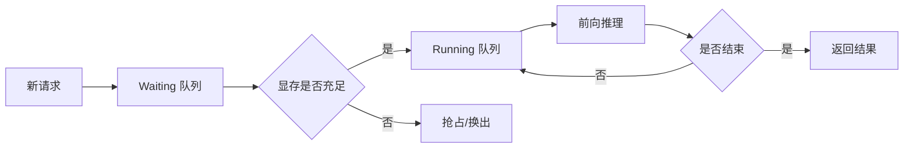

---
tags:
  - vLLM
  - 推理引擎
---

# vLLM 笔记

!!! abstract "本页状态"

    占位页面，逐步补充中。

## 核心机制

vLLM 的高吞吐主要来自三个设计：

| 机制 | 作用 |
|------|------|
| **PagedAttention** | 将 KV Cache 按页管理，显存碎片率大幅下降 |
| **Continuous Batching** | 请求粒度动态入批，GPU 不必等整批结束 |
| **Prefix Caching** | 复用相同前缀的 KV，缩短 TTFT |

## 调度流程

## 待补充

- [ ] Chunked Prefill 的取舍
- [ ] 投机解码（Speculative Decoding）实测
- [ ] 多卡张量并行的通信开销分析
