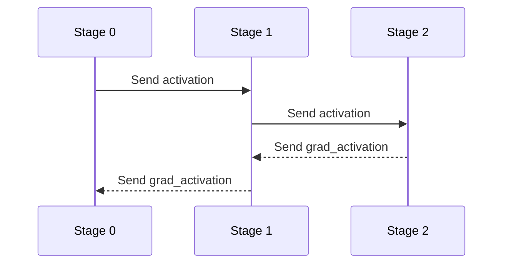
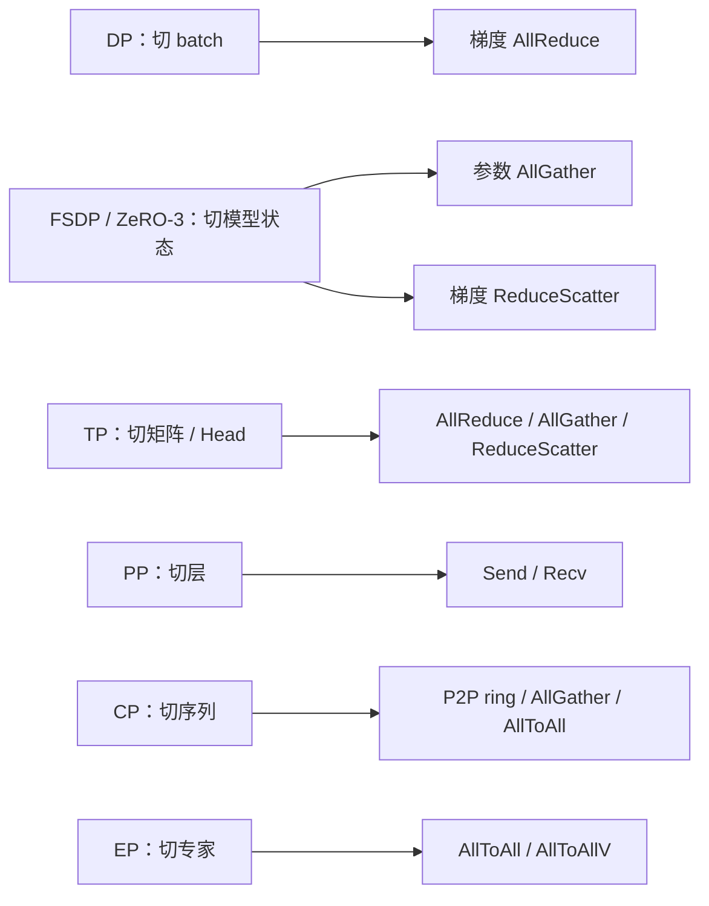
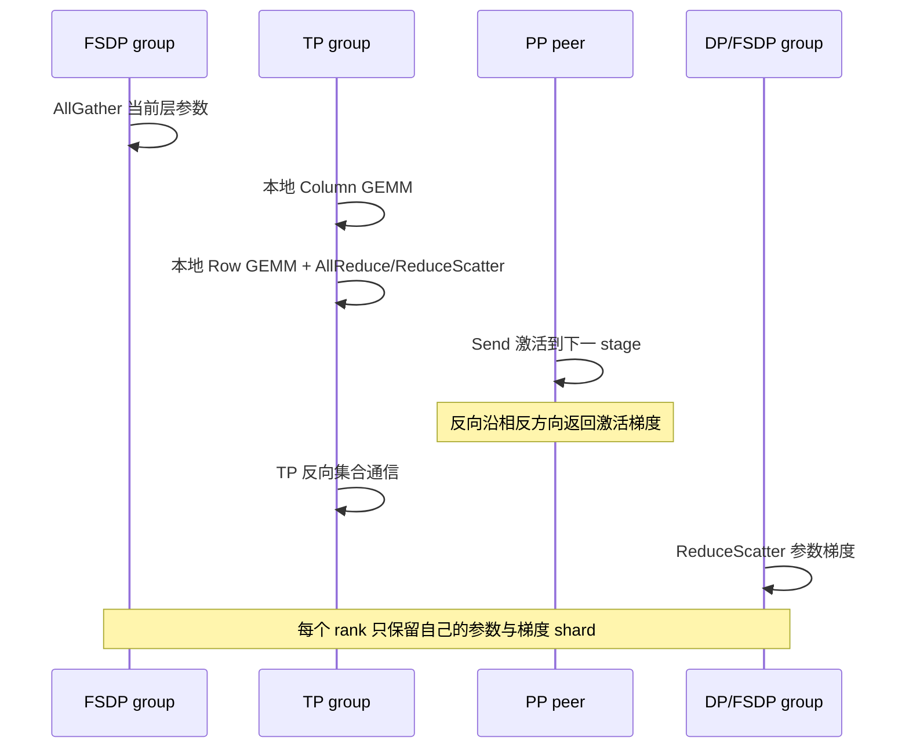

---
tags:
  - 大模型
  - 分布式训练
  - 集合通信
  - NCCL
  - HCCL
---

# 大模型分布式训练中的通信原语

!!! abstract "一句话总结"

    **通信原语定义的不是“数据怎样经过网线”，而是多个 rank 之间怎样重新组织张量。** Send/Recv 负责两个 rank 之间搬运；AllReduce 让所有 rank 得到聚合结果；AllGather 把分片变成副本；ReduceScatter 把多份局部结果变成聚合后的分片；AllToAll 重新分配分片的归属。大模型的 DP、TP、PP、CP、EP 与 ZeRO/FSDP，本质上都是计算切分加上一组通信原语。

---

## 1. 先建立心智模型：通信是在改变张量的所有权

第一次接触集合通信时，很容易把 `AllReduce`、`AllGather`、`ReduceScatter` 记成一组相似的 API。更有效的理解方式，是把一次通信看成张量所有权的变换，并连续问四个问题：

1. **谁参与？** 两个 rank、一个 process group，还是整个 world？
2. **通信前每个 rank 有什么？** 完整副本、互不相同的分片，还是同一结果的局部贡献？
3. **是否需要规约？** 只拼接/重排，还是执行 Sum、Max、Min 等逐元素运算？
4. **通信后每个 rank 留下什么？** 完整结果、一个分片，还是仅 root rank 持有结果？

设通信组中有 $p$ 个 rank，第 $r$ 个 rank 的输入为 $x_r$。常用原语可以压缩成下面这张表：

| 原语 | 输入状态 | 输出状态 | 是否规约 | 典型用途 |
|---|---|---|---|---|
| Broadcast | root 有数据 | 所有 rank 都有相同副本 | 否 | 分发配置、初始状态 |
| Reduce | 每个 rank 有局部贡献 | root 有聚合结果 | 是 | 只在主 rank 汇总指标 |
| AllReduce | 每个 rank 有局部贡献 | 所有 rank 都有聚合结果 | 是 | DDP 梯度同步、TP 局部输出求和 |
| Scatter | root 有完整张量 | 每个 rank 得到不同分片 | 否 | 从中心节点分发输入 |
| Gather | 每个 rank 有不同分片 | root 得到完整张量 | 否 | 汇总结果到主 rank |
| AllGather | 每个 rank 有不同分片 | 所有 rank 都得到完整张量 | 否 | FSDP 参数重建、TP 激活拼接 |
| ReduceScatter | 每个 rank 有完整形状的局部贡献 | 每个 rank 得到聚合结果的一片 | 是 | FSDP 梯度分片、Sequence Parallel |
| AllToAll | 每个 rank 都有发往各 rank 的分片 | 每个 rank 收到来自各 rank 的分片 | 否 | MoE token 路由、序列与 Head 布局互换 |
| Send/Recv | 发送方有数据 | 指定接收方得到数据 | 否 | Pipeline stage、环形 KV 交换 |
| Barrier | 各 rank 只有执行进度 | 所有 rank 越过同步点 | 否 | 初始化、调试；不搬运业务张量 |

最关键的区分是：

- **Reduce** 表示“把多份局部贡献合成一个数学结果”；
- **Gather** 表示“把不同分片按 rank 顺序拼成更大的张量”；
- **Scatter** 表示“让每个 rank 只保留结果的一部分”；
- **All** 表示“结果交付给组内所有 rank”，而不是只交付给 root。

这套语义与底层硬件无关。GPU 上常由 NCCL 实现，昇腾 NPU 上常由 HCCL 实现；PyTorch 的 `torch.distributed`、Megatron Core、DeepSpeed 与 vLLM 则在上层组织 process group、张量布局和调用时序。

---

## 2. 阅读地图：从框架语义走到底层执行

本文按下列层次理解通信栈：

| 层次 | 关注内容 | 推荐入口 |
|---|---|---|
| 并行策略 | 为什么要通信、在哪个维度切分 | [Megatron Core Parallelism Guide](https://docs.nvidia.com/megatron-core/developer-guide/latest/user-guide/parallelism-guide.html) |
| 框架 API | process group、同步/异步接口、张量约束 | [PyTorch `torch.distributed`](https://docs.pytorch.org/docs/stable/distributed.html) |
| 通信库语义 | 各 collective 的输入输出、root 与 rank 规则 | [NCCL Collective Operations](https://docs.nvidia.com/deeplearning/nccl/user-guide/docs/usage/collectives.html) |
| 设备执行 | stream、异步完成、通信算法与拓扑选择 | [NCCL User Guide](https://docs.nvidia.com/deeplearning/nccl/user-guide/docs/) |
| 昇腾后端 | HCCL 通信域、集合通信与故障诊断 | [CANN 通信库文档](https://www.hiascend.com/doc_center/source/zh/CANNCommunityEdition/850/index/index.html) |

本文整理于 **2026-09-16**。API 名称与后端能力以当时的 PyTorch stable、NCCL 2.31 系列和 CANN 8.5 文档为参考；原语的数学语义不依赖这些具体版本。

!!! note "先分清三个对象"

    `rank` 是通信组中的逻辑编号，`device` 是实际加速卡，`process group / communicator` 定义哪些 rank 共同参加一次通信。同一个进程可能加入 DP、TP、PP、CP、EP 等多个组，因此 `rank 0` 必须结合具体通信组理解。

---

## 3. 点对点通信：Send/Recv

点对点通信只描述一个发送方和一个接收方：

$$
\operatorname{Send}(x, r_s\rightarrow r_d),
\qquad
\operatorname{Recv}(y, r_s\rightarrow r_d)
$$

发送方 $r_s$ 把张量 $x$ 发给接收方 $r_d$，接收方把内容写入 $y$。它不要求通信组中其他 rank 同时参与，因此适合天然具有邻接关系的计算图。

### 3.1 Pipeline Parallel

Pipeline Parallel 把连续层分给不同 stage。前向时传激活，反向时沿相反方向传激活梯度：



PP 通信量主要由 stage 边界激活决定，而不是由这一 stage 内的参数总量决定。micro-batch 可以让计算与通信形成流水，但也引入了调度顺序和 pipeline bubble。

### 3.2 Context Parallel 的环形交换

当序列沿 CP 维度切分后，每个 rank 只有一段本地 KV，但本地 Query 需要读取其他序列分片。实现可以让 KV 块沿环依次 Send/Recv，并在每收到一块时立即计算一部分 Attention：

```text
第 0 轮：每个 rank 计算 local Q × local KV
第 1 轮：把 KV 发给右邻居，接收左邻居 KV，再计算
...
第 p-1 轮：所有 Q 都看过完整序列的 KV
```

与先 AllGather 全量 KV 相比，环形 P2P 不必在每张卡上同时物化完整 KV，而且更容易把传输藏在 Attention 计算后面。Megatron Core 的 CP 也提供 `p2p`、`all_gather`、`a2a` 与分层组合等不同通信方式，说明“同一种并行策略”并不绑定唯一原语。

### 3.3 点对点最常见的死锁

如果两个 rank 都先执行阻塞 Send，且底层没有足够缓冲，双方可能互相等待；如果接收端期待的 source、tag、shape 或顺序与发送端不一致，也可能一直挂住。常用处理方式是：

- 固定相邻 rank 的奇偶发送顺序；
- 成对组织非阻塞 `isend/irecv`，最后等待句柄；
- 使用后端提供的 grouped send/recv；
- 把每个 micro-batch 的方向、peer 与张量元数据写入可检查的调度表。

---

## 4. 一对多与多对一：Broadcast、Reduce、Scatter、Gather

这四个原语都有一个特殊的 root rank。

### 4.1 Broadcast：从 root 复制到所有 rank

假设 root 为 rank 0：

```text
通信前：rank 0 [A B C D]   rank 1 [ ? ]   rank 2 [ ? ]   rank 3 [ ? ]
通信后：rank 0 [A B C D]   rank 1 [A B C D]   rank 2 [A B C D]   rank 3 [A B C D]
```

Broadcast 常用于分发初始化后的权重、随机种子、配置或少量控制状态。大规模训练不会每一步都由 root 广播全部梯度，因为 root 会成为瓶颈，而且每个 rank 已经拥有自己的局部梯度贡献。

### 4.2 Reduce：把局部贡献聚合到 root

以 Sum 为例：

$$
y_{root}=\sum_{r=0}^{p-1}x_r
$$

只有 root 的结果有效。它适合汇总 loss 总和、样本数或自定义统计量。如果聚合结果随后又要给所有 rank 使用，那么 Reduce 后再 Broadcast 在语义上等价于 AllReduce。

### 4.3 Scatter：root 把完整张量拆给各 rank

```text
通信前：rank 0 [A | B | C | D]
通信后：rank 0 [A]   rank 1 [B]   rank 2 [C]   rank 3 [D]
```

Scatter 改变的是数据归属，不执行规约。它适合从中心化输入缓冲区分发数据，但高吞吐训练通常让每个 data worker 独立读取自己的数据分片，以避免 root 成为输入瓶颈。

### 4.4 Gather：把各 rank 的分片收集到 root

```text
通信前：rank 0 [A]   rank 1 [B]   rank 2 [C]   rank 3 [D]
通信后：rank 0 [A | B | C | D]
```

Gather 常用于集中保存预测、采样结果或检查点元数据。它会让 root 承担更大的显存/内存压力，不适合无节制地汇总所有训练激活。

---

## 5. 真正常驻热路径的集合通信

大模型训练最常见的是 AllReduce、AllGather、ReduceScatter 与 AllToAll。它们没有单一 root，组内每个 rank 都是对等参与者。

### 5.1 AllReduce：聚合后把结果交给所有 rank

以求和为例：

$$
y_r=\sum_{i=0}^{p-1}x_i,\qquad \forall r\in[0,p)
$$

若四个 rank 的标量输入分别为 1、2、3、4，AllReduce(Sum) 后每个 rank 都得到 10。

它适用于“每张卡算出同一逻辑张量的一部分贡献，之后每张卡都需要完整结果”的场景：

- DDP 中，每个 rank 对不同 mini-batch 求得参数梯度，AllReduce 后得到全局梯度和，再除以全局样本数；
- Row Parallel Linear 中，每个 rank 对输入维的一段做 GEMM，局部输出形状相同，需要求和得到完整输出；
- 复制参数在不同并行 rank 上各自产生梯度时，需要同步这些梯度。

!!! warning "Sum 不一定等于最终的平均梯度"

    通信库只执行指定规约。全局梯度究竟取 Sum 还是 Mean，还取决于 loss reduction、梯度累积步数、data parallel size 与有效样本数。遇到 loss 正常但收敛速度随卡数变化时，要检查缩放发生在 AllReduce 前还是后。

### 5.2 AllGather：把分片变成每个 rank 上的完整张量

若每个 rank 持有 $x_r\in\mathbb{R}^{m}$：

$$
y_r=\operatorname{concat}(x_0,x_1,\ldots,x_{p-1}),
\qquad y_r\in\mathbb{R}^{pm}
$$

```text
通信前：rank 0 [A]   rank 1 [B]   rank 2 [C]   rank 3 [D]
通信后：每个 rank 都是 [A | B | C | D]
```

AllGather 不做数值求和，它只按 rank 顺序拼接。常见用途包括：

- FSDP/ZeRO-3 在执行某个计算单元前临时重建完整参数；
- Column Parallel Linear 在下游算子不能继续消费分片输出时拼回完整 hidden dimension；
- Sequence Parallel 在需要恢复完整 token 维激活时重建张量；
- 某些 CP 实现先收集完整 KV，再计算本地 Query 的 Attention。

AllGather 的直接代价是输出在每个 rank 上扩大到原来的 $p$ 倍。因此“何时 gather、完整张量存活多久、能否在下一层继续保持分片”往往比 API 本身更重要。

### 5.3 ReduceScatter：先规约，再让每个 rank 只留一片

每个 rank 的输入都能被划分成 $p$ 个等大块：

$$
x_r=[x_r^{(0)},x_r^{(1)},\ldots,x_r^{(p-1)}]
$$

ReduceScatter(Sum) 后，rank $j$ 得到：

$$
y_j=\sum_{r=0}^{p-1}x_r^{(j)}
$$

```text
rank 0 输入 [A0 A1 A2 A3]
rank 1 输入 [B0 B1 B2 B3]
rank 2 输入 [C0 C1 C2 C3]
rank 3 输入 [D0 D1 D2 D3]

通信后：
rank 0 [A0+B0+C0+D0]
rank 1 [A1+B1+C1+D1]
rank 2 [A2+B2+C2+D2]
rank 3 [A3+B3+C3+D3]
```

它适用于“需要聚合，但聚合后仍希望保持分片”的场景：

- FSDP/ZeRO 把全局梯度聚合后按参数分片保存；
- TP + Sequence Parallel 把各 TP rank 的局部输出求和，并沿 sequence 维分发；
- 分布式优化器让每个 rank 只更新自己负责的一段参数与优化器状态。

与 AllReduce 相比，ReduceScatter 避免每个 rank 都保留完整聚合结果。如果下一步本来就只需要一个分片，AllReduce 会产生多余副本。

### 5.4 AllReduce = ReduceScatter + AllGather

从结果语义看：

$$
\operatorname{AllReduce}(x)
=
\operatorname{AllGather}(\operatorname{ReduceScatter}(x))
$$

这也是 ring AllReduce 的常见实现结构：第一阶段在环上 ReduceScatter，第二阶段 AllGather 已规约的分片。NCCL 文档也明确给出了这组等价关系。

这条关系对系统设计很有用。假设下游可以消费分片结果，就能停在 ReduceScatter，不执行后半段 AllGather；等真正需要完整值时再 gather。这正是多种 sharded parallelism 节省显存与通信的基本思路。

### 5.5 AllToAll：重新分配数据归属

AllToAll 要求每个 rank 把输入切成发往各目的 rank 的块：

$$
x_i=[x_{i\rightarrow0},x_{i\rightarrow1},\ldots,x_{i\rightarrow p-1}]
$$

通信后，rank $j$ 收到：

$$
y_j=[x_{0\rightarrow j},x_{1\rightarrow j},\ldots,x_{p-1\rightarrow j}]
$$

```text
             目标 rank
来源 rank       0      1      2      3
    0          x00    x01    x02    x03
    1          x10    x11    x12    x13
    2          x20    x21    x22    x23
    3          x30    x31    x32    x33

rank 2 最终收到 [x02 | x12 | x22 | x32]
```

AllToAll 既不复制所有输入，也不做规约；它完成一次“转置式”的数据重排。它的代表场景是 MoE：

1. Router 为每个 token 选择 Top-K expert；
2. 本地 token 按目标 expert/rank 分桶；
3. AllToAll 把 token dispatch 到专家所在 rank；
4. 各 rank 执行本地 expert GEMM；
5. 反向 AllToAll 把 expert 输出送回 token 来源 rank；
6. 按路由权重 combine，并恢复原 token 顺序。

真实 MoE 中每个目的 rank 的 token 数通常不同，因此需要 AllToAllV、split sizes 或先交换计数。容量限制、padding 和 token drop 都在解决动态不均衡带来的 shape 与负载问题。

AllToAll 还可以在序列分片与 Attention Head 分片之间转换布局。例如输入从 `[S/p,H]` 变成 `[S,H/p]`：每个 rank 获得完整序列，但只处理一部分 Head；计算后再做逆变换。

---

## 6. 通信原语怎样对应大模型并行策略

可以把并行策略理解为两部分：先决定**在哪个轴切张量或计算**，再选择原语恢复下一个算子需要的布局。



### 6.1 Data Parallel：局部 batch，复制参数，全局梯度

每个 DP rank 保存完整参数 $W$，读取不同 mini-batch $B_r$，独立计算局部梯度 $g_r$：

$$
g=\frac{1}{p}\sum_{r=0}^{p-1}g_r
$$

经典 DDP 用 AllReduce 同步梯度。为了避免“反向全部结束后才传一整个模型的梯度”，框架通常把参数梯度装入 bucket：某个 bucket 的梯度一旦全部 ready，就异步发起 AllReduce，同时 GPU 继续计算更靠前层的反向。

因此 DDP 性能不只取决于总通信字节，还取决于：

- bucket 太小：collective 次数多，启动延迟占比大；
- bucket 太大：通信启动晚，难与反向计算重叠；
- 参数使用顺序变化：bucket ready 顺序不稳定；
- 某个 rank 少走了一个分支：梯度 collective 序列不一致，可能挂住。

### 6.2 ZeRO/FSDP：用 AllGather 换参数显存，用 ReduceScatter 保持梯度分片

以完整分片为例，每个 rank 常驻保存约 $1/p$ 参数、梯度和优化器状态。执行某个 FSDP unit 时：

```text
参数 shard
   ↓ AllGather
临时完整参数
   ↓ Forward / Backward
完整形状的局部梯度贡献
   ↓ ReduceScatter
聚合后的 gradient shard
   ↓ Local optimizer step
更新本 rank 的 parameter shard
```

AllGather 早一点，可以与前一层计算重叠，却会增加同时存活的完整参数；释放早一点，可以降低峰值显存，却可能在反向前再次 gather。通信调度因此也是显存生命周期调度。

[PyTorch FSDP 文档](https://docs.pytorch.org/docs/main/fsdp.html)把用于参数 AllGather 和梯度 ReduceScatter 的 process group 作为核心配置之一。它说明 FSDP 的“分片”并不是静态地把模型切完就结束，而是在每个计算单元边界反复切换“分片参数”和“临时完整参数”。

### 6.3 Tensor Parallel：局部 GEMM 后恢复代数等价性

设线性层 $Y=XW$。

**Column Parallel** 沿输出维切权重：

$$
W=[W_0,W_1,\ldots,W_{p-1}],
\qquad Y_r=XW_r
$$

每个 rank 得到 $Y$ 的一段。如果下一个算子能继续消费这个分片，就不通信；如果需要完整 $Y$，执行 AllGather。

**Row Parallel** 沿输入维切权重和输入：

$$
X=[X_0,X_1,\ldots,X_{p-1}],
\qquad
W=\begin{bmatrix}W_0\\W_1\\\vdots\\W_{p-1}\end{bmatrix}
$$

$$
Y=\sum_{r=0}^{p-1}X_rW_r
$$

每个 rank 的 $X_rW_r$ 形状相同，是完整输出的局部贡献，因此用 AllReduce 求和。若启用 Sequence Parallel，也可以 ReduceScatter 后沿 token 维保持输出分片。

这解释了一个常见现象：TP 通信频率很高，几乎每个 Transformer block 都会出现若干次 collective。因此 TP group 通常优先放在节点内的高速互联域。

### 6.4 Pipeline Parallel：层边界只传激活与梯度

PP 把模型深度切开，stage 间通常用 Send/Recv。相比 TP，它通信次数与 micro-batch 调度相关，消息是边界激活；相比 DP，它不需要同步每一份参数梯度，因为不同 stage 本来就持有不同参数。

PP 的主要挑战是：

- micro-batch 太少导致 pipeline bubble；
- stage 计算量不均衡导致快卡等待慢卡；
- 前向/反向 Send/Recv 次序错误造成死锁；
- 最后一层或 Embedding/LM Head 让首尾 stage 负载偏重。

### 6.5 Context Parallel：让每个 Query 访问完整上下文

CP 沿 sequence 维切输入与激活。LayerNorm、逐 token MLP 等不跨 token 的算子可以直接处理本地片段；Attention 必须让本地 Query 看到全序列 KV。

常见实现包括：

- **KV AllGather**：逻辑简单，但每个 rank 物化完整 KV；
- **P2P ring**：KV 分块轮转，边传边算，峰值显存较低；
- **AllToAll**：在 sequence 维与 Head 维之间转置分片；
- **分层通信**：节点内用 AllToAll，节点间用 P2P，匹配不同链路。

因此 CP 的核心不是“把序列一切为 $p$ 就结束”，而是选择一种能完成全局 Attention、又能控制 KV 峰值和跨节点流量的交换方式。

### 6.6 Expert Parallel：两次重分发夹住本地专家计算

EP 把不同专家放到不同 rank。Dense 层的数据布局是“按 token 原顺序”，专家 GEMM 想要的是“按目标 expert 聚类”，所以需要 dispatch AllToAll；计算结束后再用 combine AllToAll 恢复 token 归属。

EP 的性能容易受长尾控制：即使总 token 数不变，某个热门 expert 所在 rank 接收过多 token，也会让整个通信组等待它。优化方向包括负载均衡损失、容量控制、专家复制、局部优先路由、分层 AllToAll，以及将 dispatch/GEMM/combine 融合或重叠。

更完整的并行切分关系见[《大模型并行策略与切分：结合 vLLM 和 vLLM Ascend 源码》](../ai/llm-parallelism-vllm-vllm-ascend.md)。那篇回答“模型怎样切”，本文回答“切完以后张量怎样恢复为下一个算子需要的布局”。

---

## 7. 通信成本：字节数之外还有启动延迟

最常用的粗略模型是 $\alpha$-$\beta$ 模型：

$$
T\approx k\alpha+n\beta
$$

其中：

- $\alpha$：发起一轮通信的固定延迟，包括软件调度和链路启动；
- $k$：算法需要的通信轮数；
- $n$：实际传输字节数；
- $\beta$：每字节传输时间，即带宽的倒数。

若包含规约，还可以增加每字节计算成本 $\gamma$：

$$
T\approx k\alpha+n\beta+n_{reduce}\gamma
$$

这解释了为什么“总通信量相同”不代表耗时相同：把一个 1 GiB AllReduce 拆成一万个小 collective，总字节数没变，但会重复支付启动延迟。

### 7.1 Ring：带宽利用好，轮数随 rank 数增长

理想 ring AllReduce 将大小为 $N$ 的张量切成 $p$ 块，经历 $p-1$ 轮 ReduceScatter 和 $p-1$ 轮 AllGather。每个 rank 的发送量约为：

$$
V_{ring\_allreduce}=2\frac{p-1}{p}N
$$

对应时间可粗略写成：

$$
T_{ring\_allreduce}
\approx
2(p-1)\alpha
+
2\frac{p-1}{p}N\beta
$$

当 $N$ 很大时，ring 能稳定地让链路搬运大块数据；当消息很小时，$2(p-1)$ 轮的固定延迟可能占主导。

### 7.2 Tree：轮数较少，适合低延迟路径

树形算法的深度约为 $\log_2p$，更容易降低小消息的轮数，但不同拓扑、分块和双树实现会改变实际带宽。现代通信库不会永远固定使用“ring 大消息、tree 小消息”的简单规则，而会结合：

- 消息大小和数据类型；
- GPU/NPU 型号与互联拓扑；
- PCIe、NVLink/HCCS、RoCE/InfiniBand 等链路；
- 单机或多机、NIC 数量与 NUMA 位置；
- collective 类型以及可用的网络内规约能力。

NCCL 默认会根据拓扑和架构自动选择算法；除非在定位问题或完成基准验证，不应把手工指定某个算法当作普适优化。

### 7.3 AllToAll 的难点是并发扇出与不均衡

AllToAll 中每个 rank 都要与多个 peer 交换不同数据。即使理论总字节数可控，性能仍可能受以下因素限制：

- peer 数量增加，连接与调度开销上升；
- 不同目的 rank 的 split size 差异大；
- 跨节点流量没有先在节点内聚合；
- token 排序、计数交换和恢复顺序的 kernel 成本；
- 热门 expert 让通信与计算同时出现长尾。

因此评估 MoE 通信不能只看 AllToAll 的带宽，还要同时看每个 rank 的发送/接收 token 数和 expert GEMM 时间。

### 7.4 拓扑决定 process group 应该怎样摆放

假设一台机器有 8 张高速互联卡，多机之间带宽更低。常见做法是：

- 高频、细粒度的 TP 尽量限制在单机高速互联域；
- PP 跨节点，只传 stage 边界激活；
- DP/FSDP 使用分层 collective，先节点内、再节点间、最后节点内分发；
- 大 EP group 跨节点时，重点评估 AllToAll 的双向带宽和拥塞。

通信组的逻辑 rank 顺序也会影响物理流量。创建 process group 前，应先画出 `global rank → node → local device → NIC → TP/DP/PP/CP/EP group` 映射。

---

## 8. 隐藏通信，而不是假设通信消失了

一次迭代的时间不一定等于计算时间加通信时间。如果通信与无依赖的计算并行：

$$
T_{step}\approx T_{compute}+T_{exposed\_comm}
$$

真正需要优化的是暴露在关键路径上的 `exposed_comm`。

### 8.1 Bucket 与分块

把大张量分块可以更早启动通信，并形成流水；分得过细又会增加 $\alpha$。DDP gradient bucket、FSDP unit 大小、PP micro-batch 和 CP KV block 都在做类似权衡。

### 8.2 Prefetch

FSDP 可以在当前层计算时预取下一层参数 AllGather。它缩短等待，但让当前完整参数和下一层预取参数同时驻留，增加峰值显存。

### 8.3 独立通信流与事件依赖

通信可以进入独立 stream，让计算 stream 继续工作；但消费通信结果前必须建立 event/wait 依赖。否则会出现两类问题：

- 过早同步：每次 collective 后立刻全局等待，完全失去重叠；
- 同步不足：计算读取尚未完成的接收缓冲区，得到错误结果或竞态。

NCCL 的 host API 返回通常只表示操作已经入队，设备上的 collective 仍异步执行。它的 [CUDA Stream Semantics](https://docs.nvidia.com/deeplearning/nccl/user-guide/docs/usage/streams.html)明确要求按 stream/event 语义判断完成，而不是把 Python/C++ 调用返回当作数据已经可用。

### 8.4 融合与低精度通信

融合多个小 collective 能减少启动次数；用 BF16/FP16/FP8 或量化格式传输可以减少字节数。但低精度规约会改变数值误差，融合也会改变张量生命周期和调度粒度。需要同时验证：

- 收敛和最终精度；
- 峰值显存；
- 通信是否真的与计算重叠；
- 融合后的大消息是否引入新的关键路径。

---

## 9. 同步语义：API 返回不等于全局完成

通信错误最难排查的部分，往往不是原语选错，而是对“何时完成”理解不一致。

### 9.1 Collective 要求所有成员以一致顺序参与

在同一个 communicator 中，所有 rank 必须以兼容的顺序调用 collective，并满足后端要求的 count、datatype 等约束。NCCL 文档明确指出，不一致可能造成 hang、crash 或 data corruption。

下面的顺序会死锁或产生未定义行为：

```text
rank 0: AllReduce(A) → AllGather(B)
rank 1: AllGather(B) → AllReduce(A)
```

即使两个张量 shape 都合法，rank 0 的第一次 collective 也找不到执行同一个 AllReduce 的 peer。

### 9.2 `async_op=True` 只返回工作句柄

在 PyTorch 中，异步 collective 返回 `Work`。这允许 host 继续下发工作，但不表示接收张量已经能被任意 stream 安全消费。正确做法是让依赖计算等待 `Work` 或对应 stream event，而不是仅依赖 CPU 代码顺序。

### 9.3 Barrier 不是性能问题的通用修复

Barrier 只让组内 rank 在某个点会合。它适合初始化和定位“谁没有走到这里”，但会破坏重叠，并且不能修复 collective 顺序、shape 或 process group 错误。训练热路径中频繁插 Barrier，通常只是把根因隐藏成稳定的低性能。

### 9.4 多个 process group 仍需要全局一致的调度约束

TP、DP、EP 可以使用不同 process group，但一个 GPU 上的通信 kernel、stream 和网卡资源仍然共享。若不同 rank 以冲突顺序启动跨 group 操作，可能形成循环等待；即使不死锁，也可能互相争抢链路，使时间线难以预测。

---

## 10. 用一次 Transformer 训练迭代串起所有原语

假设模型同时启用 FSDP 数据并行、TP 和 PP，不考虑 CP/EP，一次稳态 micro-batch 的关键数据流可以抽象为：



如果再加入 MoE，部分 MLP 层前后会多一对 AllToAll；加入 CP，Attention 内会多出 KV 的 P2P/AllGather/AllToAll。一个 rank 因此可能在一次 layer forward 内连续进入多个不同通信组。

这也是阅读性能 trace 的正确顺序：

1. 先认出 collective 属于哪个 group；
2. 再确认它在恢复哪个张量维度；
3. 检查输出是完整副本还是分片；
4. 最后分析算法、带宽和 overlap。

只看到一个耗时很长的 `AllReduce` 就直接调 NCCL/HCCL 参数，常常会错过更上游的问题：也许模型本可使用 ReduceScatter 保持分片，也许 bucket 太晚才 ready，也许某个 rank 的计算长尾让其他 rank 提前进入 collective 等待。

---

## 11. 选原语时的快速判断

可以从下游需要的张量状态反推：

| 当前状态 | 下游需要 | 合适原语 |
|---|---|---|
| 每个 rank 有同形状的局部贡献 | 每个 rank 都要完整聚合结果 | AllReduce |
| 每个 rank 有同形状的局部贡献 | 每个 rank 只要聚合结果的一片 | ReduceScatter |
| 每个 rank 有不同分片 | 每个 rank 都要完整拼接结果 | AllGather |
| 每个 rank 有不同分片 | 只有 root 要完整结果 | Gather |
| root 有完整张量 | 每个 rank 只要不同分片 | Scatter |
| root 有数据 | 每个 rank 都要相同副本 | Broadcast |
| 每个 rank 的不同块属于不同目的 rank | 按目的重新分桶 | AllToAll / AllToAllV |
| 只有相邻 stage/peer 需要数据 | 指定 peer 接收 | Send/Recv |
| 只需要检查执行进度是否对齐 | 所有 rank 会合 | Barrier |

进一步优化时，再问四个问题：

1. 下游能否直接消费分片，推迟或取消 AllGather？
2. 能否把 AllReduce 拆成 ReduceScatter，并让后续状态继续分片？
3. 能否让通信与没有依赖的 GEMM/Attention 重叠？
4. process group 是否与物理高速互联边界一致？

---

## 12. 常见故障与调试清单

### 12.1 Collective hang

优先检查：

- 所有 group 成员是否真的执行了这次 collective；
- 各 rank 的调用顺序是否一致；
- 是否有 rank 在更早的数据加载、OOM 或 kernel error 中退出；
- process group 成员与 rank 映射是否一致；
- Send/Recv 的 peer、tag 和方向是否配对；
- MoE 中没有 token 的 rank 是否仍按协议参与通信。

### 12.2 Shape、count 或 dtype 不一致

NCCL collective 要求参与 rank 使用兼容的 count 和 datatype。AllGather/ReduceScatter 还要求输入输出分片关系满足约束。动态序列和 MoE 场景要特别检查 split sizes 是否先正确交换。

### 12.3 结果数值错误

检查：

- 需要拼接时是否误用了 Reduce，或需要求和时误用了 Gather；
- AllGather 的 rank 顺序是否与张量分片轴一致；
- Sum/Mean 缩放是否重复或遗漏；
- 非阻塞通信的输出是否在完成前被消费；
- in-place 缓冲区是否被后续计算提前覆盖；
- 低精度规约是否引入不可接受的误差。

### 12.4 通信很慢

不要只看 collective 名称。应同时记录：

- 每次消息字节数、调用次数与持续时间；
- 每个 rank 进入 collective 的时间，区分“等待慢 rank”和“实际传输慢”；
- 节点内/节点间带宽，GPU/NPU 与 NIC 的亲和关系；
- 算法、协议和通道选择；
- 计算与通信 stream 是否真正重叠；
- MoE 每个 rank 的 token 数与 expert 计算时长；
- 是否有大量小 collective，可通过 bucket/fusion 合并。

### 12.5 PyTorch/NCCL 调试入口

在可复现的小规模任务中，可以临时启用：

```bash
TORCH_CPP_LOG_LEVEL=INFO
TORCH_DISTRIBUTED_DEBUG=DETAIL
NCCL_DEBUG=INFO
```

`TORCH_DISTRIBUTED_DEBUG=DETAIL` 会增加一致性检查和日志开销，只适合调试。PyTorch 还提供 `monitored_barrier()` 帮助报告未在超时内到达的 rank；它是定位工具，不应常驻训练热路径。具体行为见 [`torch.distributed` 调试文档](https://docs.pytorch.org/docs/stable/distributed.html#debugging-torch-distributed-applications)。

昇腾环境中应按 HCCL 文档把问题分成通信域初始化、建链与任务执行阶段，并结合训练框架日志、HCCL 日志、rank table 和设备侧错误一起定位。

---

## 13. 总结

通信原语真正描述的是张量状态转换：

- **Send/Recv**：把张量交给指定 peer；
- **AllReduce**：把局部贡献聚合成每个 rank 都持有的完整结果；
- **AllGather**：把互不相同的分片拼成每个 rank 都持有的完整张量；
- **ReduceScatter**：把局部贡献聚合后继续保持分片；
- **AllToAll**：按新的所有权规则重新分桶；
- **Broadcast/Reduce/Scatter/Gather**：围绕 root 完成一对多或多对一的数据流。

映射到大模型时，DP 用 AllReduce 同步梯度，FSDP/ZeRO 用 AllGather 临时重建参数并用 ReduceScatter 保存梯度分片，TP 用 collective 恢复矩阵切分后的代数等价性，PP 用 Send/Recv 传 stage 边界激活，CP 交换跨序列 KV，EP 用 AllToAll 完成 token dispatch/combine。

分析一段分布式代码或一条性能时间线时，先写清楚通信前后的 tensor shape、分片轴、process group 和归属关系，再讨论 NCCL/HCCL 算法与链路。原语选错是架构问题，调用顺序错是正确性问题，拓扑和 overlap 没处理好才是性能问题。

---

## 参考资料

1. [NCCL Collective Operations](https://docs.nvidia.com/deeplearning/nccl/user-guide/docs/usage/collectives.html)
2. [NCCL CUDA Stream Semantics](https://docs.nvidia.com/deeplearning/nccl/user-guide/docs/usage/streams.html)
3. [NCCL Environment Variables and Algorithm Selection](https://docs.nvidia.com/deeplearning/nccl/user-guide/docs/env.html)
4. [PyTorch Distributed Communication Package](https://docs.pytorch.org/docs/stable/distributed.html)
5. [PyTorch FullyShardedDataParallel](https://docs.pytorch.org/docs/main/fsdp.html)
6. [Megatron Core Parallelism Strategies Guide](https://docs.nvidia.com/megatron-core/developer-guide/latest/user-guide/parallelism-guide.html)
7. [Megatron Core Context Parallelism](https://docs.nvidia.com/megatron-core/developer-guide/latest/user-guide/features/context_parallel.html)
8. [CANN 8.5 通信库文档](https://www.hiascend.com/doc_center/source/zh/CANNCommunityEdition/850/index/index.html)
