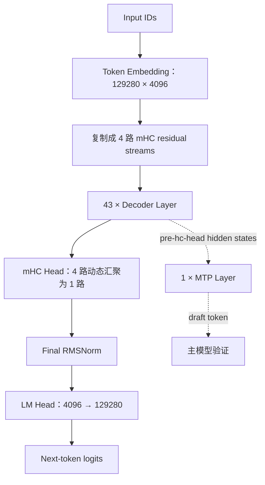
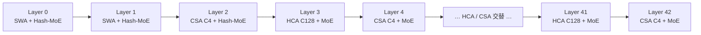
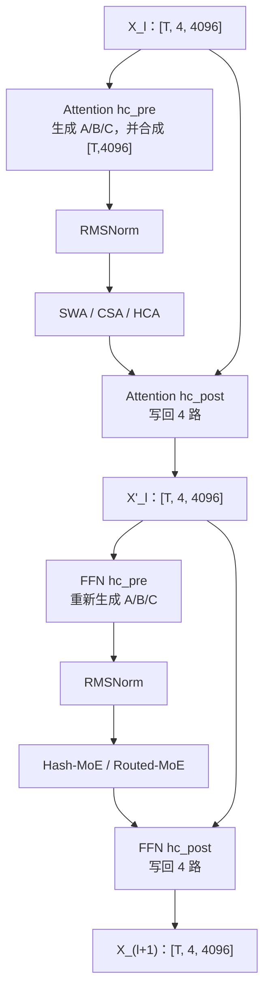
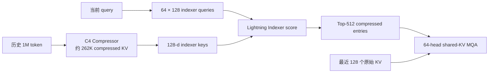
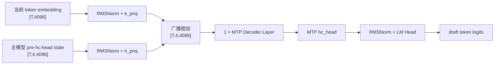

---
tags:
  - DeepSeek
  - 模型架构
  - MoE
  - 稀疏注意力
  - 长上下文
---
# DeepSeek-V4-Flash 模型结构解析

!!! abstract "一句话总结"

    DeepSeek-V4-Flash 是一个 **284B 总参数、13B 激活参数、43 层的 Decoder-only MoE Transformer**。它把残差流扩展成 4 路 mHC，在注意力层中交替使用 **C4 压缩 + Top-512 稀疏选择的 CSA** 和 **C128 重压缩 + 稠密读取的 HCA**，每层保留 128-token 原始滑窗；FFN 全部使用 256 路由专家中的 Top-6 加 1 个共享专家，并额外携带 1 个 MTP 层用于推测解码。


## 1. 先建立整体认识

DeepSeek-V4-Flash 的设计目标可以概括为：**把“模型容量”“残差容量”和“长上下文成本”拆成三条相互独立的扩展轴**。

1. **MoE 扩参数，不按比例增加每个 token 的计算量**  
   总共有 256 个路由专家，但每个 token 只激活 6 个，并始终经过 1 个共享专家。

2. **mHC 扩残差宽度，不把每个子层复制 4 份**  
   层间状态是 4 路、每路 4096 维；进入 Attention 或 MoE 前先动态合并成一条 4096 维输入，子层只计算一次，再把输出写回 4 路残差流。

3. **CSA/HCA 压缩序列轴，避免对 1M 历史 token 做完整注意力**  
   CSA 每 4 个 token 形成一个压缩 KV，再从历史压缩条目中选 Top-512；HCA 每 128 个 token 形成一个压缩 KV，并对这些少量条目做稠密注意力。两者都额外读取最近 128 个原始 token。

宏观数据流如下：



### 1.1 阅读基线

本文交叉核对了三类来源：

- DeepSeek 官方技术报告 [DeepSeek-V4: Towards Highly Efficient Million-Token Context Intelligence](https://arxiv.org/abs/2606.19348)；
- 官方 [DeepSeek-V4-Flash-Base `config.json`](https://huggingface.co/deepseek-ai/DeepSeek-V4-Flash-Base/blob/main/config.json)，检查时配置提交为 `8855555`；
- `vllm-ascend` 本地分支 `feat/add-fastokens-dependency`，基线提交 `bf99c3aee`，分析日期为 2026-08-30。

本文讨论的是模型拓扑。Ascend W8A8、官方 FP4 + FP8、Base FP8 等 checkpoint 会改变线性层和 MoE 的实际算子与存储格式，但不会改变这里描述的 43 层、mHC、CSA/HCA、MoE 和 MTP 连接关系。

### 1.2 源码阅读地图

| 想理解的内容 | 入口文件与关键对象 |
|---|---|
| 总模型、单层、mHC、MoE | `vllm_ascend/models/deepseek_v4/model.py`：`DeepseekV4Model`、`DeepseekV2DecoderLayer`、`DeepseekV4MoE` |
| Attention 投影与层类型选择 | `vllm_ascend/models/deepseek_v4/model.py`：`DeepseekV4Attention` |
| C4/C128 压缩状态 | `vllm_ascend/models/deepseek_v4/compressor.py`：`Compressor` |
| Lightning Indexer 与 Top-K | `vllm_ascend/models/deepseek_v4/indexer.py`：`DeepseekV4Indexer` |
| Ascend DSA 数据面 | `vllm_ascend/attention/dsa_v1.py`：`AscendDeepseekSparseAttention` |
| MTP 草稿层 | `vllm_ascend/models/deepseek_v4/mtp.py`：`DeepSeekMultiTokenPredictorLayer` |
| `compress_ratios` 层索引解释 | `vllm_ascend/utils.py`：`get_dsv4_compress_ratio`、`extract_dsv4_layer_index` |

!!! note

    `DeepseekV2DecoderLayer` 是复用下来的类名，不代表 DeepSeek-V4 仍在执行 V2 的模型结构。实际构造出的 Attention、MoE 和残差连接都已经是 V4 专用实现。


---

## 2. 官方配置速查

以下值来自 DeepSeek-V4-Flash-Base 的公开配置和官方技术报告。

| 模块 | 参数 | 值 | 含义 |
|---|---:|---:|---|
| 规模 | 总参数 | 284B | 所有稠密参数和专家参数之和 |
| 规模 | 激活参数 | 13B | 单个 token 前向时实际参与计算的参数量 |
| 基础 | `vocab_size` | 129,280 | 词表大小 |
| 基础 | `hidden_size` | 4,096 | 单路隐藏维度，记作 $d$ |
| 基础 | `num_hidden_layers` | 43 | 主干 Decoder Layer 数 |
| 基础 | `max_position_embeddings` | 1,048,576 | 1M token 上下文 |
| mHC | `hc_mult` | 4 | 残差流数量，记作 $n_{hc}$ |
| mHC | `hc_sinkhorn_iters` | 20 | 双随机矩阵归一化迭代次数 |
| Attention | `num_attention_heads` | 64 | Query 头数 |
| Attention | `num_key_value_heads` | 1 | 所有 Query 头共享一份 KV |
| Attention | `head_dim` | 512 | Query 和共享 KV 的维度 |
| Attention | `q_lora_rank` | 1,024 | Query 低秩中间维度 |
| Attention | `qk_rope_head_dim` | 64 | 每头使用 RoPE 的末尾维度 |
| Attention | `o_groups` | 8 | 分组输出投影的组数 |
| Attention | `o_lora_rank` | 1,024 | 每个输出组的中间维度 |
| Local | `sliding_window` | 128 | 每层保留的原始局部 KV 窗口 |
| CSA | 压缩率 $m$ | 4 | 每 4 个原始 token 生成一个压缩条目 |
| CSA | `index_n_heads` | 64 | Lightning Indexer Query 头数 |
| CSA | `index_head_dim` | 128 | Indexer 每头维度 |
| CSA | `index_topk` | 512 | 每个 Query 选择的压缩 KV 条目数 |
| HCA | 压缩率 $m'$ | 128 | 每 128 个原始 token 生成一个压缩条目 |
| MoE | `n_routed_experts` | 256 | 每层路由专家总数 |
| MoE | `num_experts_per_tok` | 6 | 每个 token 激活的路由专家数 |
| MoE | `n_shared_experts` | 1 | 每个 token 都执行的共享专家数 |
| MoE | `moe_intermediate_size` | 2,048 | 单个专家的 SwiGLU 中间维度 |
| MoE | `num_hash_layers` | 3 | 前 3 层使用 Hash 路由 |
| MoE | `routed_scaling_factor` | 1.5 | 路由专家输出缩放因子 |
| MTP | `num_nextn_predict_layers` | 1 | 额外的 MTP 层数 |

精度需要分 checkpoint 理解：

- Base 配置声明 FP8 block-wise 量化，专家也为 FP8；
- 官方 Instruct checkpoint 为 FP4 + FP8 混合精度：MoE 专家参数使用 FP4，大部分其余参数使用 FP8；
- Ascend 教程常见的 W8A8/W4A8 权重是平台侧转换产物，不是模型结构的一部分。


---

## 3. 43 层如何排列：2 层纯滑窗 + 21 层 CSA + 20 层 HCA

配置中的 `compress_ratios` 是：

```text
[0, 0, 4, 128, 4, 128, ..., 4, 128, 4, 0]
```

它有 44 项，但主模型只有 43 层：索引 0～42 属于主干，最后一个索引 43 属于 MTP 层。

| 主干层索引 | 数量 | `compress_ratio` | Attention | MoE 路由 |
|---|---:|---:|---|---|
| 0、1 | 2 | 0 | 仅 128-token Sliding Window | Hash 路由 |
| 2 | 1 | 4 | CSA：C4 + Top-512 + Sliding Window | Hash 路由 |
| 3、5、7、…、41 | 20 | 128 | HCA：C128 dense + Sliding Window | 学习型路由 |
| 4、6、8、…、42 | 20 | 4 | CSA：C4 + Top-512 + Sliding Window | 学习型路由 |

因此主干总数为：

$$
2\ \text{SWA-only} + 21\ \text{CSA} + 20\ \text{HCA} = 43\ \text{layers}
$$

这里有两个很容易混淆的点：

- **每个 Transformer block 都是 MoE**。V4-Flash 不再像一些前代 MoE 模型那样让最前面几层使用 Dense FFN；前 3 层只是把学习型 Router 换成 Hash Router。
- **CSA/HCA 的交替只描述 Attention 子层**。MoE 和 mHC 骨架在所有 43 层中保持一致。




---

## 4. mHC：把残差通道从一条扩展成四条

### 4.1 它不是把 Attention 和 MoE 复制四份

普通 Transformer 在层间传递一条 $d$ 维残差流。DeepSeek-V4-Flash 使用 `hc_mult=4`，将它扩展为：

$$
X_l\in\mathbb{R}^{4\times4096}
$$

对 vLLM 打平后的 $T$ 个调度 token，实际张量是 `[T, 4, 4096]`。Embedding 最初产生 `[T,4096]`，`DeepseekV4Model.forward()` 用 `unsqueeze + repeat` 复制成 4 路。

但 Attention 或 MoE 并不分别处理 4 路。每个子层先通过输入映射 $A_l$ 把 4 路合成一条，再执行一次普通的 4096 维子层，最后通过 $C_l$ 注入回 4 路：

$$
X_{l+1}=B_lX_l+C_l\mathcal{F}_l(A_lX_l)
$$

其中：

- $A_l\in\mathbb{R}^{1\times4}$：决定 4 路状态怎样组成当前子层输入；
- $B_l\in\mathbb{R}^{4\times4}$：决定旧残差怎样在 4 路之间流动；
- $C_l\in\mathbb{R}^{4\times1}$：决定子层输出怎样写回 4 路；
- $\mathcal{F}_l$：一次 Attention 或一次 MoE，输入输出仍然都是 4096 维。

所以 mHC 增加的是**层间状态表达能力**，不是简单地把主干 FLOPs 乘以 4。

### 4.2 为什么要加“Manifold-Constrained”

如果 $B_l$ 是任意矩阵，几十层连续相乘后，残差信号可能快速放大、衰减或互相抵消。mHC 将 $B_l$ 约束为双随机矩阵：

$$
B_l\mathbf{1}=\mathbf{1},\qquad
\mathbf{1}^{T}B_l=\mathbf{1}^{T},\qquad
B_l\ge 0
$$

它的每行、每列之和都为 1，位于 Birkhoff polytope 上。技术报告指出，这使 $\lVert B_l\rVert_2\le 1$，残差变换成为非扩张映射。

实现上先动态生成未约束的 $\tilde A_l,\tilde B_l,\tilde C_l$，再执行：

$$
A_l=\sigma(\tilde A_l),\qquad C_l=2\sigma(\tilde C_l)
$$

$$
B_l=\operatorname{Sinkhorn}_{20}(\exp(\tilde B_l))
$$

20 次行列归一化对应配置中的 `hc_sinkhorn_iters=20`。

### 4.3 一个 Decoder Layer 中 mHC 执行两次

Attention 和 MoE 各有一套独立的 mHC 参数：



在 Ascend 实现中，动态映射的准备和回写分别由 `npu_hc_pre_v2` 与 `npu_hc_post` 融合算子完成。经过 43 层后，`DeepseekV4Model.hc_head()` 再根据当前 4 路状态动态生成权重，把 `[T,4,4096]` 汇聚回 `[T,4096]`，随后才进入 Final RMSNorm 和 LM Head。


---

## 5. Attention 公共骨架：低秩 Query + 单头共享 KV + 分组输出

CSA、HCA 和纯滑窗层虽然读取的历史范围不同，但共享同一套 Query/KV/Output 投影结构。

### 5.1 Query 路径

输入 $h_t\in\mathbb{R}^{4096}$ 先降到 1024 维，再展开成 64 个 512 维 Query：

$$
h_t:4096
\xrightarrow{W^{DQ}}
c_t^Q:1024
\xrightarrow{\operatorname{RMSNorm}}
\xrightarrow{W^{UQ}}
Q_t:64\times512
$$

这对应 `wq_a → q_norm → wq_b`。1024 维的 $c_t^Q$ 还会被 CSA 的 Lightning Indexer 复用，避免重复做一套 Query 下投影。

每个 512 维 Query 的最后 64 维应用 RoPE，其余 448 维不旋转：

$$
512=448\ \text{NoPE}+64\ \text{RoPE}
$$

### 5.2 KV 路径不是 64 头 K/V

`num_key_value_heads=1`。模型从隐藏状态产生一个 512 维共享 KV 条目：

$$
h_t:4096\xrightarrow{W^{KV}}c_t^{KV}:512
$$

这一个条目同时作为 Key 和 Value，被 64 个 Query 头共享，属于 MQA。它与 DeepSeek-V3 常见的 MLA 直觉不同：V4 技术报告明确把核心注意力描述为 **shared Key-Value MQA**；低秩 Query 和序列压缩也不应笼统等同于“缓存 MLA latent”。

### 5.3 Query/KV 归一化、Partial RoPE 和 Attention Sink

核心注意力前，每个 Query head 和唯一的共享 KV head 都再做 RMSNorm，以抑制 attention logits 爆炸。

由于同一条压缩向量同时充当 K 和 V，最后 64 维带有绝对位置旋转。模型在注意力输出上施加反向位置旋转，使其重新表达相对位置关系。

每个注意力头还有一个可学习的 sink logit $z'_h$：

$$
s_{h,i,j}=
\frac{\exp(z_{h,i,j})}
{\sum_k\exp(z_{h,i,k})+\exp(z'_h)}
$$

分母多出来的 sink 项允许一个头把实际 KV 上的注意力总质量降到 1 以下，必要时接近 0，而不必强迫它关注某个无关 token。

### 5.4 为什么需要 Grouped Output Projection

64 个头、每头 512 维，直接拼接会得到 32768 维。V4-Flash 把 64 个头分成 8 组：

```text
64 × 512 = 32768
→ 8 组，每组 8 × 512 = 4096
→ 每组投影到 1024
→ 拼接为 8 × 1024 = 8192
→ 最终投影到 4096
```

对应实现中的 `wo_a` 和 `wo_b`。它用一次分组低秩瓶颈，降低超宽 Attention 输出映射的参数量与 FLOPs。


---

## 6. CSA：C4 压缩之后再从历史中选 Top-512

CSA 是 `compress_ratio=4` 层的核心。

### 6.1 C4 Compressor 不是平均池化

设 $m=4$。模型并不是简单地对每 4 个 token 求平均，而是为 KV 内容和逐维压缩权重分别做投影，并加入可学习的位置偏置。

CSA 有两条重叠分支 $a$ 和 $b$。第 $i$ 个压缩条目综合当前 4-token block 的 $a$ 分支与前一个 4-token block 的 $b$ 分支：

$$
C_i^{Comp}
=\sum_{j=4i}^{4(i+1)-1}S_j^a\odot C_j^a
+\sum_{j=4(i-1)}^{4i-1}S_j^b\odot C_j^b
$$

权重 $S$ 在两组共 8 个位置上按行做 Softmax。虽然一个压缩条目融合了相邻两个 block 的信息，但相邻条目会复用重叠部分，所以条目总数仍约为原序列的 $1/4$。

在 `Compressor` 中，这对应：

- `wkv`：产生待压缩 KV；
- `wgate`：产生逐维压缩权重；
- `ape`：可学习的位置偏置；
- `overlap=True`：仅 C4 使用双分支重叠压缩；
- state cache：保存尚未凑满一个压缩块的尾部状态。

### 6.2 Lightning Indexer 如何选 Top-512

如果 1M 上下文的所有 C4 条目都进入核心注意力，仍有大约 262K 个历史位置。Lightning Indexer 用更窄的 128 维 key/query 做一次候选检索。

Indexer Query 使用同一份 1024 维 $c_t^Q$：

$$
c_t^Q:1024\rightarrow Q_t^I:64\times128
$$

同时，从当前隐藏状态生成 64 个 head 权重 $w_{t,h}^I$。Query token $t$ 与历史压缩块 $s$ 的分数为：

$$
I_{t,s}=\sum_{h=1}^{64}
w_{t,h}^I\operatorname{ReLU}
\left(q_{t,h}^I\cdot K_s^{IComp}\right)
$$

然后只保留分数最高的 512 个压缩 KV 条目，交给 512 维核心 MQA。



!!! important "Top-512 的单位"

    `index_topk=512` 选择的是 **512 个 C4 压缩条目**，不是 512 个原始 token。每个条目总结 4-token block，并通过重叠分支携带相邻 block 信息；核心注意力还会额外读取最近 128 个未压缩 token。

### 6.3 1M 上下文下的访问直觉

忽略开头、尾部和因果边界细节：

$$
1{,}048{,}576/4=262{,}144\ \text{C4 candidates}
$$

每个 Query 的核心 Attention 最终只读取：

$$
512\ \text{compressed entries}+128\ \text{raw local entries}
$$

Indexer 仍需对候选做打分，但它使用更窄的 128 维、低精度表示；昂贵的 64 头 × 512 维核心注意力只在 Top-512 上执行。


---

## 7. HCA：C128 重压缩后做稠密注意力

HCA 使用 `compress_ratio=128`。它不运行 Lightning Indexer，而是把序列压得足够短之后，对全部可见压缩条目做稠密注意力。

对每 128 个原始 token：

$$
C_i^{Comp}
=\sum_{j=128i}^{128(i+1)-1}S_j\odot C_j
$$

其中 $S$ 由 `wgate` 投影和 128 个位置的可学习偏置共同决定。与 CSA 不同，HCA 不使用前后 block 的重叠分支，`Compressor.overlap=False`。

在 1M 上下文下：

$$
1{,}048{,}576/128=8{,}192\ \text{HCA compressed entries}
$$

因此每个 Query 大致读取：

$$
8{,}192\ \text{compressed entries}+128\ \text{raw local entries}
$$

HCA 访问的压缩条目数比 CSA 的 Top-512 多，但每个条目覆盖 128 个原始 token，并省掉了 Indexer。两类层交替出现，形成互补：

| 机制 | 压缩率 | 核心注意力范围 | 擅长保留的信息 |
|---|---:|---|---|
| CSA | C4 | 从大量细粒度条目中动态选 Top-512 | 内容相关的远程细节 |
| HCA | C128 | 稠密读取全部粗粒度条目 | 全局、低分辨率背景 |
| SWA | 不压缩 | 最近 128 token | 精确的局部依赖与块内因果性 |

这三条路径一起工作，才是 V4 的完整长上下文注意力：**局部看原文，远处用 C4 做内容检索，再用 C128 保留全局概览**。


---

## 8. 为什么每个 CSA/HCA 层都还需要 128-token Sliding Window

压缩注意力只允许 Query 读取已经完成的历史压缩块，以严格保持因果性。因此当前尚未凑满 4 或 128 个 token 的 block 不能提前生成压缩条目；若只有压缩分支，Query 也无法细粒度读取同一个 block 中它之前的 token。

所以每层额外维护最近 128 个原始共享 KV：

- 补足压缩块内部的精确因果依赖；
- 让最近 token 不必先被有损压缩；
- 让尚未凑满压缩率的尾部状态有地方暂存。

这也解释了为什么 DeepSeek-V4 的 KV Cache 不是一种统一张量，而是混合状态：

| 层类型 | 主要缓存 |
|---|---|
| ratio 0 | SWA 原始 KV |
| ratio 4 | SWA KV、C4 压缩 KV、Compressor 尾状态、Indexer Compressor 状态、Indexer key/scale |
| ratio 128 | SWA KV、C128 压缩 KV、Compressor 尾状态 |

推理引擎如果只按普通 MHA/GQA 的“每层一组同构 K/V block”来估算或分配缓存，会在这里失败。更多 vLLM Ascend 的 cache 注册和调度细节见 [DeepSeek-V4-Flash 推理调用全过程](../ai/deepseek-v4-flash-inference-walkthrough.md)。


---

## 9. MoE：所有层都是 Top-6 + Shared Expert

### 9.1 单个专家

每个专家是一个中间维度 2048 的 SwiGLU MLP：

$$
\operatorname{Expert}(x)=
W_{down}\left(\operatorname{SiLU}(W_{gate}x)\odot W_{up}x\right)
$$

维度变化为：

```text
4096 → gate/up 两条 2048 → SwiGLU → 2048 → 4096
```

配置中的 `swiglu_limit=10.0` 对激活做 clamp，用于抑制训练中的异常值和 loss spike。

### 9.2 前三层：Hash Routing

层 0～2 不计算学习型 Router 的 Top-K，而是根据输入 token ID 查询本层的 `tid2eid` 表：

```text
token_id
→ tid2eid[token_id]
→ 6 个 routed expert IDs
```

在源码中，该表形状为 `[vocab_size, num_experts_per_tok] = [129280, 6]`。同一个词表 token 在某个 Hash-MoE 层总是走该层预定义的 6 个专家；不同层拥有自己的映射表。

Hash routing 用确定性的 token→expert 映射替代最前几层的动态路由。它并不意味着这些层是 Dense FFN，也不意味着 6 个专家退化为 1 个固定专家。

### 9.3 后 40 层：学习型 Router

从层 3 开始，Router 将 4096 维隐藏状态投影为 256 个 affinity scores。DeepSeek-V4 相比 V3 的一个变化是评分激活从 Sigmoid 改成：

$$
s_i=\sqrt{\operatorname{Softplus}(g_i)}
$$

随后：

1. 加上 auxiliary-loss-free load balancing 的 correction bias；
2. 选择 Top-6 routed experts；
3. 对选中权重重新归一化，因为 `norm_topk_prob=true`；
4. 汇总 routed expert 输出并乘 `routed_scaling_factor=1.5`；
5. 加上始终执行的 shared expert 输出。

可以写成：

$$
y=\operatorname{SharedExpert}(x)
+1.5\sum_{i\in\operatorname{Top6}(x)}\hat p_i\operatorname{Expert}_i(x)
$$

从系统角度看，256 个专家提供 284B 的总模型容量，Top-6 限制单 token 的计算量；代价是需要 expert dispatch、grouped GEMM 和 combine，跨卡部署时还会引入 EP 集合通信。


---

## 10. 一个完整 Decoder Layer 的数据流

把前面的组件合起来，主干中任意一层都遵循下面的公共骨架：

```text
X_l [T, 4, 4096]
│
├─ Attention mHC pre：4 路 → 1 路 [T,4096]
├─ RMSNorm
├─ Attention：
│    layer 0/1       → SWA-only
│    even >= 2       → CSA(C4 + Indexer Top-512 + SWA)
│    odd  >= 3       → HCA(C128 dense + SWA)
├─ Attention mHC post：写回 [T,4,4096]
│
├─ FFN mHC pre：4 路 → 1 路 [T,4096]
├─ RMSNorm
├─ MoE：
│    layer 0..2      → Hash Top-6 + Shared
│    layer 3..42     → Routed Top-6 + Shared
├─ FFN mHC post：写回 [T,4,4096]
│
└─ X_(l+1) [T, 4, 4096]
```

43 层结束后：

```text
[T,4,4096]
→ mHC head 动态加权汇聚
→ [T,4096]
→ Final RMSNorm
→ LM Head
→ [T,129280] logits
```

这里的 $T$ 是当前调度批次打平后的 token 数，不是固定 batch size。vLLM 会把不同请求当前需要计算的 token 拼接起来，因此源码中的主张量通常不是 `[batch, sequence, hidden]`。


---

## 11. MTP：主干之外还有一个下一 token 预测层

配置中的 `num_nextn_predict_layers=1` 表示 checkpoint 携带一个 Multi-Token Prediction 层。它在训练时提供额外的未来 token 预测目标，在推理时可以作为 draft model 做 speculative decoding。

MTP 层接收两类信息：

- 当前输入 token 的 embedding，经 RMSNorm 和 `e_proj`；
- 主模型在最终 `hc_head` 汇聚前的 4 路隐藏状态，经 RMSNorm 和 `h_proj`。

二者相加后仍保持 4 路结构：

$$
X^{MTP}
=W_e\operatorname{RMSNorm}(e_t)
+W_h\operatorname{RMSNorm}(X_{target})
$$

然后经过一个完整的 V4 Decoder Layer、MTP 自己的 mHC head、RMSNorm 和共享预测头，得到 draft logits。



`compress_ratios` 最后的第 44 项为 0，因此这个 MTP 层走纯滑窗 Attention；构造时 `is_draft_layer=True`，不会继承主干前三层的 Hash Router。不开启 MTP speculative decoding 时，它不参与普通逐 token 主模型前向，主模型结构仍是 43 层。


---

## 12. 从构造到运行：vLLM Ascend 如何落地这套结构

### 12.1 初始化路径

模型构造时的关键关系是：

```text
AscendDeepseekV4ForCausalLM
└─ DeepseekV4Model
   ├─ VocabParallelEmbedding
   ├─ 43 × DeepseekV2DecoderLayer
   │  ├─ DeepseekV4Attention
   │  │  ├─ Compressor（ratio 4 / 128 时创建）
   │  │  ├─ DeepseekV4Indexer（仅 ratio 4 时创建）
   │  │  └─ AscendDeepseekSparseAttention
   │  ├─ DeepseekV4MoE
   │  └─ Attention/FFN 两套 mHC 参数
   ├─ mHC Head
   └─ Final RMSNorm
```

`DeepseekV4Attention.__init__()` 根据当前 layer index 查 `compress_ratios`：

- ratio 0：只注册 SWA cache；
- ratio 4：注册主 Compressor、Indexer 自己的 Compressor、Indexer cache 和 SWA cache；
- ratio 128：注册主 Compressor 和 SWA cache。

这一步把模型配置中的层级结构转换成了推理引擎可见的异构 cache 拓扑。

### 12.2 运行路径

一次主模型前向的结构级路径是：

```text
AscendDeepseekV4ForCausalLM.forward
→ DeepseekV4Model.forward
→ embedding + 复制 4 路 mHC state
→ for layer in 43 layers
   → DeepseekV2DecoderLayer.forward
      → hc_pre → RMSNorm → DeepseekV4Attention
      → hc_post
      → hc_pre → RMSNorm → DeepseekV4MoE
      → hc_post
→ hc_head → Final RMSNorm
→ compute_logits → LM Head
```

Attention 内部还会根据层类型分支：

```text
ratio 0   → raw SWA attention
ratio 4   → C4 compressor + Lightning Indexer + sparse core attention + SWA
ratio 128 → C128 compressor + dense compressed attention + SWA
```

论文中的数学结构与 Ascend 实现并不是一一对应的 Python 小算子：`npu_hc_pre_v2`、`compressor`、Top-K、cache scatter 和 DSA attention 等都可能是融合 NPU 算子。但融合只改变执行边界，不改变张量含义和模型拓扑。


---

## 13. 这套结构为什么能支撑 1M 上下文

把三个主要成本放在一起看：

| 成本来源 | 普通做法 | DeepSeek-V4-Flash |
|---|---|---|
| 模型容量 | 所有 FFN 参数每 token 激活 | 256 路由专家只激活 6 个，另加 1 个共享专家 |
| 残差表达能力 | 单路 4096 维 | 4 路 4096 维 mHC，但子层只算一次 |
| 远程 KV 条目数 | 与原始序列长度线性增长 | CSA 压到 1/4 后 Top-512；HCA 直接压到 1/128 |
| 局部精度 | 与远程历史同一种表示 | 最近 128 token 单独保留原始 KV |
| Attention 输出 | 32768 直接投影到 4096 | 8 组先各降到 1024，再合并投影 |
| 下一 token 草稿 | 额外完整 draft model | 复用主模型隐藏状态的 1 层 MTP |

官方报告给出的整体结果是：在 1M 上下文下，V4-Flash 的单 token 推理 FLOPs 约为 DeepSeek-V3.2 的 10%，KV Cache 约为其 7%。这不是某一个技巧单独带来的，而是压缩、稀疏、共享 KV、低精度存储、Grouped Output Projection 和 MoE 共同作用的结果。


---

## 14. 常见误区与调试清单

### 14.1 常见误区

1. **“43 层里前 3 层是 Dense FFN”**  
   错。43 层全部是 MoE；前 3 层只是使用 Hash routing。

2. **“`compress_ratios` 有 44 项，所以主模型有 44 层”**  
   错。前 43 项属于主干，最后 1 项属于 MTP。

3. **“Top-512 就是关注 512 个原始 token”**  
   错。它选择 512 个 C4 压缩条目，核心注意力还会读取 128 个原始滑窗条目。

4. **“C128 比 C4 更稀疏”**  
   不准确。HCA 的历史条目更少，但对全部 C128 条目做稠密读取；CSA 候选更细，随后再做 Top-K 稀疏选择。

5. **“mHC 让每层 Attention 和 MoE 都计算 4 次”**  
   错。4 路残差先合并成一条子层输入，Attention/MoE 只执行一次，再写回 4 路。

6. **“V4 的 KV 就是传统 MLA latent cache”**  
   不严谨。官方结构将其描述为单头共享 KV 的 MQA，并在序列轴上额外执行 C4/C128 压缩；Query 使用低秩投影。

7. **“FP4 是所有权重的统一精度”**  
   错。官方 Instruct 权重主要是 MoE experts FP4、其余参数 FP8；Base 和 Ascend 转换权重又有不同精度口径。

### 14.2 结构问题的调试顺序

遇到 shape、cache 或数值问题时，可以按下面顺序排查：

- [ ] 当前 layer index 对应的 `compress_ratio` 是否正确；MTP 的 layer index 是否误映射到主干。
- [ ] 主干 hidden state 是否保持 `[T,4,4096]`，只有子层输入和最终 logits 路径才降为 `[T,4096]`。
- [ ] ratio 4 是否同时拥有 Attention Compressor 和 Indexer Compressor；ratio 128 是否错误创建了 Indexer。
- [ ] Indexer 输出是否为每个 Query 的 512 个**压缩条目索引**，而不是原 token 索引。
- [ ] 最近 128 token 的 SWA cache 与尚未完成压缩的 tail state 是否被混为一种状态。
- [ ] 层 0～2 是否传入 `input_ids` 以执行 `tid2eid` Hash routing；MTP draft layer 是否错误使用 Hash routing。
- [ ] Query 是否为 `64×512`，Indexer Query 是否为 `64×128`，共享 KV 是否只有 `1×512`。
- [ ] Partial RoPE 是否只作用于末尾 64 维，压缩位置是否使用 `compress_rope_theta=160000`。
- [ ] Routed expert 输出是否在 Top-K 归一化后乘 1.5，再与 shared expert 相加。
- [ ] checkpoint 精度与实际 quant method 是否匹配，避免把结构问题误判为量化问题。

本文是基于公开配置与源码的静态结构分析，没有在本地执行 NPU 数值或性能验证。涉及融合算子的 dtype、内存布局和实际吞吐，应以对应硬件上的 profiling 为准。


---

## 15. 总结

记住下面这条主线，就能把 DeepSeek-V4-Flash 的复杂结构串起来：

```text
Embedding
→ 4 路 mHC residual streams
→ 43 层：
   Attention = 2×SWA-only + 21×CSA(C4 Top-512) + 20×HCA(C128 dense)
   FFN       = 每层 Top-6/256 routed experts + 1 shared expert
→ mHC head 汇聚
→ RMSNorm + LM Head
→ 可选 1 层 MTP speculative decoding
```

它最关键的设计不是“把一个普通 Transformer 做得更大”，而是重新安排了三个维度：

- 参数轴交给 MoE；
- 残差轴交给 mHC；
- 序列轴交给 CSA/HCA/SWA 混合注意力。

三者共同把 284B 模型的单 token 激活量压到 13B，并让 1M 上下文的 KV 与 Attention 成本进入可部署范围。


## 参考资料

- [DeepSeek-V4 Technical Report](https://arxiv.org/abs/2606.19348)
- [DeepSeek-V4-Flash 官方模型卡](https://huggingface.co/deepseek-ai/DeepSeek-V4-Flash)
- [DeepSeek-V4-Flash-Base config.json](https://huggingface.co/deepseek-ai/DeepSeek-V4-Flash-Base/blob/main/config.json)
- [vLLM Ascend DeepSeek-V4-Flash 部署文档](https://docs.vllm.ai/projects/ascend/en/latest/tutorials/models/DeepSeek-V4-Flash.html)

