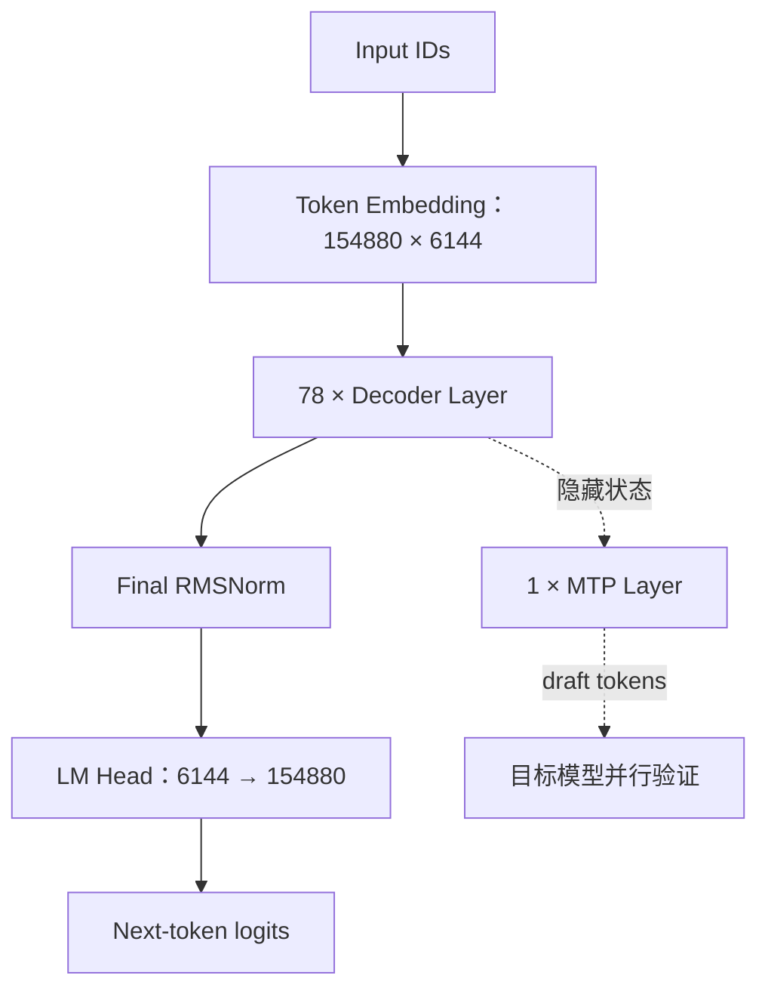
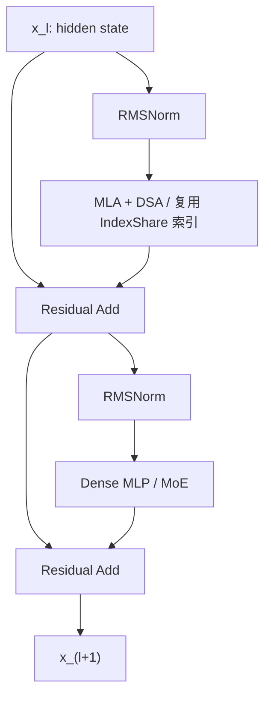
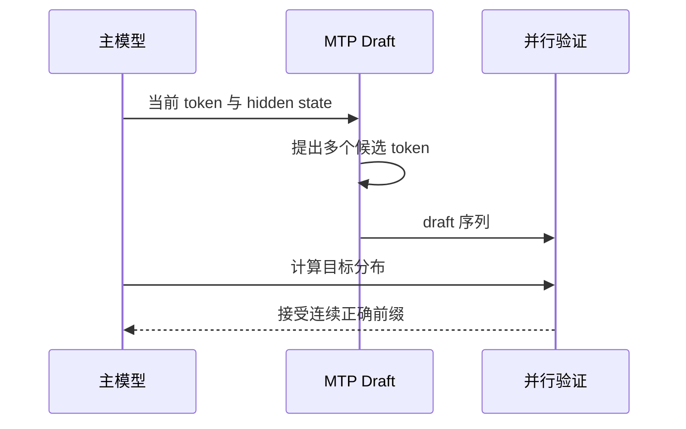

---
tags:
  - GLM
  - 模型架构
  - MoE
  - 稀疏注意力
---
# GLM-5.2 模型结构解析

!!! abstract "一句话总结"

    GLM-5.2 是一个 **Decoder-only Transformer**，主干由 **78 层 Transformer、MLA、DSA、IndexShare 和 MoE** 组成；每个 token 只激活 8 个路由专家和 1 个共享专家，并额外携带 1 个 MTP 层用于推测解码。它用 **MLA 压缩 KV Cache**，用 **DSA 将核心注意力从全量 token 缩小到 Top-2048 token**，再用 **IndexShare 跨层复用 Top-K 结果**，从而把 1M 上下文的计算量压到可部署范围。


## 1. 先建立整体认识

GLM-5.2 的核心不是某一个孤立的新算子，而是三条效率路线同时工作：

1. **MoE：降低每个 token 的参数计算量**  
   模型拥有 256 个路由专家，但每个 token 只进入其中 8 个，同时始终经过 1 个共享专家。

2. **MLA：降低 KV Cache 占用**  
   不直接缓存每个注意力头完整的 K、V，而是缓存 512 维 latent KV 与 64 维 RoPE key。

3. **DSA + IndexShare：降低长上下文注意力计算量**  
   DSA 先找出当前 query 最相关的 2048 个历史 token，再只对这些 token 做核心注意力；IndexShare 让相邻层复用这组 Top-K 索引，避免每层都重新搜索。

模型的宏观数据流如下：



!!! important

    MTP 层是推测解码的 draft 分支。不开启 MTP speculative decoding 时，普通自回归生成仍然由主干模型逐 token 产生结果。


---

## 2. 官方配置速查

以下参数来自 GLM-5.2 官方 Hugging Face `config.json`；它比泛化的 `GlmMoeDsaConfig` 默认值更能代表具体 checkpoint。

| 模块 | 参数 | GLM-5.2 的值 | 含义 |
|---|---:|---:|---|
| 基础 | `model_type` | `glm_moe_dsa` | MoE + DeepSeek Sparse Attention 架构 |
| 基础 | `vocab_size` | 154,880 | 词表大小 |
| 基础 | `hidden_size` | 6,144 | 主隐藏维度 |
| 基础 | `num_hidden_layers` | 78 | 主干 Decoder 层数 |
| 基础 | `max_position_embeddings` | 1,048,576 | 1M token 上下文 |
| 基础 | `dtype` | BF16 | 官方原始权重精度 |
| 归一化 | `rms_norm_eps` | `1e-5` | RMSNorm epsilon |
| 注意力 | `num_attention_heads` | 64 | Query 头数 |
| 注意力 | `q_lora_rank` | 2,048 | Query 低秩压缩维度 |
| 注意力 | `kv_lora_rank` | 512 | KV latent 维度 |
| 注意力 | `qk_nope_head_dim` | 192 | 每头不承载位置编码的 Q/K 维度 |
| 注意力 | `qk_rope_head_dim` | 64 | 每头承载 RoPE 的 Q/K 维度 |
| 注意力 | `qk_head_dim` | 256 | 每头总 Q/K 维度，192 + 64 |
| 注意力 | `v_head_dim` | 256 | 每头 V 维度 |
| RoPE | `rope_theta` | 8,000,000 | RoPE 基频参数 |
| DSA | `index_topk` | 2,048 | 每个 query 选择的历史 token 数 |
| DSA | `index_n_heads` | 32 | Lightning Indexer 头数 |
| DSA | `index_head_dim` | 128 | Indexer 每头维度 |
| IndexShare | `index_topk_freq` | 4 | 大体上每 4 层计算一次 Top-K |
| IndexShare | `index_skip_topk_offset` | 3 | 与前三层及共享模式的层偏移有关 |
| MLP | `intermediate_size` | 12,288 | 前 3 个 Dense MLP 的中间维度 |
| MoE | `moe_intermediate_size` | 2,048 | 单个专家的中间维度 |
| MoE | `n_routed_experts` | 256 | 路由专家总数 |
| MoE | `num_experts_per_tok` | 8 | 每个 token 激活的路由专家数 |
| MoE | `n_shared_experts` | 1 | 每个 token 都执行的共享专家数 |
| MoE | `routed_scaling_factor` | 2.5 | 路由输出缩放系数 |
| MoE | `moe_router_dtype` | FP32 | Router 使用较高精度计算 |
| MTP | `num_nextn_predict_layers` | 1 | checkpoint 携带 1 个 NextN/MTP 层 |
| MTP | `index_share_for_mtp_iteration` | `true` | MTP 多次 draft 迭代复用索引结果 |

来源：[GLM-5.2 config.json](https://huggingface.co/zai-org/GLM-5.2/blob/main/config.json)、[Transformers GLM-MoE-DSA 文档](https://huggingface.co/docs/transformers/model_doc/glm_moe_dsa)。

!!! note "层数口径"

    GLM-5 技术报告正文曾使用“80 层”的概括说法，但其参数表列出 3 个 Dense 层、75 个 MoE 层和 1 个 MTP 层；GLM-5.2 具体 checkpoint 的 `num_hidden_layers` 明确为 78，另有 1 个 `nextn` 层。分析部署与源码时，应以 checkpoint config 的 **78 个主干层 + 1 个 MTP 层**为准。


---

## 3. 一个 Decoder Layer 内部发生了什么

GLM-5.2 使用典型的 **Pre-Norm + Residual** 结构。设第 $l$ 层输入为 $x_l$：

$$
a_l = x_l + \operatorname{Attention}\left(\operatorname{RMSNorm}(x_l)\right)
$$

$$
x_{l+1} = a_l + \operatorname{FFN/MoE}\left(\operatorname{RMSNorm}(a_l)\right)
$$

对应到结构图：



78 层的 FFN 类型并不完全一样：

- **第 0～2 层：Dense MLP**；
- **第 3～77 层：MoE**，共 75 层；
- 每层都有注意力模块，Dense/MoE 的区别只发生在 FFN 子层。

一种常见的工程直觉是：前三层先用 Dense MLP 稳定提取底层特征，再进入大规模稀疏专家网络，可以避免过早引入路由噪声与通信开销；但 GLM-5 报告并未把这句话作为正式设计结论。

---

## 4. MLA：先解决 KV Cache 太大的问题

### 4.1 普通 MHA 的问题

普通多头注意力会为每个历史 token、每一层保存所有 K 和 V：

$$
\text{KV Cache} \propto L \times n_{layers} \times n_{heads} \times (d_k+d_v)
$$

上下文增长到 1M token 时，即使注意力计算被稀疏化，完整 K/V 的显存占用仍然可能无法接受。

### 4.2 GLM-5.2 的 Query 路径

输入隐藏状态 $h_t\in\mathbb{R}^{6144}$ 先压缩到 2048 维，再展开为 64 个注意力头：

$$
h_t:6144
\rightarrow c_t^Q:2048
\rightarrow Q_t:64\times(192+64)
$$

其中：

- 192 维是 **NoPE 部分**，不应用旋转位置编码；
- 64 维是 **RoPE 部分**，承载位置信息；
- 每个头的 Q/K 总维度是 $192+64=256$。

这条路径对应实现中的 `q_a_proj → RMSNorm → q_b_proj`。

### 4.3 GLM-5.2 的 KV 路径

KV 路径先生成：

$$
h_t:6144
\rightarrow
\begin{cases}
c_t^{KV}:512 \\
k_t^R:64
\end{cases}
$$

其中 $c_t^{KV}$ 是压缩后的 latent KV，随后可展开为：

$$
c_t^{KV}:512
\rightarrow
\begin{cases}
K_t^{NoPE}:64\times192 \\
V_t:64\times256
\end{cases}
$$

推理时真正需要长期缓存的核心内容是：

$$
\boxed{c_t^{KV}(512) + k_t^R(64)}
$$

也就是每 token、每层约 **576 个元素**，而不是缓存 64 个头的完整 K/V。高性能推理内核还可以把 KV 上投影权重吸收到注意力计算中，避免显式还原巨大的多头 K/V 张量。

### 4.4 MLA 为什么与 DSA 能配合

MLA 回答的是：“历史 token 应该以什么紧凑格式保存？”  
DSA 回答的是：“当前 query 真正需要读取哪些历史 token？”

因此二者不是替代关系：

- MLA 压缩 **缓存宽度**；
- DSA 减少每次注意力读取的 **token 数量**。

GLM-5 技术报告指出，其 MLA 采用 512 维 latent KV 和 64 维 RoPE key，并通过调整 Query/Value 头维度与头数来平衡 prefill 参数量、decode 计算量和模型质量。[GLM-5 Technical Report](https://arxiv.org/abs/2602.15763)

---

## 5. DSA：从全部历史 token 中动态挑 Top-2048

### 5.1 DSA 不是固定滑窗

滑动窗口注意力只保留最近的一段 token，距离太远的内容无论多重要都无法被读取。DSA（DeepSeek Sparse Attention）则根据内容相关性动态选 token：远处的函数定义、约束条件或早期工具结果，只要相关，就仍可能进入 Top-K。

DSA 分两步：

1. **Lightning Indexer** 快速扫描可见前缀并计算相关性分数；
2. **Sparse MLA Attention** 只读取分数最高的 2048 个位置。

### 5.2 Lightning Indexer

对 query token $t$ 与历史 token $s$，Indexer 可写成：

$$
I_{t,s}=\sum_{j=1}^{H_I}w_{t,j}\,\operatorname{ReLU}
\left(q^I_{t,j}\cdot k^I_s\right)
$$

GLM-5.2 中：

- $H_I=32$ 个 indexer heads；
- 每个 $q^I_{t,j}$ 和 $k^I_s$ 为 128 维；
- $w_{t,j}$ 是当前 query 为各 indexer head 生成的权重；
- Indexer 可以使用低精度、高度融合的内核执行。

得到所有 $I_{t,s}$ 后选择：

$$
S_t=\operatorname{TopK}(I_{t,:}, 2048)
$$

核心注意力变成：

$$
u_t=\operatorname{MLA}\left(q_t,\{c_s\mid s\in S_t\}\right)
$$

DSA 的公式和训练方式来自 DeepSeek-V3.2，GLM-5/5.2 将它作为 MLA 上的稀疏选择机制使用。[DeepSeek-V3.2 Technical Report](https://arxiv.org/abs/2512.02556)

### 5.3 复杂度应该怎样理解

| 部分 | Dense Attention | DSA |
|---|---:|---:|
| 核心注意力 | $O(L^2)$ | $O(Lk)$，其中 $k=2048$ |
| Indexer | 无 | 仍为 $O(L^2)$，但向量更窄、头数更少 |
| 单步 decode | 读取全部 $L$ 个 KV | Indexer 扫描 $L$，核心注意力读取 $k$ 个 KV |

因此“DSA 是线性注意力”并不严谨。更准确地说：

- **核心注意力**由 $O(L^2)$ 降到 $O(Lk)$；
- Indexer 仍然需要扫描历史 token；
- 当 $L\gg2048$ 时，核心注意力节省非常明显；
- 当上下文不超过 2048 时，稀疏选择的收益较小，运行时可能采用更适合短序列的实现。

---

## 6. IndexShare：GLM-5.2 相对 GLM-5 的关键结构升级

### 6.1 为什么 DSA 还不够

DSA 虽然让核心注意力只读取 2048 个 token，但每一层如果都运行一次 Indexer，长上下文下 Indexer 本身会成为主要开销。研究发现，相邻层选出的 Top-K token 高度重合，因此没有必要让每层都重复搜索。

### 6.2 Full 层与 Shared 层

GLM-5.2 将层分为：

- **Full 层**：真正运行 Indexer，生成 Top-K indices；
- **Shared 层**：不重新搜索，直接复用前一个 Full 层的 indices。

官方 checkpoint 的 78 层模式为：

```text
层号（0-based）
0:F, 1:F, 2:F,
3:S, 4:S, 5:S,
6:F, 7:S, 8:S, 9:S,
10:F, 11:S, 12:S, 13:S,
...
74:F, 75:S, 76:S, 77:S
```

即：

- Full 层共 **21 层**；
- Shared 层共 **57 层**；
- 约 **73% 的层不再重复运行 Indexer**；
- 从第 2 层开始，整体接近 `FSSS | FSSS | ...` 的四层一组模式。


!!! note "IndexShare 与 IndexCache"

    GLM-5.2 的模型卡把这一升级称为 **IndexShare**；其引用论文名为 **IndexCache**。二者的共同核心都是“跨层复用 DSA 的 Top-K 索引”。论文给出的通用方法还包括免训练的贪心层选择与带多层蒸馏的训练方法；GLM-5.2 checkpoint 则已经固化了自己的层模式。


GLM-5.2 官方说明称，在 1M 上下文长度下，IndexShare 可将单 token FLOPs 降低约 2.9 倍；模型卡中的结构模式也与 config 的 `indexer_types` 一致。[GLM-5.2 Model Card](https://huggingface.co/zai-org/GLM-5.2)、[IndexCache Paper](https://arxiv.org/abs/2603.12201)

---

## 7. MoE：744B 总参数为什么每个 token 只激活约 40B

### 7.1 前 3 层是 Dense MLP

Dense MLP 使用 SwiGLU 风格结构：

$$
\operatorname{MLP}(x)=W_{down}
\left(\operatorname{SiLU}(W_{gate}x)\odot W_{up}x\right)
$$

维度为：

```text
6144 → 12288 → 6144
```

`gate_proj`、`up_proj` 和 `down_proj` 三个矩阵合计约 2.26 亿参数/层。

### 7.2 后 75 层是 MoE

每个 MoE 层包含：

- 256 个 routed experts；
- 每个 token 选择 8 个 routed experts；
- 1 个 shared expert 始终参与；
- 单个专家的中间维度为 2048；
- 每个专家仍是 SwiGLU MLP：`6144 → 2048 → 6144`。

对单个 token，可将 MoE 输出概念化为：

$$
y=
E_{shared}(x)+
2.5\sum_{i\in\operatorname{Top8}(x)}\hat g_i(x)E_i(x)
$$

Router 对专家分数使用 sigmoid，选中后归一化 Top-K 权重；Router 本身使用 FP32，有利于降低大规模路由时的数值误差。当前配置 `n_group=1`、`topk_group=1`，因此不存在跨多个 expert group 再筛组的复杂过程。

### 7.3 “总参数”和“激活参数”不要混淆

| 概念 | 大致规模 | 决定什么 |
|---|---:|---|
| 总参数 | 官方命名 744B；HF checkpoint 约 753B | 权重存储、加载和跨设备切分需求 |
| 每 token 激活参数 | 约 40B | 单 token 前向计算量 |

虽然一个 token 只计算 8/256 个路由专家，但服务启动时仍需保存全部 256 个专家权重。因此：

> **A40B 不等于只需要存 40B 权重。MoE 节省的是主要前向计算，不会自动把模型权重缩小到 40B。**

### 7.4 为什么有 744B 与 753B 两种说法

- GLM 官方仓库将模型标为 **744B-A40B**；
- Hugging Face 对实际 GLM-5.2 checkpoint 的参数统计显示约 **753B**；
- config 还包含额外的 1 个 MTP/NextN 层，并且词嵌入和 LM Head 不共享权重。

从结构规模估算，约 9B 的差值与“是否将额外 MTP block、embedding/head 等纳入统计”的口径差异相符。工程上应这样使用这两个数字：

- 讨论系列架构和激活计算量：使用 **744B-A40B**；
- 估算 checkpoint 下载、权重显存和加载时间：以实际文件大小及框架报告的 **约 753B** 为准。

这里的“差值来源”是根据公开 config 与模块规模做的工程推导；官方尚未给出一份专门统一两个数字的参数清单。

---

## 8. MTP：一个小分支怎样加速多个 token 的生成

### 8.1 基本思想

普通自回归解码每次只能得到下一个 token。MTP（Multi-Token Prediction）使用一个额外的 draft 层连续提出多个候选 token，再由完整主模型一次并行验证。它相对整个 78 层主干更轻，但自身仍是一个包含注意力与 MoE 的完整附加层，不能理解成几乎没有成本的小分类头。



如果一次提出 6 个 token，前 5 个都通过验证，那么一次主模型前向就可以提交 5 个 token，而不是只提交 1 个。

### 8.2 GLM-5 系列的参数共享

GLM-5 技术报告描述了“训练时展开多个预测位置，但共享 MTP 层参数”的方法：它避免 MTP 参数量和 KV Cache 随预测步数线性增长，同时改善后续 draft token 的接受率。

GLM-5.2 的具体配置是：

- checkpoint 中有 1 个 `nextn` 层；
- 推理时可以递归/迭代使用该层产生多步 draft；
- `index_share_for_mtp_iteration=true`：第一个 draft step 计算 DSA Top-K，后续 draft step 可以复用；
- 官方模型卡称，改进后的 MTP 最长可带来约 **20% 的接受长度提升**。

目标模型仍会验证 draft，因此在实现正确的 speculative decoding 中，MTP 改变的是速度，不应改变目标模型的采样语义。

参考：[GLM-5 Technical Report](https://arxiv.org/abs/2602.15763)、[GLM-5.2 官方仓库](https://github.com/zai-org/GLM-5)、[vLLM MTP 实现说明](https://docs.vllm.ai/en/stable/api/vllm/model_executor/models/deepseek_mtp/)。

---

## 9. Prefill 与 Decode 的完整执行过程

### 9.1 Prefill

对输入 prompt 的所有 token：

1. Token Embedding 得到 `[batch, seq, 6144]`；
2. 依次进入 78 层 Decoder；
3. 每层通过 MLA 生成 query 与压缩 KV；
4. Full 层的 Indexer 为每个 query 在可见前缀中选择 Top-2048；
5. Shared 层复用前面 Full 层的 indices；
6. Sparse MLA 只对选中位置执行核心注意力；
7. 前 3 层执行 Dense MLP，后 75 层执行 Top-8 + Shared Expert MoE；
8. KV latent、RoPE key 与 Indexer key 写入各自 cache；
9. 最后一层 hidden state 经 RMSNorm 和 LM Head 得到首个输出 token 的 logits。

### 9.2 Decode

每生成一个新 token：

1. 只输入新 token，而不是重新输入整个序列；
2. MLA 为新 token 生成 query 和新的 cache 项；
3. Full 层 Indexer 用新 query 扫描历史 Indexer key cache；
4. 选择最多 2048 个历史位置；
5. Sparse MLA 只读取这些位置的 latent KV；
6. Shared 层沿用最近 Full 层的 Top-K；
7. MoE Router 为这个 token 选 8 个 routed experts，同时执行 shared expert；
8. 输出下一 token logits；
9. 如果开启 MTP，则先产生多个 draft，再由主模型批量验证。

---

## 10. KV Cache 与显存：1M 上下文仍然不便宜

### 10.1 理论主 MLA Cache

按 config 的 512 维 latent KV + 64 维 RoPE key 粗略估算，BF16 主 MLA Cache 为：

$$
1{,}048{,}576\times78\times(512+64)\times2\ \text{bytes}
\approx87.75\ \text{GiB}
$$

这是 **单条 1M 序列**、仅主 MLA cache 的理论量级，尚未计入：

- Indexer key cache；
- block/page 对齐与元数据；
- 临时 workspace；
- CUDA/NPU Graph 占用；
- 并发请求及 MTP 所需状态。

vLLM 公布的一种 FP8 DSA cache 布局中，每 token、每层主 MLA cache 约为 656 bytes，按 78 层和 1M token 粗算约 **50 GiB**；不同硬件与后端的实际布局可能不同。[vLLM DSA Implementation](https://vllm.ai/blog/2025-09-29-deepseek-v3-2)

### 10.2 DSA 不等于不存未选中的 token

Top-K 是针对“当前 query”动态决定的。某个 token 本次没有被选中，不代表后续 query 永远不会选中它。因此运行时通常仍需保留所有历史 token 的 MLA latent cache 与供 Indexer 使用的 key cache。

所以：

- DSA 主要减少 **注意力计算和内存读取量**；
- MLA 主要减少 **单 token 的缓存宽度**；
- Prefix Cache、KV offload、PD 分离等系统技术仍然很重要。

---

## 11. 对 vLLM / SGLang / vLLM-Ascend 适配的含义

理解模型结构后，可以直接看出推理框架为什么需要专门适配，而不能只把它当成普通 MoE 模型：

### 11.1 需要三类 Cache

至少要区分：

1. MLA latent KV cache；
2. RoPE key cache；
3. DSA Indexer key 与 Top-K indices 状态。

### 11.2 Prefill 与 Decode 需要不同稀疏内核

- Prefill 同时有大量 query token，要执行带 causal 边界的批量 Top-K；
- Decode 通常每请求只有少量新 query，但需要访问很长的 paged cache；
- 仅仅“先算完整 attention logits，再用 mask 清零”可能保持语义，却无法获得真正的稀疏计算收益。

### 11.3 IndexShare 会影响流水线并行切层

如果一个 Pipeline Parallel stage 恰好从 Shared 层开始，它需要拿到前一个 Full 层生成的 Top-K indices。运行时必须做到以下至少一种：

- 让每个 PP stage 从可计算 Indexer 的 Full 层开始；
- 或显式跨 stage 传递 Top-K indices。

因此 GLM-5.2 的 PP 切分不只是把 78 层平均分配那么简单。

### 11.4 MoE 需要把“计算并行”和“权重驻留”分开考虑

- TP 主要切注意力和线性层；
- EP 主要分布 256 个专家；
- DP/DP-Attention 可进一步扩展吞吐；
- 每 token 只激活 8 个 routed experts，但路由产生的 All-to-All 通信可能成为瓶颈。

### 11.5 MTP 需要框架显式开启

checkpoint 带有 MTP 层，不代表运行时一定自动获得加速。框架还需要实现：

- draft token 生成；
- target 并行验证；
- 接受/拒绝逻辑；
- MTP 迭代间的 DSA Top-K 复用；
- 与 continuous batching、CUDA/NPU Graph、采样参数的正确组合。

---

## 12. GLM-5 → GLM-5.2，结构上到底改了什么

| 项目 | GLM-5 | GLM-5.2 |
|---|---|---|
| 基础骨干 | 744B-A40B MoE + MLA + DSA | 基本沿用 |
| 主干层数 | 78 个配置层：3 Dense + 75 MoE | 相同 |
| 上下文 | 技术报告主要训练/评测到约 200K | config 扩展为 1,048,576 |
| DSA Indexer | 各层独立运行是基础形态 | IndexShare：约四层共享一次索引计算 |
| MTP | 参数共享式 MTP | 进一步改进接受长度，并复用 draft 迭代索引 |
| 核心定位 | Agentic engineering | 稳定 1M 上下文的长程任务 |

所以最简洁的结论是：

> **GLM-5.2 没有推翻 GLM-5 的主干，而是重点修复超长上下文下“Indexer 仍然太贵”和“MTP draft 还不够高效”两个问题。**

---

## 13. 常见误解

### 误解 1：744B 模型每个 token 都计算 744B 参数

不是。MoE 每 token 只激活 8 个 routed experts 和 1 个 shared expert，整体约为 A40B；但所有专家权重仍要存储。

### 误解 2：DSA 让所有注意力计算都变成 $O(L)$

不是。核心注意力是 $O(Lk)$，但 Indexer 仍扫描历史 token；对完整序列累计看，Indexer 仍包含二次复杂度成分。IndexShare 的目的正是减少跨层重复 Indexer 计算。

### 误解 3：Top-2048 意味着模型只能记住最近 2048 token

不是。它可以从整个可见前缀动态挑任意 2048 个位置，不局限于最近窗口。

### 误解 4：有 1M context 配置就能低成本跑满 1M

不是。1M 仍需要数十 GiB 级单序列 KV Cache、额外 Indexer cache 和大量 prefill 计算；并发场景下成本会进一步放大。

### 误解 5：checkpoint 有 MTP 层就一定更快

不是。必须由推理框架启用并正确实现 speculative decoding；draft 太长而接受率低时，验证开销反而可能抵消收益。

### 误解 6：GLM-5.2 仍是早期 ChatGLM 的 Prefix-LM/Blank Infilling 结构

不是。当前开源 checkpoint 的模型类型明确是 `GlmMoeDsaForCausalLM`，应按现代 Decoder-only Causal LM 理解，不能直接套用 ChatGLM-6B 时代的结构描述。

---

## 14. 阅读源码时的类与配置映射

| 想看的概念 | Transformers 中的入口/关键词 |
|---|---|
| 整体 Causal LM | `GlmMoeDsaForCausalLM` |
| 主干模型 | `GlmMoeDsaModel` |
| 单层结构 | `GlmMoeDsaDecoderLayer` |
| MLA + DSA 注意力 | `GlmMoeDsaAttention` |
| Lightning Indexer | `GlmMoeDsaIndexer` |
| MoE Router | `GlmMoeDsaTopkRouter` |
| MoE Block | `GlmMoeDsaMoE` |
| Dense Expert/MLP | `GlmMoeDsaMLP` |
| 层间索引模式 | `indexer_types`、`index_topk_freq`、`index_skip_topk_offset` |
| MTP | `num_nextn_predict_layers`、`index_share_for_mtp_iteration` |

建议阅读顺序：

1. 先看 `config.json`，建立所有维度；
2. 看 `DecoderLayer`，确认 Residual、Norm、Attention、MoE 的调用顺序；
3. 看 `Attention` 中 Q/KV 的低秩投影和 cache 写入；
4. 单独看 `Indexer` 如何算分、做 Top-K、复用 indices；
5. 看 Router 如何从 256 个专家中选择 8 个；
6. 最后看推理框架如何将 MTP、Paged KV Cache 和稀疏内核串起来。

---

## 15. 最终记忆框架

可以用下面五句话记住 GLM-5.2：

1. **它是 78 层 Decoder-only MoE 模型，前 3 层 Dense、后 75 层 MoE。**
2. **每个 token 从 256 个路由专家中选 8 个，并始终执行 1 个共享专家。**
3. **MLA 把每 token、每层需要缓存的主信息压缩为 512 维 latent KV + 64 维 RoPE key。**
4. **DSA 从整个历史中动态选 Top-2048，IndexShare 再让相邻四层共享一次选择结果。**
5. **额外的 1 个 MTP 层负责提出多个 draft token，由完整主模型并行验证。**

组合起来就是：

$$
\boxed{\text{GLM-5.2} = \text{MoE} + \text{MLA} + \text{DSA} + \text{IndexShare} + \text{MTP}}
$$

---

## 参考资料

1. [GLM-5.2 官方 Model Card](https://huggingface.co/zai-org/GLM-5.2)
2. [GLM-5.2 官方 config.json](https://huggingface.co/zai-org/GLM-5.2/blob/main/config.json)
3. [GLM-5 / 5.1 / 5.2 官方仓库](https://github.com/zai-org/GLM-5)
4. [GLM-5: From Vibe Coding to Agentic Engineering](https://arxiv.org/abs/2602.15763)
5. [IndexCache: Accelerating Sparse Attention via Cross-Layer Index Reuse](https://arxiv.org/abs/2603.12201)
6. [DeepSeek-V3.2 Technical Report：DSA 原理](https://arxiv.org/abs/2512.02556)
7. [Hugging Face Transformers：GLM-MoE-DSA](https://huggingface.co/docs/transformers/model_doc/glm_moe_dsa)
8. [vLLM：DSA 的 Paged Cache 与 Top-K 实现](https://vllm.ai/blog/2025-09-29-deepseek-v3-2)

!!! info "资料口径"

    GLM-5.2 尚无一份独立技术报告完整重述全部主干结构。本文以 GLM-5.2 的官方 checkpoint/config 和模型卡为具体事实来源，以 GLM-5 技术报告解释继承的 MLA、MoE、MTP 主干，以 DSA 与 IndexCache 原论文解释相应机制。凡涉及参数量拆解、KV Cache 数量级和框架行为的内容，均按公开配置做工程推导，并已明确标注为估算或实现相关结论。

