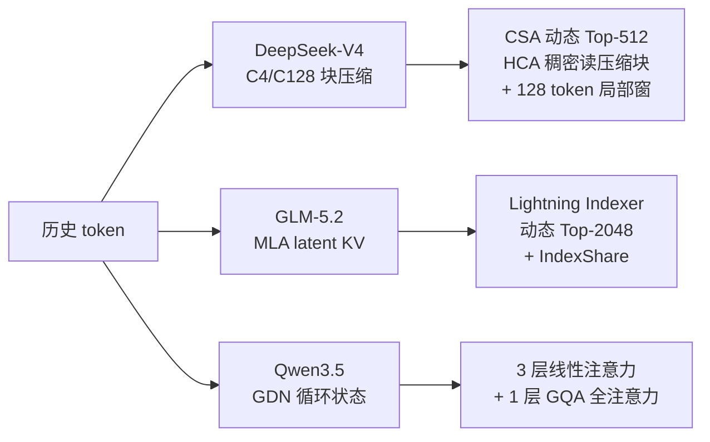

---
tags:
  - 注意力机制
  - DeepSeek
  - GLM
  - Qwen
  - 长上下文
  - 线性注意力
---

# 主流大模型注意力机制：DeepSeek、GLM 与 Qwen

!!! abstract "一句话总结"

    当前长上下文模型已经不再只有“把标准 Attention 做得更快”这一条路线：**DeepSeek-V4 用 CSA/HCA 压缩历史 token，GLM-5.2 用 MLA 压缩每个 token 的 KV、再用 DSA 选择 Top-K token，Qwen3.5 则把四分之三的全注意力替换为固定状态的 Gated DeltaNet**。三者分别在“压缩 token 数”“压缩每个 token 的表示”“不再逐 token 保存历史”上做文章。

---

## 1. 先建立统一的心智模型

分析注意力机制时，最容易陷入 `MHA / GQA / MLA / DSA / GDN` 的缩写堆砌。更有效的办法是连续问三个问题：

1. **历史信息保存成什么？** 完整 K/V、latent KV、压缩块，还是固定大小的循环状态？
2. **当前 query 读取多少历史？** 全部 token、固定窗口、动态 Top-K，还是只读一个聚合状态？
3. **被压缩掉的信息如何补偿？** 保留局部窗口、周期性全注意力，还是由内容索引器找回远距离 token？

沿这三个问题看，三类模型的核心差异非常清楚：



### 1.1 本文选取的代表模型

“DeepSeek、GLM、Qwen”都是持续演进的模型家族。本文选取 2026 年公开、且能从配置或实现中核对结构的三个代表：

| 家族 | 本文基线 | 关注点 |
|---|---|---|
| DeepSeek | DeepSeek-V4-Flash | CSA/HCA 混合压缩注意力与局部窗口 |
| GLM | GLM-5.2 | MLA、DSA、Lightning Indexer、IndexShare |
| Qwen | Qwen3.5-397B-A17B；用 9B 配置辅助说明 | Gated DeltaNet 与 Gated GQA 的 3:1 混合 |

主要依据如下：

- [DeepSeek-V4 技术报告](https://arxiv.org/abs/2606.19348)与 [DeepSeek-V4-Flash-Base 配置](https://huggingface.co/deepseek-ai/DeepSeek-V4-Flash-Base/blob/main/config.json)；
- [GLM-5 技术报告](https://arxiv.org/abs/2602.15763)与 [GLM-5.2 配置](https://huggingface.co/zai-org/GLM-5.2/blob/main/config.json)；
- [Qwen3.5-397B-A17B 配置](https://huggingface.co/Qwen/Qwen3.5-397B-A17B/blob/main/config.json)、[Qwen3.5-9B 配置](https://huggingface.co/Qwen/Qwen3.5-9B/blob/main/config.json)和 [Transformers Qwen3.5 文档](https://huggingface.co/docs/transformers/model_doc/qwen3_5)。

!!! note "为什么不只比较三家的某个缩写"

    注意力头的共享方式与历史 token 的选择方式是两个正交维度。例如 GQA 解决“多少个 Query 头共享一组 KV”，DSA 解决“从多少个历史位置中读取 KV”。一个模型可以同时使用 MLA、DSA 和局部窗口，不能把它们当成互斥选项。

---

## 2. 标准 Attention 的两笔长上下文账

设当前层输入为 $X\in\mathbb{R}^{L\times d}$，标准自注意力为：

$$
Q=XW_Q,\qquad K=XW_K,\qquad V=XW_V
$$

$$
O=\operatorname{softmax}\left(\frac{QK^T}{\sqrt{d_h}}+M\right)V
$$

其中 $L$ 是序列长度，$d_h$ 是单头维度，$M$ 是因果掩码。长上下文带来两类不同成本。

### 2.1 Prefill 的计算成本

Prefill 同时处理 $L$ 个 query，每个 query 与可见历史做点积，核心注意力复杂度近似为：

$$
O(L^2d_h)
$$

FlashAttention 能避免显式落地完整的 $L\times L$ 分数矩阵并改善 IO，但并没有从算法上消除所有 pairwise 计算。

### 2.2 Decode 的缓存与带宽成本

自回归 Decode 每次只有少量新 query，却必须读取此前所有 K/V：

$$
\text{KV Cache}
\propto
L\times n_{layers}\times n_{kv\_heads}\times(d_k+d_v)
$$

单 token Decode 的算术量只随 $L$ 线性增长，但它往往受显存带宽约束：每生成一个 token，都要重新读取长长的历史缓存。

因此，现代注意力优化大致落在三条轴上：

| 优化轴 | 典型机制 | 改变了什么 |
|---|---|---|
| 头轴 | MQA、GQA、MLA | 减少每个历史 token 要保存的 KV 宽度 |
| 序列轴 | Sliding Window、DSA、CSA/HCA | 减少当前 query 实际读取的历史位置 |
| 状态轴 | Gated DeltaNet 等线性注意力 | 用固定状态概括历史，不再保存逐 token KV |

---

## 3. DeepSeek-V4：先压缩 token，再在压缩历史上做注意力

DeepSeek-V4 没有沿用“每层保存一份 MLA latent KV，再从原始 token 中 Top-K”的单一路线，而是把注意力层分成三类：

- 前两层仅保留 **128-token Sliding Window**；
- CSA 层把每 4 个 token 压成一个条目，再从历史压缩条目中动态选择 Top-512；
- HCA 层把每 128 个 token 压成一个条目，并对这些高度压缩的条目做稠密注意力；
- CSA/HCA 都额外读取最近 128 个原始 token，保护局部精度。

DeepSeek-V4-Flash 的 43 个主干层可概括为：

$$
2\ \text{SWA-only}
+21\ \text{CSA}
+20\ \text{HCA}
$$

详细层表和张量形状见站内笔记[《DeepSeek-V4-Flash 模型结构解析》](deepseek-v4-flash-architecture.md)。

### 3.1 CSA：C4 压缩 + 内容相关 Top-512

设原序列为 $x_0,x_1,\dots,x_{L-1}$。CSA 以压缩率 $m=4$ 将相邻 token 聚合为压缩 KV：

$$
(x_{4j},x_{4j+1},x_{4j+2},x_{4j+3})
\longrightarrow
(\bar k_j,\bar v_j)
$$

于是远端历史的条目数从 $L$ 下降到约 $L/4$。对当前 query，轻量索引分支先在压缩条目上打分，再选择 Top-512：

$$
I_t=\operatorname{TopK}_{j\le t/4}(s_{t,j},512)
$$

核心注意力只读取 $I_t$ 对应的压缩 KV，再与最近 128 个原始 token 的局部注意力结果结合。

这里的 Top-512 是 **512 个压缩条目**，不能简单等同于 512 个原始 token。每个条目概括一个 4-token micro block，能覆盖的离散历史范围更广，但块内细节已经被压缩。

### 3.2 HCA：C128 重压缩 + 稠密读取

HCA 使用更激进的 $m'=128$：

$$
(x_{128j},\dots,x_{128j+127})
\longrightarrow
(\tilde k_j,\tilde v_j)
$$

对于 1M token 上下文，远端压缩条目数约为：

$$
\frac{1,048,576}{128}=8192
$$

8192 个条目已经足够少，因此 HCA 不再做 Top-K，而是稠密读取全部 C128 压缩历史。它像一个低分辨率全局地图：不能替代原始细节，却能让每个 query 始终看到完整时间跨度。

### 3.3 为什么 CSA 与 HCA 要交替

两种层弥补彼此的弱点：

- CSA 的压缩较轻、内容选择较细，但依赖索引器，可能漏掉未入选位置；
- HCA 不做动态筛选，保证全局覆盖，但每个条目的信息密度很高、细节较粗；
- 128-token 局部窗口负责语法、临近依赖和压缩边界附近的精确信息。

因此 DeepSeek-V4 的思路不是“单一稀疏模式”，而是：

> **局部原始细节 + 中粒度内容检索 + 粗粒度全局覆盖。**

### 3.4 成本与代价

粗略忽略头维度和常数后：

| 路径 | 每个 query 的远端读取规模 |
|---|---:|
| 标准全注意力 | $L$ |
| CSA | $\min(L/4,512)$ 个压缩条目 |
| HCA | $L/128$ 个压缩条目 |
| 局部补偿 | 最近 128 个原始 token |

这显著降低长上下文的 KV 与 Decode 读取量。DeepSeek 报告给出的结果是：在 1M 上下文下，V4-Pro 的单 token 推理 FLOPs 与 KV Cache 分别约为 DeepSeek-V3.2 的 27% 和 10%。代价是实现复杂度从一个注意力内核扩展为压缩状态、索引、局部窗口与多类缓存的协同。

---

## 4. GLM-5.2：MLA 压缩 KV，DSA 动态选择原始位置

GLM-5.2 的路线可以拆成三个连续动作：

1. 用 **MLA** 把每个 token 的 K/V 压缩成较窄的 latent；
2. 用 **Lightning Indexer** 从可见历史中找出 Top-2048 token；
3. 用 **IndexShare** 让相邻层复用选择结果。

详细参数和层级结构见站内笔记[《GLM-5.2 模型结构解析》](glm-5.2-architecture.md)。

### 4.1 MLA：缓存 latent，而不是完整多头 K/V

GLM-5.2 的 Query 路径为：

$$
h_t:6144
\rightarrow c_t^Q:2048
\rightarrow Q_t:64\times(192+64)
$$

KV 路径先生成：

$$
h_t:6144
\rightarrow
\begin{cases}
c_t^{KV}:512\\
k_t^R:64
\end{cases}
$$

其中 $c_t^{KV}$ 是不带位置编码的压缩 latent，$k_t^R$ 是承载 RoPE 的 key。推理实现可以长期缓存：

$$
\boxed{c_t^{KV}(512)+k_t^R(64)}
$$

而不是缓存 $64$ 个头展开后的完整 K/V。MLA 主要压缩的是**每个历史位置的宽度**。

### 4.2 DSA：动态选择 Top-2048 历史 token

仅压缩 KV 仍然意味着当前 query 要扫描全部历史。DSA 再增加一个轻量索引器，为 query $t$ 与历史位置 $s$ 计算内容相关分数。可用下式理解其结构：

$$
s_{t,s}=\sum_{h=1}^{H_I}w_{t,h}
\operatorname{ReLU}\left(\langle q^I_{t,h},k^I_s\rangle\right)
$$

然后选择：

$$
I_t=\operatorname{TopK}_{s\le t}(s_{t,s},2048)
$$

主注意力只读取 $I_t$ 对应的 latent KV。与固定滑窗相比，这种选择不受距离限制：很早出现的函数定义、约束或实体，只要索引分数高，仍能进入当前注意力。

### 4.3 IndexShare：Top-K 结果也需要缓存和复用

动态 Top-K 不是免费的。如果 78 层都独立扫描历史，索引器本身会成为明显成本。GLM-5.2 通过 `index_topk_freq=4` 等配置，让一部分层真正计算索引，其他层复用已选择的位置。

这建立了一个重要工程不变量：

> 复用层不能只“少跑一个算子”，它必须拿到与当前请求、当前 query、当前调度轮次严格对应的 Top-K 索引。

因此实现中除了 KV Cache，还会出现 indexer key cache、Top-K index buffer，以及层间共享状态。连续批处理、Chunked Prefill 和推测解码都会让这些状态的生命周期更难管理。

### 4.4 GLM 路线解决了什么，又留下什么

- MLA 将 KV Cache 宽度从完整多头表示压缩到 576 个元素；
- DSA 将主注意力的历史读取长度限制到 2048；
- IndexShare 将索引器执行频率约降为每四层一次；
- 但索引器仍需感知长历史，且 Top-K 是离散操作，对高性能 kernel、分页缓存和跨卡合并提出额外要求。

GLM 的长上下文效率来自“**先把每个位置存窄，再只读少数位置**”，与 DeepSeek-V4“先把相邻位置合成更少的条目”并不相同。

---

## 5. Qwen3.5：用固定循环状态替换四分之三的 KV Cache

Qwen3.5 继承 Qwen3-Next 的混合 token mixer：每四层构成一个重复单元。

```text
Linear Attention → Linear Attention → Linear Attention → Full Attention
```

即：

- 75% 层使用 **Gated DeltaNet（GDN）**；
- 25% 层使用带输出门控的 **GQA Full Attention**；
- `full_attention_interval=4`，具体层类型由 `layer_types` 显式记录。

Qwen3.5-397B-A17B 有 60 层，即 45 个 GDN 层和 15 个全注意力层；Qwen3.5-9B 有 32 层，即 24 个 GDN 层和 8 个全注意力层。

### 5.1 GDN 的关键：历史被写入固定大小状态

GDN 不为每个历史 token 永久保留 K/V，而是维护循环矩阵状态 $S_t$。省略批次与多头下标后，按 [Transformers Qwen3-Next 参考实现](https://github.com/huggingface/transformers/blob/main/src/transformers/models/qwen3_next/modeling_qwen3_next.py)中的执行顺序，Gated Delta Rule 可以写成：

$$
\bar S_{t-1}=g_tS_{t-1}
$$

$$
\hat v_t=\bar S_{t-1}^{T}k_t
$$

$$
\Delta_t=\beta_t(v_t-\hat v_t)
$$

$$
S_t=\bar S_{t-1}+k_t\Delta_t^T
$$

$$
o_t=S_t^{T}q_t
$$

其中：

- $g_t$ 先控制旧状态的保留或衰减，得到 $\bar S_{t-1}$；
- $\hat v_t$ 是衰减后状态对 key $k_t$ 已经记住的 value；
- $v_t-\hat v_t$ 是需要写入的“新信息”；
- $\beta_t$ 控制本次更新强度；
- query $q_t$ 直接从更新后的状态读取输出。

Qwen3.5 还在 Q/K/V 前加入宽度为 4 的 causal Conv1D，补充很近的局部顺序信息。

### 5.2 为什么它被称为线性注意力

训练或 Prefill 时，GDN 可以用 chunked/parallel scan 形式计算，整体随序列长度近似线性增长。Decode 时只需读取和更新固定大小状态：

$$
\text{GDN state size}=O(n_h d_kd_v)
$$

它不随上下文长度 $L$ 增长。相比之下，全注意力层的 KV Cache 是 $O(L)$。

这也是 Qwen 路线最激进的地方：DeepSeek 和 GLM 仍然保存“可寻址的历史条目”，GDN 保存的是聚合后的状态，无法再像 KV Cache 一样任意取回某个原始 token。

### 5.3 周期性全注意力为什么仍然必要

固定状态会发生信息叠加与遗忘。某些任务需要精确回看很久之前的字符串、代码片段或多处细节，单靠有限状态很难完全承担。因此每四层保留一个全注意力层，让模型重新进行 token-to-token 的显式交互。

Qwen3.5 的全注意力并非朴素 MHA：

- 使用 GQA，多个 Query 头共享较少的 KV 头；
- Q、K 在进入注意力前做 RMSNorm；
- Query 投影同时产生 gate，注意力输出乘以 $\sigma(gate)$ 后再进入输出投影；
- 只在四分之一层中产生随上下文增长的 KV Cache。

以 Qwen3.5-397B-A17B 为例，完整模型配置为 32 个 Query 头、2 个 KV 头、`head_dim=256`；线性层则使用 16 个 key heads、64 个 value heads，key/value head dim 均为 128。

### 5.4 推理系统面对的是 Hybrid Cache

Qwen3.5 不是简单地“KV Cache 降为四分之一”：

- 全注意力层需要分页 KV Cache；
- GDN 层需要每请求的 recurrent state 与 Conv1D state；
- Chunked Prefill 必须从旧状态继续更新；
- 请求抢占、复制、前缀复用和推测解码都要分别处理两类状态。

这也是 vLLM 将其标记为 stateful hybrid model 的原因：调度器不仅要管理 block table，还要管理固定状态槽位与状态复制函数。

---

## 6. 三条路线放在同一张表里

| 维度 | DeepSeek-V4-Flash | GLM-5.2 | Qwen3.5 |
|---|---|---|---|
| 主路线 | CSA/HCA 混合压缩注意力 | MLA + DSA + IndexShare | GDN + 周期性 GQA |
| 历史保存单位 | C4/C128 压缩条目 + 局部原始 KV | 每个原始 token 的 latent KV + RoPE key | GDN 固定状态；全注意力层保留 KV |
| 历史选择 | CSA Top-512；HCA 读全部 C128 条目 | 内容相关 Top-2048 原始位置 | GDN 不显式选 token；每四层一次全注意力 |
| 局部信息 | 每层 128-token 原始窗口 | 由 DSA/MLA 主路径处理 | 4-tap causal Conv1D + 全注意力层 |
| Decode 状态随 $L$ 增长 | 压缩后增长 | latent KV 仍线性增长 | GDN 层不增长；全注意力层线性增长 |
| 精确寻址旧 token | 压缩块粒度，CSA 内容检索 | Top-K 原始 token 粒度 | 只在全注意力层显式寻址 |
| 主要额外状态 | compressor、index、局部缓存 | latent KV、indexer cache、Top-K buffer | recurrent state、conv state、KV Cache |
| 核心风险 | 压缩损失与索引漏选 | 索引成本、Top-K 状态一致性 | 固定状态遗忘与混合缓存复杂度 |

### 6.1 用复杂度近似看差异

只看单层单 token Decode，并省略头维度等常数：

$$
\begin{aligned}
\text{Full Attention} &: O(L)\\
\text{GLM DSA} &: O(K),\ K=2048\quad\text{（另有索引成本）}\\
\text{DeepSeek CSA} &: O(K_c+W),\ K_c=512,\ W=128\\
\text{DeepSeek HCA} &: O(L/128+W)\\
\text{Qwen GDN} &: O(1)\quad\text{（状态大小固定）}
\end{aligned}
$$

这张式子只能说明主注意力读取规模，不能直接用于比较端到端速度。真实延迟还取决于：

- 压缩器或索引器本身的计算；
- 稀疏 gather 是否能连续访存；
- recurrent state 是否能常驻高速缓存；
- kernel 启动、量化、并行通信和连续批处理；
- 全注意力、局部注意力与稀疏注意力各占多少层。

---

## 7. 从推理角度看，谁更容易跑好

### 7.1 稠密算子不一定慢，稀疏算子不一定快

GPU/NPU 擅长规则、连续的大矩阵计算。Top-K 稀疏注意力虽然 FLOPs 少，但会引入离散索引、分页 gather、不规则长度和额外元数据。若稀疏内核实现不成熟，理论计算量优势可能被访存与调度开销吃掉。

HCA 的价值正在于此：C128 已经把条目数压得很少，之后用规则的稠密注意力，硬件利用率可能比更稀疏但更碎片化的访问更好。

### 7.2 Prefill 与 Decode 的最优机制并不相同

- Prefill 关心大批 query 的并行度与 TTFT；
- Decode 关心 KV/状态读取带宽、批量请求数与单步通信；
- GDN 的 chunked prefill 和 recurrent decode 是两套 kernel；
- DSA 的 prefill Top-K 与 decode Top-K 也常走不同实现；
- 压缩缓存何时生成、何时持久化，会直接影响 Chunked Prefill。

所以“某机制复杂度为 $O(L)$”还远远不够，必须说明是在训练、Prefill 还是 Decode 阶段。

### 7.3 长上下文容量还受并行策略影响

即使模型已经压缩 KV，超长上下文仍可能需要 Context Parallel：

- TP 先沿 KV head 或 latent head 切分；
- 当 KV head 很少、TP 继续增大只会复制缓存时，再沿 token 轴做 DCP；
- 稀疏注意力还要合并各 rank 的候选 Top-K；
- GDN 固定状态通常沿 head 维做 TP，但全注意力层仍有 KV 分页问题。

这些系统层问题在[《大模型并行策略与切分：结合 vLLM 和 vLLM Ascend 源码》](../ai/llm-parallelism-vllm-vllm-ascend.md)中展开。

---

## 8. 常见误区

### 8.1 “GQA 就是稀疏注意力”

不是。GQA 在头轴共享 KV，仍可以读取全部历史 token；DSA/CSA 在序列轴选择历史位置。两者可以同时存在。

### 8.2 “MLA 把长上下文复杂度变成常数”

不是。MLA 主要缩小每个 token 的缓存宽度，历史 token 数仍随 $L$ 增长。只有叠加 DSA、窗口或 Context Parallel 后，读取长度与单卡容量才进一步下降。

### 8.3 “线性注意力没有缓存”

不是。它没有逐 token KV Cache，但仍有 recurrent state、卷积状态，以及混合架构中全注意力层的 KV Cache。

### 8.4 “Top-K 越小，模型与推理一定越好”

Top-K 变小会减少主注意力计算，也更容易漏掉相关信息；并且过小、过碎的 gather 可能降低硬件利用率。它是质量、算力、带宽与 kernel 形态的共同折中。

### 8.5 “1M context 表示每层都精确看完 1M token”

对这些模型都不成立：

- DeepSeek-V4 看的是压缩条目、Top-K 条目与局部窗口；
- GLM-5.2 通过索引器只把 Top-2048 交给主注意力；
- Qwen3.5 的多数层只读固定状态，周期性全注意力层才显式访问 token 历史。

“支持 1M 上下文”描述的是模型整体可处理的上下文范围，不等于每一层执行 1M×1M 的稠密注意力。

---

## 9. 总结：三家实际上在压缩不同的轴

可以用三句话记住全文：

1. **DeepSeek-V4 压缩 token 轴**：把相邻历史变成 C4/C128 条目，再用 CSA 检索和 HCA 全局覆盖；
2. **GLM-5.2 同时压缩表示轴与读取轴**：MLA 把每个 token 存窄，DSA 只读 Top-2048，IndexShare 减少重复检索；
3. **Qwen3.5 改写状态轴**：四分之三层用固定 GDN 状态概括历史，每四层用一次 GQA 全注意力恢复显式 token 交互。

它们没有绝对的“谁替代谁”。未来模型很可能继续混合这些思想：固定状态负责高吞吐，压缩或稀疏注意力负责长程精确检索，局部窗口负责短距离细节。真正决定系统效果的，是模型训练是否适应这种信息瓶颈，以及推理引擎能否把多类状态和 kernel 高效组织起来。
